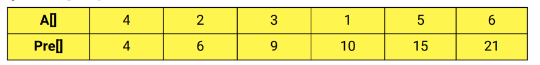

# Lập trình C++ cơ bản đến nâng cao

# Nội dung bài học

## Biến và kiểu dữ liệu

### Biến và nhập xuất dữ liệu

**Biến (variable) là gì?**

- Biến là thứ được dùng để lưu trữ dữ liệu của chương trình và nó mang ý nghĩa có thể thay đổi được.
- Cách sử dụng biến:
    - Trước khi sử dụng phải khai báo biến
    - Cú pháp khai báo: `<Kiểu dữ liệu> <Tên biến>;` hoặc `<Kiểu dữ liệu> <Tên biến 1>, <Tên biến 2>,...;`
    
    ```cpp
    #include <iostream>
    
    int main()
    {
        int i; // Khai báo biến i có kiểu dữ liệu số nguyên (integer)
        float f; // Khai báo biến f có kiểu dữ liệu số thực (float)
        char c; // Khai báo biến c có kiểu dữ liệu ký tự (character)
    
        int a, b; // Khai báo 2 biến a, b có kiểu dữ liệu số nguyên (integer)
    
        int d = 1; // Khai báo biến d và gán (assign) cho biến d giá trị 1
    
        std::cout << d;
    
        return 0;
    }
    ```
    
    Kết quả:
    
    ```cpp
    1
    
    ```
    

**Cách đặt tên biến**

- Không đặt tên biến trùng với từ khóa (void, for, while, do, delete,...)
- Tên biến không chứa khoảng trắng hoặc ký tự đặc biệt
- Ký tự đầu tiên của tên biến phải là chữ cái

**Nhập xuất dữ liệu**

- Để nhập xuất dữ liệu trong C++, chúng ta sử dụng thư viện `iostream`. Thư viện này cung cấp cho chúng ta những thứ được định nghĩa sẵn để sử dụng.Kết quả:Kết quả:Kết quả:
    - `std::cout`: In dữ liệu ra console
    
    ```
    #include <iostream>
    
    int main()
    {
        std::cout << "Hello World!"; // In ra console chuỗi "Hello World!"
    
        return 0;
    }
    ```
    
    ```
    Hello World!
    
    ```
    
    - `std::cin`: Đọc dữ liệu từ bàn phím và gán dữ liệu cho biến được chỉ định. Dùng cho thao tác nhập dữ liệu.
    
    ```cpp
    #include <iostream>
    
    int main()
    {
        int x;
        std::cout << "x = ";
        std::cin >> x; // Nhập vào giá trị của x
    
        std::cout << "Value of x: " << x; // In ra console giá trị của x
    
        return 0;
    }
    ```
    
    ```cpp
    x = 10
    Value of x: 10
    
    ```
    
    - `std::endl`: Ngắt dòng khi hiển thị dữ liệu trên console, có thể dùng ký tự `\n` để thay thế.
    
    ```cpp
    #include <iostream>
    
    int main()
    {
        std::cout << "Hello World!" << std::endl;
        std::cout << "CPP" << std::endl << "Learing!" << std::endl;
        std::cout << "Full\nStack";
    
        return 0;
    }
    ```
    
    `Hello World!
    CPP 
    Learning!
    Full 
    Stack`
    

### Kiểu dữ liệu thường gặp

## Các kiểu dữ liệu thường gặp

- Các kiểu dữ liệu thường gặp trong C++:
    - Integer (int): Kiểu số nguyên (`1`, `2`, `3`)
    - Float (float): Kiểu số thực (`1.2`, `1.3`, `3.14`,...)
    - Double (double): Kiểu số thực (có giới hạn lưu trữ lớn hơn so với float)
    - Boolean (bool): 1/0 (True/False)
    - Character (char): Kiểu ký tự (`'a'`, `'b'`, `'c'`,...)
- Ngoài ra còn có các kiểu dữ liệu khác: `long`, `long long`, `unsigned long`, `short`, `unsigned short`,...
    
    ```c
    #include <iostream>
    
    int main()
    {
        int a = 1;
    
        float b = 1.4;
    
        double c = 3.14;
    
        char d = 'a';
    
        bool e = true;
        bool f = 1;
    
        return 0;
    }
    
    ```
    

## Giới hạn lưu trữ

- Ngoài việc lưu trữ các loại dữ liệu khác nhau, mỗi kiểu dữ liệu lại có các giới hạn lưu trữ khác nhau
    
    Ví dụ:
    
    - Kiểu `int` có thể lưu trữ 4 byte (-2,147,483,648 tới 2,147,483,647)
    - Kiểu `short` có thể lưu trữ 2 byte (-32,768 tới 32,767)
- Sử dụng các macro sau đây để kiểm tra giá trị lớn nhất hoặc nhỏ nhất mà 1 kiểu dữ liệu có thể lưu trữ
    - `INT_MAX`: Giá trị lớn nhất mà kiểu `int` có thể lưu trữ.
    - `INT_MIN`: Giá trị nhỏ nhất mà kiểu `int` có thể lưu trữ.
    - `SHRT_MAX`: Giá trị nhất mà kiểu `short` có thể lưu trữ.
    - `SHRT_MIN`: Giá trị nhỏ nh mà kiểu `short` có thể lưu trữ.
    - `LONG_MAX`: Giá trị nhất mà kiểu `long` có thể lưu trữ.
    - `LONG_MIN`: Giá trị nhỏ nh mà kiểu `long` có thể lưu trữ.
    - `FLT_MAX`: Giá trị nhất mà kiểu `float` có thể lưu trữ.
    - `FLT_MIN`: Giá trị nhỏ nh mà kiểu `float` có thể lưu trữ.
    - `DBL_MAX`: Giá trị nhất mà kiểu `double` có thể lưu trữ.
    - `DBL_MIN`: Giá trị nhỏ nh mà kiểu `double` có thể lưu trữ.
    
    Ví dụ:
    
    ```cpp
    #include <iostream>
    
    int main()
    {
        std::cout << "Min int: " << INT_MIN << std::endl;
        std::cout << "Max int: " << INT_MAX << std::endl;
        std::cout << "Min short: " << SHRT_MIN << std::endl;
        std::cout << "Max short: " << SHRT_MAX << std::endl;
    
        return 0;
    }
    ```
    
- Sử dụng `sizeof` để xác định số lượng byte mà một kiểu dữ liệu có thể lưu trữ
    
    Ví dụ:
    
    ```cpp
    #include <iostream>
    
    int main()
    {
        std::cout << "Int: " << sizeof(int) << std::endl; // 4
        std::cout << "Float: " << sizeof(float) << std::endl; // 4
        std::cout << "Double: " << sizeof(double) << std::endl; // 8
        std::cout << "Bool: " << sizeof(bool) << std::endl; // 1
        std::cout << "Char: " << sizeof(char) << std::endl; // 1
        std::cout << "Long: " << sizeof(long) << std::endl; // 4
    
        return 0;
    }
    ```
    

## Pair

**pair** nằm trong thư viện `#include <utility>` được sử dụng để kết hợp 2 kiểu dữ liệu với nhau, nó cung cấp cách lưu trữ 2 giá trị đi kèm nhau nhưng chỉ sử dụng 1 biến.

Nhìn chung pair giúp lưu trữ dữ liệu theo cặp và có những đặc điểm sau :

- Phần tử thứ nhất của pair được gọi là first, phần tử thứ 2 của pair được gọi là second
- Bạn có thể so sánh, gán, copy pair như kiểu dữ liệu bạn thường gặp
- Để truy cập vào phần tử thứ nhất và thứ 2 trong pair ta sử dụng toán tử dấu chấm

Cú pháp khai báo :

```
//Cách 1 : Giá trị của first và second là mặc định
pair<first_data_type, second_data_type> pair_name;

//Cách 2 : Giá trị của first là value1, second là value2
pair<first_data_type, second_data_type> pair_name = make_pair(value1, value2)

//Cách 3 : Giá trị của first là value1, second là value2
pair<first_data_type, second_data_type> pair_name(value1, value2)

//Cách 4 : Giá trị của first là value1, second là value2
pair<first_data_type, second_data_type> pair_name = {value1, value2}

```

Thành phần first và second của pair có thể là các kiểu dữ liệu thường gặp như int, float, double, long long,char... hay cũng có thể chính là một pair khác. Ngoài ra nó còn có thể là các kiểu phức tạp hơn như string, vector<>, set, object... tuy nhiên nhưng kiến thức này bạn chưa gặp nên tạm thời bỏ qua.

Ví dụ 1: Các kiểu khai báo pair

```cpp
#include <iostream>
#include <utility>
using namespace std;

int main(){
    pair<int, int> a = make_pair(28, 100);
    cout << a.first << ' ' << a.second << endl;

    pair<char, int> b = {'@', 28};
    cout << b.first << ' ' << b.second << endl;

    pair<char, char> c('#', '$');
    cout << c.first << ' ' << c.second << endl;
    return 0;
}
```

Output :

```cpp
28 100
@ 28
# $
```

Ví dụ 2 : pair lồng nhau

```cpp
#include <iostream>
#include <utility>
using namespace std;

int main(){
    pair<int, pair<char, int> > p1 = make_pair(28, make_pair('@', 100));
    cout << p1.first << endl;
    cout << p1.second.first << ' ' << p1.second.second << endl;

    pair<pair<int, int>, pair<int, int>> p2 = {{10, 20}, {30, 40}};
    cout << p2.first.first << ' ' << p2.first.second << endl;
    cout << p2.second.first << ' ' << p2.second.second << endl;
    return 0;
}
```

Output :

```cpp
28
@ 100
10 20
30 40
```

### Biến cục bộ và biến toàn cục

## Biến cục bộ và biến toàn cục

1. Phạm vi cục bộ
- Trong 1 chương trình sẽ có các phạm vi (scope), mỗi 1 phạm vi sẽ được thể hiện bằng dấu `{}`.
- Biến khai báo ở phạm vi nào thì chỉ được sử dụng ở trong phạm vi đó (đó được gọi là các biến cục bộ).
    
    Ví dụ:
    
    ```cpp
    #include <iostream>
    
    int main()
    {
        int main_var = 0;
        std::cout << main_var << std::endl;
    
        { // Phạm vi 1
            int scope_var_1 = 1;
            std::cout << scope_var_1 << std::endl;
    
            {
                std::cout << scope_var_1 << std::endl;
            }
        }
    
        { // Phạm vi 2
            int scope_var_2 = 2;
            std::cout << scope_var_2 << std::endl;
            std::cout << scope_var_1 << std::endl; // Lỗi: scope_var_1 was not declared in this scope
        }
    
        return 0;
    }
    ```
    
- Khi có 1 biến ở phạm vi bên trong trùng tên với 1 biến ở phạm vi bên ngoài, chương trình sẽ ưu tiên lấy giá trị của biến ở phạm vi ***gần nhất*** tính từ trong ra ngoài.
    
    Ví dụ:
    
    ```cpp
    #include <iostream>
    
    int main()
    {
        int main_var = 0;
    
        {
            int main_var = 1;
            std::cout << main_var; // 1
        }
    
        std::cout << main_var; // 0
    
        return 0;
    }
    
    ```
    
1. Phạm vi toàn cục
- Các biến được khai báo ở bên ngoài chương trình được gọi là biến toàn cục có thể được sử dụng ở bất cứ nơi nào trong chương trình.
    
    Ví dụ:
    
    ```cpp
    #include <iostream>
    
    int global_var = 1;
    
    int main()
    {
        int global_var = 3;
    
        std::cout << "Main scope: " << global_var << std::endl;
    
        { // Phạm vi 1
            std::cout << "Scope 1: " << global_var << std::endl;
            // Kết quả: 2
        }
    
        { // Phạm vi 2
            std::cout << "Scope 2: " << ::global_var << std::endl;
            // Kết quả: 1
        }
    
        return 0;
    }
    ```
    

### Hằng số

Có thể dùng **const hoặc** dùng **define**  để xác định hằng số. Dùng define thì sẽ ko thể thay đổi giá trị của nó được. Ví dụ: #define PI 3.14 

```cpp
#include<iostream>

// #define PI 3.14 (macro)

int main() {
    const double PI = 3.14;
    const int MY_AGE = 18;

    std::cout << PI;

    return 0;
}

```

### Toán tử gán và toán tử số học

```cpp
#include<iostream>

int main() {
    
    // + - * / %
    int i = 10;
    int j = 15;

    int c = i + j;
    int d = i - j;
    int e = i * j;
    int f = i % j; // Lấy số dư
    int g = i / j; // Lấy phần nguyên

    std::cout << c << std::endl << d << std::endl 
    << e << std::endl << f << std::endl << g;

    return 0;
}
```

Kết quả: 

```cpp
25
-5
150
10
0
```

### Toán tử quan hệ và toán tử logic

## Toán tử quan hệ

- Là các phép toán để thực hiện việc so sánh: `>`, `<`, `>=`, `<=`, `==`, `!=`.
- Các phép toán này trả về giá trị boolean.
    
    Ví dụ:
    
    ```cpp
    #include <iostream>
    
    int main()
    {
        std::cout << (3 > 2) << std::endl; // 1 - true
        std::cout << (1 > 2) << std::endl; // 0 - false
    
        int a = 3;
        int b = 3;
        std::cout << (a == b) << std::endl; // 1 - true
        std::cout << (a != b) << std::endl; // 0 - false
    
        bool c = a < b;
        std::cout << c << std::endl; // 0 - false
    
        return 0;
    }
    
    ```
    
    Kết quả:
    
    ```cpp
    1
    0
    1
    0
    0
    
    ```
    
- Lưu ý: 2 giá trị tham gia vào phép so sánh phải có cùng kiểu dữ liệu.

## Toán tử logic

- Các toán tử logic trong C++: `AND (&&)`, `OR (||)`, `NOT (!)`
    - AND: Nếu 2 vế đều là `true` thì kết quả trả về là `true`, các trường hợp còn lại thì trả về `false`.
    - OR: Nếu 2 vế đều là `false` thì kết quả trả về là `false`, các trường hợp còn lại thì trả về `true`.
    - NOT: Trả về giá trị phủ định.
    
    Ví dụ:
    
    ```cpp
    #include <iostream>
    
    int main()
    {
        // AND
        std::cout << (true && true) << std::endl; // 1 - true
        std::cout << (true && false) << std::endl; // 0 - false
        std::cout << (false && true) << std::endl; // 0 - false
        std::cout << (false && false) << std::endl; // 0 - false
    
        // OR
        std::cout << (true || true) << std::endl; // 1 - true
        std::cout << (true || false) << std::endl; // 1 - true
        std::cout << (false || true) << std::endl; // 1 - true
        std::cout << (false || false) << std::endl; // 0 - false
    
        // NOT
        std::cout << !true << std::endl; // 0 - false
        std::cout << !false << std::endl; // 1 - true
    
        return 0;
    }
    
    ```
    
- Sử dụng kết hợp với toán tử quan hệ.
    
    Ví dụ:
    
    ```cpp
    #include <iotream>
    
    int main()
    {
        int a = 1, b = 2, c = 3;
    
        bool d = (a < b) && (b > c); // true && false
        bool e = (a < b) || (b > c); // true || false
    
        std::cout << d << std::endl; // 0 - false
        std::cout << e << std::endl; // 1 - true
    
        return 0;
    }
    
    ```
    

### Ép kiểu dữ liệu và bảng mã ASCII

- Bảng mã ASCII


```cpp
#include <iostream>

int main()
{
    int a = 3;
    int b = 2;
    float c = (float) a/b; 
    std::cout << c; // Kết quả: 1.5

    std::cout << (bool) a; // 1 - true

    return 0;
}
```

- Lưu ý: Khi ép kiểu số (trừ số 0) sang bool thì đều ra ***true***  trừ số 0 ra ***false***

### Bài tập chương

- Bài 1: Nhập vào 2 số a, b và hãy in ra tổng, hiệu 2 số đó

```cpp
#include <iostream>

int main()
{
    int a = 10;
    int b = 15;

    int c = a + b;
    int d = a - b;

    std::cout << c << std::endl << d;
    // 25 và -5
}
```

- Bài 2: Nhập vào 1 chữ cái viết thường bất kỳ. Hãy in ra màn hình chữ cái đó dưới dạng viết hoa

```cpp
#include <iostream>

int main()
{
    int a = 'a';
    int b = 'b';

    std::cout << (char) (a - 32) << std::endl << (char) (b -32) ;
    // A và B
}

```

- Bài 3: Nhập vào 2 số nguyên a, b. Hãy hoán đổi giá trị giá trị của 2 số đó và in ra màn hình

```cpp
#include <iostream>

int main()
{
    float a;
    float b;

    std::cout << "Nhập a: ";
    std::cin >> a;
    std::cout << "Nhập b: ";
    std::cin >> b;

    float c = a;
    a = b;
    b = c;

    std::cout << "Giá trị của a: " << a << std::endl;
    std::cout << "Giá trị của b: " << b;

}
```

Kết quả: 

```cpp
Nhập a: 15
Nhập b: 10
Giá trị của a: 10
Giá trị của b: 15
```

- Bài 4: Nhập vào 2 số nguyên ương a và b (a và b không trùng giá trị). Hãy in ra màn hình số nhỏ hơn (không dùng cấu trúc if else hoặc toán tử 3 ngôi).

```cpp
#include <iostream>
#include<math.h>

int main()
{
    int a;
    int b;

    std::cout << "Nhập a: ";
    std::cin >> a;
    std::cout << "Nhập b: ";
    std::cin >> b;

    int c = a + b;
    int d = abs(a - b);
    
    float e = (c - d)/2;

    std::cout << "Giá trị của số nhỏ hơn: " << e;

}
```

Kết quả:

```cpp
Nhập a: 100
Nhập b: 101
Giá trị của số nhỏ hơn: 100
```

## Cấu trúc điều khiển và vòng lặp

### Cấu trúc if else

```cpp
#include <iostream>

using namespace std;
int main()
{
    int a = 10;
    int b = 15;

    if (a<b) {
        cout << "Điều iện đúng";
    } else {
        cout << "Điều iện sai";
    }
    // Điều iện đúng

}
```

### Cấu trúc switch case

```cpp
#include <iostream>
#include<math.h>

using namespace std;
int main()
{
    int month = 1;
    
    switch (month)
    {
    case 1: 
    case 3: 
    case 5: 
    case 7: 
    case 8: 
    case 10: 
    case 12: 
        cout << "31 ngày";
        break;
    case 4: 
    case 6: 
    case 9: 
    case 11: 
        cout << "30 ngày";
        break;
    case 2: 
        cout << "28 ngày";
        break;
    default:
        cout << "unknowned";
    }

}
```

Kết quả:

```cpp
31 ngày
```

### Toán tử 3 ngôi

Cú pháp: 

```cpp
<dieu kien> ? <gia tri 1> : <gia tri 2>
```

```cpp
#include <iostream>
#include<math.h>

using namespace std;
int main()
{
    int a, b;
    
    cout << "a = ";
    cin >> a;
    cout << "b = ";
    cin >> b;
    int ketqua = (a < b) ? a : b ;
    cout << "Gia trị nhỏ hơn là: " << ketqua;

    return 0;
}
```

Kết quả

```cpp
a = 10
b = 15
Gia trị nhỏ hơn là: 10
```

### Vòng lặp

- For

```cpp
for (int i = 1; i <= 8; i++) {
        cout << i << endl;
    }
```

- While

```cpp
int i = 1;
    while (i <= 8) {
        cout << i << endl;
        i++;
    }
```

- Do while

```cpp
int i = 1;
    do {
        cout << i << endl;
        i++;
    } while (i <= 8);
```

Kết quả: ***1 2 3 4 5 6 7 8***

### Bài tập về vòng lặp

- Bài 1: Nhập 1 số nguyên dương a. In ra màn hình giá trị của S = 1 + 2 + 3 + … + a

```cpp
#include <iostream>
#include<math.h>

using namespace std;
int main()
{
    int a;
    cout << "Nhập số nguyên dương a: ";
    cin >> a;
    int S = 0;
    for (int i = 1; i <= a; i++) {
        S = S + i;
    }
    cout << "Tổng S = " << S;
}
```

Kết quả

```cpp
Nhập số nguyên dương a: 10
Tổng S = 55
```

- Bài 2: Nhập 1 số nguyên dương a. In ra màn hình giá trị của S = 1^2 + 2^2 + … + a^2

```cpp
#include <iostream>
#include<math.h>

using namespace std;
int main()
{
    int a;
    cout << "Nhập số nguyên dương a: ";
    cin >> a;
    int S = 0;
    for (int i = 1; i <= a; i++) {
		    // S = S + i*i;
        S = S + pow(i, 2); 
        // Lũy thừa: pow(a, b) a là cơ số, b là số mũ
    }
    cout << "Tổng S = " << S;
}
```

Kết quả

```cpp
Nhập số nguyên dương a: 10
Tổng S = 385
```

- Bài 3: Nhập 1 số nguyên dương a. In ra màn hình giai thừa a!

```cpp
#include <iostream>
#include<math.h>

using namespace std;
int main()
{
    int a;
    cout << "Nhập số nguyên dương a: ";
    cin >> a;
    unsigned long long S = 1; 
    // long long để cho số cực kì lớn
    for (int i = 1; i <= a; i++) {
        S = S*i; 
    }
    cout << "a! = " << S;
}
```

Kết quả

```cpp
Nhập số nguyên dương a: 10
a! = 3628800
```

- Bài 4: Nhập vào 1 số dương a. In ra màn hình các số chia hết cho 5 từ 1 đến a

```cpp
#include <iostream>
#include<math.h>

using namespace std;
int main()
{
    int a;
    cout << "Nhập số nguyên dương a: ";
    cin >> a;
    for (int i = 1; i <= a; i++) {
        if (i % 5 == 0) {
            cout << i << " ";
        }
    }
}
```

Kết quả

```cpp
Nhập số nguyên dương a: 50
5 10 15 20 25 30 35 40 45 50 
```

### Break, continue, goto

- **Break**: Dùng để kết thúc vòng lặp nếu thỏa điều kiện

```cpp
#include <iostream>
#include<math.h>

using namespace std;
int main()
{
    int a;
    cout << "Nhập số nguyên dương a: ";
    cin >> a;
    for (int i = 1; i <= a; i++) {
        if (i == 10 ) {
            break;
        }
        cout << i << " ";
    }
}
```

Kết quả

```cpp
Nhập số nguyên dương a: 15
1 2 3 4 5 6 7 8 9
```

- **Continue**: Dùng để bỏ qua cái lệnh đó nếu điều kiện đúng

```cpp
#include <iostream>
#include<math.h>

using namespace std;
int main()
{
    int a;
    cout << "Nhập số nguyên dương a: ";
    cin >> a;
    for (int i = 1; i <= a; i++) {
        if (i == 10 ) {
            continue;
        }
        cout << i << " ";
    }
}
```

```cpp
#include <iostream>
#include<math.h>

using namespace std;
int main()
{
    int i = 1;
    while (i <= 15)
    {
        if (i == 10) {
            i++;
            continue;
        }
        cout << i << " ";
        i++;
    }
    
}
```

Kết quả

```cpp
Nhập số nguyên dương a: 15
1 2 3 4 5 6 7 8 9 11 12 13 14 15 
```

- **Goto**:  Chương trình này yêu cầu người dùng nhập một số nguyên dương lẻ. Tuy nhiên, nếu bạn nhập một số bé hơn 0 hoặc số chẵn, chương trình sẽ sử dụng lệnh **goto** để nhảy đến nhãn **try_again**. Chương trình sẽ lặp lại thao tác nhập và chỉ kết thúc khi người dùng nhập vào một số nguyên dương lẻ.

```cpp
#include <iostream>
#include<math.h>

using namespace std;
int main()
{
    int a;
    
    try_again: // label - nhãn
    cout << "Nhập số nguyên dương lẻ a: ";
    cin >> a;

    
    if (a<= 0 || a % 2 == 0) {
        goto try_again;
    }

    cout << "Giá trị của a là: " << a;
    
}
```

```cpp
#include <iostream>
#include<math.h>

using namespace std;
int main()
{
    int a;
    
    while (true) {
        cout << "Nhập số nguyên dương lẻ a: ";
        cin >> a;

        if ( a > 0 && a % 2 == 1) {
            break;
        }

    }    

    cout << "Giá trị của a là: " << a;
    
}
```

Kết quả

```cpp
Nhập số nguyên dương lẻ a: 10
Nhập số nguyên dương lẻ a: 11
Giá trị của a là: 11
```

### Bài tập chương

- Bài 1: Viết chương trình giải phương trình bậc nhất 1 ẩn **ax + b = 0**, trong đó a và b là các hệ số nhập từ bàn phím

```cpp
#include <iostream>
#include<math.h>

using namespace std;
int main()
{
    int a, b;
    
    cout << "Nhập a: ";
    cin >> a;
    
    cout << "Nhập b: ";
    cin >> b;

    float x = (float) -b/a;

    if (a == 0 && b == 0) {
        cout << "Phương trình vô số nghiệm";
    } else if (a == 0 && b != 0) {
        cout << "Phương trình vô nghiệm";
    } else if (a != 0) {
        cout << "Phương trình có 1 nghiệm duy nhất x = " << x;
    }
}
```

Kết quả

```cpp
Nhập a: 0
Nhập b: 0
Phương trình vô số nghiệm

Nhập a: 0
Nhập b: 5
Phương trình vô nghiệm

Nhập a: 10
Nhập b: 15
Phương trình có 1 nghiệm duy nhất x = -1.5
```

- Bài 2: Viết chương trình nhập vào 1 số nguyên dương a (a ≤ 100). Tính và hiển thị tổng các số tự nhiên lẻ từ 1 đến a

```cpp
#include <iostream>
#include<math.h>

using namespace std;
int main()
{
    int a;
    
    try_again:
    cout << "Nhập số nguyên dương a (a <= 100): ";
    cin >> a;

    int sum = 0;
    
    
    if (a > 100 || a < 0) {
        goto try_again;
    } else {
        for (int i = 1; i <= a; i++){
            if (i % 2 == 1) {
                sum = sum + i;
                cout << i << " ";
            }
        }
    }
    
    cout << endl;
    cout << "Tổng các số tự nhiên lẻ là: " << sum;
}
```

Kết quả

```cpp
Nhập số nguyên dương a (a <= 100): 15
1 3 5 7 9 11 13 15 
Tổng các số tự nhiên lẻ là: 64
```

- Bài 3: Viết chương trình nhập nhiệt độ F từ bàn phím rồi tính và hiển thị nhiệt độ đó ở độ C **( Gợi ý: degC = (degF - 32)/1.8 )**

```cpp
#include <iostream>
#include<math.h>

using namespace std;
int main()
{
    float degF;
    
    cout << "Nhập nhiệt độ F: ";
    cin >> degF;

    float degC;

    degC = (degF - 32)/1.8;

    cout << "Nhiệt độ C sau khi chuyển từ độ F là: " << degC;
    
}
```

Kết quả

```cpp
Nhập nhiệt độ F: 100
Nhiệt độ C sau khi chuyển từ độ F là: 37.7778
```

- Bài 4: Viết chương trình nhập vào một số nguyên dương a từ bàn phím. Hãy kiểm tra xem a có phải là số nguyên tố không?

```cpp
#include <iostream>
#include<math.h>

using namespace std;
int main()
{
    int a;
    
    while (true)
    {
        cout << "Nhập số nguyên dương a: ";
        cin >> a;
        
        if (a > 1) {
            break;
        }
    }

    for ( int i = 2; i <= a; i++)
    {
        if (a % i == 0) {
            cout << a << " không là số nguyên tố";
            break;
        } else {
            cout << a << " là số nguyên tố";
            break;
        }
    }
    
}
```

Kết quả

```cpp
Nhập số nguyên dương a: -15
Nhập số nguyên dương a: 13
13 là số nguyên tố
```

- Bài 5: Viết chương trình nhập vào một số nguyên dương a từ bàn phím. Tính tổng các chữ số tạo nên số đó

```cpp
#include <iostream>
#include<math.h>

using namespace std;
int main()
{
    int a;
    int sum = 0;

    while (a > 0) {
        sum = sum + (a % 10);
        a = a / 10;
    }

    cout << "Tổng là: " << sum;
    
}
```

Kết quả

```cpp
Nhập số nguyên dương a: 2025
Tổng là: 9
```

## Mảng

### Mảng 1 chiều

Cú pháp: <kiểu dữ liệu> <tên mảng> [Số lượng phần tử]

```cpp
#include <iostream>
#include<math.h>

using namespace std;
int main()
{
    int a[5];
    
    for (int i = 0; i < 5; i++) {
        cout << "a[" << i << "] = " ;
        cin >> a[i];
    }

    for (int i = 0; i < 5; i++) {
        cout << "a[" << i << "] = " << a[i] << "; ";
    }
    
}
```

Kết quả

```cpp
a[0] = 1
a[1] = 2
a[2] = 3
a[3] = 4
a[4] = 5
a[0] = 1; a[1] = 2; a[2] = 3; a[3] = 4; a[4] = 5;
```

### Thực hành sử dụng mảng #1

- Bài 1: Tạo mảng số nguyên dương có a phần tử (tối đa 10 phần tử). Nhập vào 1 số nguyên dương x và thêm x vào cuối mảng vừa tạo

```cpp
#include <iostream>
#include<math.h>

using namespace std;
int main()
{
    int a;
    int b[20];
    cout << "Số phần tử mảng: ";
    cin >> a;
    
    int x;
    cout << "Nhập số nguyên dương x: ";
    cin >> x;

    cout << "Nhập mảng: ";
    for (int i = 0; i < a; i++) {
        cin >> b[i];
    }

    b[a] = x;
    a++;

    cout << "Mảng sau khi thêm: ";
    for (int i = 0; i < a; i++) {
        cout << b[i] << " ";
    }
    
}
```

Kết quả

```cpp
Số phần tử mảng: 4
Nhập số nguyên dương x: 10
Nhập mảng: 1 2 3 4
Mảng sau khi thêm: 1 2 3 4 10
```

- Bài 2: Tạo mảng số nguyên dương có a phần tử (tối đa 10 phần tử). Nhập vào 1 số nguyên dương x (0 ≤ x ≤ 9) và xóa phần tử ở vị trí x

```cpp
#include <iostream>
#include<math.h>

using namespace std;
int main()
{
    int a;
    int b[20];
    cout << "Số phần tử mảng: ";
    cin >> a;
    
    int x;
    try_again:
        cout << "Nhập số nguyên dương x (0 <= x <= 9): ";
        cin >> x;
    if (x < 0 || x > 9) {
        goto try_again;
    }
    

    cout << "Nhập mảng: ";
    for (int i = 0; i < a; i++) {
        cin >> b[i];
    }

    cout << "Mảng sau khi xóa: ";
    for (int i = 0; i < a; i++) {
        if (b[i] == b[x]) {
            continue;
        }
        cout << b[i] << " ";
    }
    
}
```

Kết quả

```cpp
Số phần tử mảng: 5
Nhập số nguyên dương x (0 <= x <= 9): 10
Nhập số nguyên dương x (0 <= x <= 9): 0
Nhập mảng: 1 2 3 4 5
Mảng sau khi xóa: 2 3 4 5
```

- Bài 3: Tạo mảng số nguyên dương có a phần tử (tối đa 10 phần tử). Nhập vào 1 số nguyên dương x (0 ≤ x ≤ 9) và số nguyên dương y. Thêm y vào vị trí x của mảng

```cpp
#include <iostream>
#include<math.h>

using namespace std;
int main()
{
    int a;
    int b[20];
    cout << "Số phần tử mảng: ";
    cin >> a;
    
    int x;
    try_again:
        cout << "Nhập số nguyên dương x (0 <= x <= 9): ";
        cin >> x;
    if (x < 0 || x > 9) {
        goto try_again;
    }

    int y;
    cout << "Nhập số nguyên dương y: ";
    cin >> y;
    

    cout << "Nhập mảng: ";
    for (int i = 0; i < a; i++) {
        cin >> b[i];
    }

    for (int i = a; i > x; i--) {
        b[i] = b[i-1];
    }

    b[x] = y;
    a++;

    cout << "Mảng sau khi thêm: ";
    for (int i = 0; i < a; i++) {
        cout << b[i] << " ";
    }
    
}
```

Kết quả

```cpp
Số phần tử mảng: 5
Nhập số nguyên dương x (0 <= x <= 9): 2
Nhập số nguyên dương y: 15
Nhập mảng: 1 2 3 4 5
Mảng sau khi thêm: 1 2 15 3 4 5 
```

### Mảng 2 chiều

```cpp
#include <iostream>
#include<math.h>

using namespace std;
int main()
{
    const int SO_HANG = 2;
    const int SO_COT = 3;

    int array[SO_HANG][SO_COT];
    
    for (int i = 0; i < SO_HANG; i++) {
        for (int j = 0; j < SO_COT; j++) {
            cout << "arrau["<< i << "][" << j <<"] = ";
            cin >> array[i][j];
        }
    }
}
```

Kết quả

```cpp
arrau[0][0] = 1
arrau[0][1] = 2
arrau[0][2] = 3
arrau[1][0] = 4
arrau[1][1] = 5
arrau[1][2] = 6
```

### Thực hành sử dụng mảng #2

- Bài 1: Viết chương trình nhập vào 2 số nguyên dương n và m (0 < n ≤ 10; 0 < m ≤ 10). Tạo mảng 2 chiều chứa các số nguyên có n hàng và m cột. Tính và in ra màn hình tổng các phần tử có trong mảng.

```cpp
#include <iostream>
#include<math.h>

using namespace std;
int main()
{
    int n, m;

    cout << "Nhập số hàng n: ";
    cin >> n;
    cout << "Nhập số cột m: ";
    cin >> m;

    int array[10][10];

    int sum = 0;
    
    cout << "Nhập mảng: " << endl;
    for (int i = 0; i < n; i++) {
        for (int j = 0; j < m; j++) {
            cout << "array["<< i << "][" << j <<"] = ";
            cin >> array[i][j];
            sum = sum + array[i][j];
        }
    }

    cout << "Tổng là: " << sum;
}
```

Kết quả

```cpp
Nhập số hàng n: 2
Nhập số cột m: 3
Nhập mảng: 
array[0][0] = 1
array[0][1] = 2
array[0][2] = 3
array[1][0] = 4
array[1][1] = 5
array[1][2] = 6
Tổng là: 21
```

- Bài 2: Viết chương trình nhập vào số nguyên dương n (0 < n ≤ 10). Tạo mảng 1 chiều có n phần tử là số nguyên và in ra màn hình phần tử có giá trị lớn nhất

```cpp
#include <iostream>
#include<math.h>

using namespace std;
int main()
{
    int n, m;

    cout << "Nhập n: ";
    cin >> n;

    int array[10];

    int max = 0;
    
    cout << "Nhập mảng: " << endl;
    for (int i = 0; i < n; i++) {
        cout << "array["<< i << "] = ";
        cin >> array[i];
        if (max < array[i]) {
            max = array[i];
        }
    }

    cout << "Max là: " << max;
}
```

Kết quả

```cpp
Nhập n: 5
Nhập mảng: 
array[0] = -10
array[1] = -5
array[2] = 5
array[3] = 50
array[4] = 20
Max là: 50
```

- Bài 3: Viết chương trình nhập vào 2 số nguyên dương n và m (0 < n ≤ 10, 0 < m ≤ 10). Tạo mảng 2 chiều chứa các số nguyên có n hàng và m cột. In ra màn hình các phần tử lớn nhất của các hàng

```cpp
#include <iostream>
#include<math.h>

using namespace std;
int main()
{
    int n, m;

    cout << "Nhập số hàng n: ";
    cin >> n;
    cout << "Nhập số cột m: ";
    cin >> m;

    int array[10][10];
    
    cout << "Nhập mảng: " << endl;
    for (int i = 0; i < n; i++) {
        for (int j = 0; j < m; j++) {
            cout << "array["<< i << "][" << j <<"] = ";
            cin >> array[i][j];
        }
    }

    cout << "Các số lớn nhất của từng hàng là: ";
    for (int i = 0; i < n; i++) {

        int max_row = array[i][0];
        for (int j = 0; j < m; j++) {
            if (max_row < array[i][j]) {
                max_row = array[i][j];
            }
        }

        cout << max_row << " ";
    }

}
```

Kết quả

```cpp
Nhập số hàng n: 3
Nhập số cột m: 3
Nhập mảng: 
array[0][0] = 1
array[0][1] = 2
array[0][2] = 3
array[1][0] = 4
array[1][1] = 5
array[1][2] = 6
array[2][0] = 7
array[2][1] = 8
array[2][2] = 9
Các số lớn nhất của từng hàng là: 3 6 9
```

- Bài 4: Viết chương trình nhập vào 2 số nguyên dương n và m (0 < n ≤ 10, 0 < m ≤ 10). Tạo mảng 2 chiều chứa các số nguyên có n hàng và m cột. Tính tổng các giá trị biên của mảng vừa tạo

```cpp
#include <iostream>
#include<math.h>

using namespace std;
int main()
{
    int n, m;

    cout << "Nhập số hàng n: ";
    cin >> n;
    cout << "Nhập số cột m: ";
    cin >> m;

    int array[10][10];
    
    cout << "Nhập mảng: " << endl;
    for (int i = 0; i < n; i++) {
        for (int j = 0; j < m; j++) {
            cout << "array["<< i << "][" << j <<"] = ";
            cin >> array[i][j];
        }
    }

    int sum = 0;
    for (int i = 0; i < n; i++) {
        for (int j = 0; j < m; j++) {
            if (i == 0 || j == 0 || i == n-1 || j == m-1) {
                sum += array[i][j];
            }
        }

    }

    cout << "Tổng các giá trị biên là: " << sum;
}
```

Kết quả

```cpp
Nhập số hàng n: 3
Nhập số cột m: 3
Nhập mảng: 
array[0][0] = 1
array[0][1] = 2
array[0][2] = 3
array[1][0] = 4 //1 2 3
array[1][1] = 5 //4 5 6
array[1][2] = 6 //7 8 9
array[2][0] = 7
array[2][1] = 8
array[2][2] = 9
Tổng các giá trị biên là: 40
```

### Thuật toán sắp xếp buble sort

```cpp
#include <iostream>
#include<math.h>

using namespace std;
int main()
{
    int n = 5;
    int arr[n]= {6, 5, 9, 15, 11};

    for (int i = n-1; i > 0; i--) {
        for (int j = 0; j < i; j++) {
            if (arr[j] > arr[j+1]) {
                int a = arr[j];
                arr[j] = arr[j+1]; 
                arr[j+1] = a;
            }
        }
    }

    for (int i = 0; i < n; i++) {
        cout << arr[i] << "  ";
    }
}
```

Kết quả

```cpp
5  6  9  11  15  // Sắp xếp theo thứ tự tăng dần
```

### Bài tập chương

- Bài 1: Viết chương trình nhập vào 1 số nguyên n (2 ≤ n ≤ 10). Nhập mảng có n số nguyên. Hãy sắp xếp mảng đó theo thứ tự giảm dần và in ra màn hình

```cpp
#include <iostream>
#include<math.h>

using namespace std;
int main()
{
    int n;
    int arr[9];

    cout << "Nhập n = ";
    cin >> n;

    cout << "Nhập mảng: ";
    for (int i = 0; i < n; i++) {
        cin >> arr[i];
    }

    for (int i = n - 1; i > 0; i--) {
        for (int j = 0; j < i; j++) {
            if (arr[j] < arr[j+1]) {
                int temp = arr[j];
                arr[j] = arr[j+1];
                arr[j+1] = temp;
            }
        }
    }

    cout << "Mảng sắp xếp theo thứ tự giảm dần là: ";
    for (int a = 0; a < n; a++) {
        cout << arr[a] << "  ";
    }
}
```

Kết quả

```cpp
Nhập n = 5
Nhập mảng: 5 18 15 13 20
Mảng sắp xếp theo thứ tự giảm dần là: 20  18  15  13  5 
```

- Bìa 2: Viết chương trình nhập vào 1 số nguyên n (2 ≤ n ≤ 10). Nhập mảng có n số nguyên và nhập số nguyên k. Hãy kiểm tra xem trong mảng có xuất hiện 2 phần tử có tổng bằng k hay ko, nếu có hãy in ra màn hình vị trí của 2 phần tử đó (lấy 2 vị trí đầu tiên tìm được)

```cpp
#include <iostream>
#include<math.h>

using namespace std;
int main()
{
    int n, k;
    int arr[9];

    cout << "Nhập n = ";
    cin >> n;

    cout << "Nhập mảng: ";
    for (int i = 0; i < n; i++) {
        cin >> arr[i];
    }

    cout << "Nhập k: ";
    cin >> k;

    int x = -5;
    int y = -5;

    for (int i = 0; i < n; i++) {
        for (int j = 0; j < n; j++) {
            if (i != j && (arr[i] + arr[j] == k)) {
                x = j;
                y = i;
                break; // Do lấy 2 vị trí đâu tiên thôi
            }
        }
    }

    if (x != -5 && y != -5) {
        cout << "Kết quả: " << x << " " << y;
    } else {
        cout << "Không có 2 phần tử nào có tổng = k";
    }

}
```

Kết quả

```cpp
Nhập n = 5
Nhập mảng: 1 2 3 4 5
Nhập k: 5
Kết quả: 0 3
```

- Bài 3: Viết chương trình nhập vào 2 ma trận có n hàng và m cột (0 < n ≤ 10, 0 < m ≤ 10). In ra tổng của 2 ma trận

```cpp
#include <iostream>
#include<math.h>

using namespace std;
int main()
{
    int n, m;
    int arr_1[10][10];
    int arr_2[10][10];
    int tong[10][10];

    cout << "Nhập n = ";
    cin >> n;
    cout << "Nhập m = ";
    cin >> m;

    cout << "Nhập mảng 1: " << endl;
    for (int i = 0; i < n; i++) {
        for (int j = 0; j < m; j++) {
            cin >> arr_1[i][j];
        }
    }

    cout << "Nhập mảng 2: " << endl;
    for (int i = 0; i < n; i++) {
        for (int j = 0; j < m; j++) {
            cin >> arr_2[i][j];
        }
    }

    cout << "Tổng 2 ma trận là: " << endl;
    if (n == m) {
        for (int i = 0; i < n; i++) {
            for (int j = 0; j < m; j++) {
                tong[i][j] = arr_1[i][j] + arr_2[i][j];
                cout << tong[i][j] << " ";
            }
            cout << endl;
        }
    } else {
        cout << "Vui long nhập m và n bằng nhau";
    }
    

    
}
```

Kết quả

```cpp
Nhập n = 3
Nhập m = 3
Nhập mảng 1:
1 2 3
4 5 6
7 8 9
Nhập mảng 2: 
1 2 3
4 5 6
7 8 9
Tổng 2 ma trận là: 
2 4 6
8 10 12
14 16 18
```

- Bài 4: Viết chương trình nhập vào 1 ma trận có n hàng và m cột (0 < n ≤ 10, 0 < m ≤ 10). In ra màn hình tổng của các số lẻ xuất hiện trong ma trận

```cpp
#include <iostream>
#include<math.h>

using namespace std;
int main()
{
    int n, m;
    int arr[10][10];
    int tong = 0;

    cout << "Nhập n = ";
    cin >> n;
    cout << "Nhập m = ";
    cin >> m;

    cout << "Nhập mảng: " << endl;
    for (int i = 0; i < n; i++) {
        for (int j = 0; j < m; j++) {
            cin >> arr[i][j];
        }
    }

    
    for (int i = 0; i < n; i++) {
        for (int j = 0; j < m; j++) {
            if (arr[i][j] % 2 == 1) {
                tong += arr[i][j];
            }
        }
    }
    
    cout << "Tổng các số lẻ trong ma trận là: " << tong;
    
}
```

Kết quả

```cpp
Nhập n = 3
Nhập m = 3
Nhập mảng: 
1 2 3
4 5 6
7 8 9
Tổng các số lẻ trong ma trận là: 25
```

## Mảng 2 chiều

### Lý thuyết

**1. Mảng 2 Chiều**

Trong ngôn ngữ C++ khi cần giải quyết các bài toán liên quan tới ma trận hoặc bảng số thì mảng 2 chiều là cấu trúc dữ liệu có thể giúp bạn lưu trữ dữ liệu đầu vào.

Mảng 2 chiều tương tự như một bảng số gồm hàng và cột, mảng 2 chiều chính là một mảng các mảng 1 chiều

Để truy cập các phần tử trong mảng 2 chiều ta thông qua chỉ số hàng và cột được đánh số từ 0

Chú ý để truy cập vào phần tử trong mảng 2 chiều ta luôn dùng chỉ số hàng trước, chỉ số cột sau

Cú pháp khai báo : **Data_type array_name[rows][cols];**

- **Data_type** : Kiểu dữ liệu của phần tử trong mảng như int, float, char, double..
- **array_name** : Tên mảng 2 chiều
- **rows** : Số hàng của mảng 2 chiều
- **cols** : Số cột của mảng 2 chiều

Ví dụ mảng a[4][4]


Khai báo mảng 2 chiều bạn có thể khai báo thủ công như sau :

```cpp
#include <iostream>
using namespace std;

int main(){
    int a[3][4] = {
        {1, 2, 3, 1},
        {4, 1, 5, 2},
        {3, 7, 9, 0}
    };
    cout << "a[0][2] = " << a[0][2] << endl;
    cout << "a[1][3] = " << a[1][3] << endl;
    return 0;
}
```

Output :

```cpp
a[0][2] = 3
a[1][3] = 2
```

**Chú ý** : Trong mảng 2 chiều bạn không được truy cập vào các chỉ số hàng hay cột không hợp lệ. Mình thấy có nhiều bạn có thói quen dùng chỉ số hàng và cột **từ 1 thay vì từ 0**, việc này cũng không có vấn đề gì nếu mảng của bạn đủ lớn để các chỉ số bạn dùng là hợp lệ. Vậy nên khi sử dụng thì nên biết mình làm vậy có đúng không để khai báo kích cỡ mảng 2 chiều cho phù hợp.

---

**2. Nhập Xuất Mảng 2 Chiều**

Các dạng bài tập về mảng 2 chiều đều cho các biết trước số lượng hàng và cột của mảng 2 chiều, bạn có thể khai báo mảng 2 chiều dựa vào hàng cột mà đề bài cung cấp hoặc sử dụng mảng 2 chiều có kích thước cố định đủ lớn.

Để in ra mảng 2 chiều bạn dùng 2 vòng lặp lồng nhau, vòng lặp ngoài duyệt qua hàng, vòng for trong duyệt qua từng cột của hàng.

**Ví dụ 1** : Nhập và xuất mảng 2 chiều với kích thước cố định :

Chú ý code bên dưới sẽ đúng nếu giới hạn mảng 2 chiều của đề bài không vượt quá 205 hàng và số cột không vượt quá 205.

Nếu đề bài cho số lượng hàng và cột lớn hơn bạn cần khai báo mảng 2 chiều lớn hơn để phù hợp với bài toán

```cpp
#include <iostream>
using namespace std;

int main(){
    int n, m; // n : hang, m : cot
    int a[205][205]; // 205 x 205
    cout << "Nhap so hang, cot : ";
    cin >> n >> m;
    for(int i = 0; i < n; i++){
        for(int j = 0; j < m; j++){
            cout << "a[" << i << "][" << j << "] = ";
            cin >> a[i][j];
        }
    }
    cout << "Mang vua nhap :\n";
    for(int i = 0; i < n; i++){
        for(int j = 0; j < m; j++){
            cout << a[i][j] << " ";
        }
        cout << endl;
    }
    return 0;
}
```

**Ví dụ 2** : Nhập mảng 2 chiều dựa vào số hàng, cột của đề bài

```cpp
#include <iostream>

using namespace std;

int main(){
    int n, m; // n : hang, m : cot
    cout << "Nhap so hang, cot : ";
    cin >> n >> m;
    int a[n][m];
    for(int i = 0; i < n; i++){
        for(int j = 0; j < m; j++){
            cout << "a[" << i << "][" << j << "] = ";
            cin >> a[i][j];
        }
    }
    cout << "Mang vua nhap :\n";
    for(int i = 0; i < n; i++){
        for(int j = 0; j < m; j++){
            cout << a[i][j] << " ";
        }
        cout << endl;
    }
    return 0;
}
```

---

**3. Mảng 2 Chiều Và Hàm**

Mảng 2 chiều có thể làm tham số của hàm, tuy nhiên khi hàm có tham số là mảng 2 chiều thì bạn cần **chỉ định số lượng cột** của mảng 2 chiều.

Khi gọi hàm thì đối số truyền vào phải có số cột giống với số cột của mảng 2 chiều trong tham số.

**Ví dụ 1**: Hàm nhập và xuất mảng

```cpp
#include <iostream>
using namespace std;

void nhap(int a[][205], int n, int m){
    cout << "Nhap mang : \n";
    for(int i = 0; i < n; i++){
        for(int j = 0; j < m; j++){
            cout << "a[" << i << "][" << j << "] = ";
            cin >> a[i][j];
        }
    }
}

void xuat(int a[][205], int n, int m){
    cout << "Mang 2 chieu : \n";
    for(int i = 0; i < n; i++){
        for(int j = 0; j < m; j++){
            cout << a[i][j] << " ";
        }
        cout << endl;
    }
}

int main(){
    int n, m, a[205][205];
    cout << "Nhap so hang, cot : ";
    cin >> n >> m;
    nhap(a, n, m);
    xuat(a, n, m);
    return 0;
}
```

**Ví dụ 2** : Đếm số lượng số nguyên tố trong mảng 2 chiều

```cpp
#include <iostream>
#include <math.h>
using namespace std;

bool nt(int n){
    for(int i = 2; i <= sqrt(n); i++){
        if(n % i == 0) return false;
    }
    return n > 1;
}

void nhap(int a[][205], int n, int m){
    cout << "Nhap mang : \n";
    for(int i = 0; i < n; i++){
        for(int j = 0; j < m; j++){
            cout << "a[" << i << "][" << j << "] = ";
            cin >> a[i][j];
        }
    }
}

void xuat(int a[][205], int n, int m){
    cout << "Mang 2 chieu : \n";
    for(int i = 0; i < n; i++){
        for(int j = 0; j < m; j++){
            cout << a[i][j] << " ";
        }
        cout << endl;
    }
}

int dem(int a[][205], int n, int m){
    int ans = 0;
    for(int i = 0; i < n; i++){
        for(int j = 0; j < m; j++){
            if(nt(a[i][j])){
                ++ans;
            }
        }
    }
    return ans;
}

int main(){
    int n, m, a[205][205];
    cout << "Nhap so hang, cot : ";
    cin >> n >> m;
    nhap(a, n, m);
    xuat(a, n, m);
    cout << "So luong so nguyen to : " << dem(a, n, m) << endl;
    return 0;
}
```

### **Bài Tập Mảng 2 Chiều C++**

**1. Bài Toán Liệt Kê**

Dạng bài này thường yêu cầu bạn đếm hoặc liệt kê các phần tử trong mảng 2 chiều thỏa mãn tính chất cho trước như : số nguyên tố, thuận nghịch, hoàn hảo, fibonacci...

Đối với dạng bài tập này bạn chỉ cần biết duyệt mảng 2 chiều là có thể làm được.

**Ví dụ 1** : Tìm phần tử nhỏ nhất, lớn nhất trong mảng 2 chiều

```cpp
#include <iostream>
#include <math.h>
using namespace std;

int main(){
    int n = 4, m = 4;
    int a[4][4] = {
        {3, 1, 0, 7},
        {2, 5, 10, 3},
        {3, 7, 4, 1},
        {10, 2, 0, 3}
    };
    int min_val = 1000000000, max_val = -1000000000;
    for(int i = 0; i < n; i++){
        for(int j = 0; j < m; j++){
            if(a[i][j] > max_val){
                max_val = a[i][j];
            }
            if(a[i][j] < min_val){
                min_val = a[i][j];
            }
        }
    }
    cout << "Gia tri nho nhat : " << min_val << endl;
    cout << "Gia tri lon nhat : " << max_val << endl;
    return 0;
}
```

Output :

```cpp
Gia tri nho nhat : 0
Gia tri lon nhat : 10
```

**Ví dụ 2** : Liệt kê các số Fibonacci trong mảng 2 chiều

```cpp
#include <iostream>
#include <math.h>
using namespace std;

bool fibo(long long n){
    long long F[100];
    F[0] = 0; F[1] = 1;
    for(int i = 2; i <= 92; i++){
        F[i] = F[i - 1] + F[i - 2];
    }
    for(int i = 0; i <= 92; i++){
        if(n == F[i]) return true;
    }
    return false;
}

int main(){
    int n = 4, m = 4;
    int a[4][4] = {
        {3, 1, 0, 7},
        {2, 5, 10, 3},
        {3, 7, 4, 1},
        {10, 2, 0, 3}
    };
    cout << "Cac so fibonacci : \n";
    for(int i = 0; i < n; i++){
        for(int j = 0; j < m; j++){
            if(fibo(a[i][j])){
                cout << a[i][j] << " ";
            }
        }
    }
    return 0;
}
```

Output :

```cpp
Cac so fibonacci :
3 1 0 2 5 3 3 1 2 0 3
```

---

**2. Bài Toán Xét Hàng, Cột**

Dạng bài tập này thường yêu cầu các bạn xét từng hàng hoặc từng cột của mảng 2 chiều.

Đối với bài toán xét theo hàng bạn duyệt như bình thường còn đối với bài toán duyệt theo cột thì bạn cần để vòng for ngoài duyệt theo cột và vòng for con bên trong duyệt theo hàng.

**Ví dụ 1** : Tính tổng từng hàng, từng cột của mảng 2 chiều

```cpp
#include <iostream>
#include <math.h>
using namespace std;

int main(){
    int n = 4, m = 4;
    int a[4][4] = {
        {3, 1, 0, 7},
        {2, 5, 10, 3},
        {3, 7, 4, 1},
        {10, 2, 0, 3}
    };
    //Duyệt theo hàng, i là hàng, j là cột
    for(int i = 0; i < n; i++){
        int tong = 0;
        for(int j = 0; j < m; j++){
            tong += a[i][j];
        }
        cout << "Tong hang " << i + 1 << " : " << tong << endl;
    }
    //Duyệt theo cột, i là cột, j là hàng
    for(int i = 0; i < m; i++){
        int tong = 0;
        for(int j = 0; j < n; j++){
            tong += a[j][i];
        }
        cout << "Tong cot " << i + 1 << " : " << tong << endl;
    }
    return 0;
}
```

Output :

```cpp
Tong hang 1 : 11
Tong hang 2 : 20
Tong hang 3 : 15
Tong hang 4 : 15
Tong cot 1 : 18
Tong cot 2 : 15
Tong cot 3 : 14
Tong cot 4 : 14
```

**Ví dụ 2** : Tìm hàng có nhiều số nguyên tố nhất

```cpp
#include <iostream>
#include <math.h>
using namespace std;

bool nt(int n){
    for(int i = 2; i <= sqrt(n); i++){
        if(n % i == 0) return false;
    }
    return n > 1;
}

int main(){
    int n = 4, m = 4;
    int a[4][4] = {
        {3, 1, 0, 7},
        {2, 5, 10, 3},
        {3, 7, 4, 1},
        {10, 2, 0, 3}
    };
    //Duyệt theo hàng, i là hàng, j là cột
    int res = 0, hang = -1;
    for(int i = 0; i < n; i++){
        int dem = 0;
        for(int j = 0; j < m; j++){
            if(nt(a[i][j])){
                ++dem;
            }
        }
        if(dem > res){
            res = dem; hang = i;
        }
    }
    cout << "Hang " << hang << " co nhieu so nguyen to nhat\n";
    cout << "So luong so nguyen to : " << res << endl;
    return 0;
}
```

Output :

```cpp
Hang 1 co nhieu so nguyen to nhat
So luong so nguyen to : 3
```

**Ví dụ 3** : Tìm cột có nhiều số nguyên tố nhất, nếu có nhiều cột có cùng số nguyên tố thì chọn cột có số thứ tự lớn hơn

```cpp
#include <iostream>
#include <math.h>
using namespace std;

bool nt(int n){
    for(int i = 2; i <= sqrt(n); i++){
        if(n % i == 0) return false;
    }
    return n > 1;
}

int main(){
    int n = 4, m = 4;
    int a[4][4] = {
        {3, 1, 0, 7},
        {2, 5, 10, 3},
        {3, 7, 4, 1},
        {10, 2, 0, 3}
    };
    //Duyệt theo hàng, i là hàng, j là cột
    int res = 0, cot = -1;
    for(int i = 0; i < m; i++){
        int dem = 0;
        for(int j = 0; j < n; j++){
            if(nt(a[j][i])){
                ++dem;
            }
        }
        if(dem >= res){
            res = dem; cot = i;
        }
    }
    cout << "Cot " << cot << " co nhieu so nguyen to nhat\n";
    cout << "So luong so nguyen to : " << res << endl;
    return 0;
}
```

Output :

```cpp
Cot 3 co nhieu so nguyen to nhat
So luong so nguyen to : 3
```

---

**3. Hoán Vị Hàng, Cột**

Để hoán vị 2 hàng của mảng 2 chiều thì bạn duyệt qua từng cột còn để hoán vị 2 cột thì bạn lại duyệt qua từng hàng.

**Ví dụ 1** : Bài toán hoán vị 2 hàng

```cpp
#include <iostream>
#include <math.h>
using namespace std;

int main(){
    int n = 4, m = 4;
    int a[4][4] = {
        {3, 1, 0, 7},
        {2, 5, 10, 3},
        {3, 7, 4, 1},
        {10, 2, 0, 3}
    };
    int h1 = 0, h2 = 3;
    for(int i = 0; i < m; i++){
        //a[h1][i] va a[h2][i]
        swap(a[h1][i], a[h2][i]);
    }
    for(int i = 0; i < n; i++){
        for(int j = 0; j < m; j++){
            cout << a[i][j] << " ";
        }
        cout << endl;
    }
    return 0;
}
```

Output :

```cpp
10 2 0 3
2 5 10 3
3 7 4 1
3 1 0 7
```

**Ví dụ 2** : Bài toán hoán vị 2 cột

```cpp
#include <iostream>
#include <math.h>
using namespace std;

int main(){
    int n = 4, m = 4;
    int a[4][4] = {
        {3, 1, 0, 7},
        {2, 5, 10, 3},
        {3, 7, 4, 1},
        {10, 2, 0, 3}
    };
    int c1 = 0, c2 = 3;
    for(int i = 0; i < n; i++){
        //a[i][c1] va a[i][c2]
        swap(a[i][c1], a[i][c2]);
    }
    for(int i = 0; i < n; i++){
        for(int j = 0; j < m; j++){
            cout << a[i][j] << " ";
        }
        cout << endl;
    }
    return 0;
}
```

Output :

```cpp
7 1 0 3
3 5 10 2
1 7 4 3
3 2 0 10
```

---

**4. Sắp Xếp Ma Trận Theo Hàng, Cột**

**Sắp xếp theo hàng**

Sắp xếp theo hàng trên ma trận thì bạn có thể tự code một hàm sắp xếp mảng 1 chiều sau đó áp dụng với từng hàng của mảng 2 chiều.

Như mình có nhắc ở phần lý thuyết mảng 2 chiều thì mảng 2 chiều thực chất chính là 1 mảng các mảng 1 chiều, mỗi dòng trên mảng 2 chiều chính là 1 mảng 1 chiều.

**Cách 1** : Sắp xếp hàng bằng hàm sort()

```cpp
#include <iostream>
#include <algorithm>
using namespace std;

int main(){
    int n = 4, m = 4;
    int a[4][4] = {
        {3, 1, 0, 7},
        {2, 5, 10, 3},
        {3, 7, 4, 1},
        {10, 2, 0, 3}
    };
    for(int i = 0; i < n; i++){
        sort(a[i], a[i] + m);
    }
    cout << "Mang 2 chieu sap xep theo hang : \n";
    for(int i = 0; i < n; i++){
        for(int j = 0; j < m; j++){
            cout << a[i][j] << " ";
        }
        cout << endl;
    }
    return 0;
}
```

Output :

```cpp
Mang 2 chieu sap xep theo hang :
0 1 3 7
2 3 5 10
1 3 4 7
0 2 3 10
```

### Ma trận và mảng 2 chiều

**1. Ma Trận**

Ma trận là một khái niệm quan trọng trong môn học đại số tuyến tính nhưng nếu bạn chưa học đại số tuyến tính thì cũng không có vấn đề gì khó khăn khi tiếp cận với ma trận.

Ma trận là một bảng số gồm các hàng và các cột, ví dụ ma trận A có n hàng và m cột thì sẽ được ký hiệu : Anxm

Do đó khi cần lưu trữ ma trận trong lập trình C++ thì bạn chỉ cần sử dụng một mảng 2 chiều

Ma trận có số hàng và số cột bằng nhau gọi là ma trận vuông.

---

**2. Đường Chéo Chính, Phụ**

Trong ma trận vuông thì đường chéo chính chứa những phần tử có chỉ số hàng và cột bằng nhau


**Ví dụ 1** : Liệt kê các số nguyên tố trên đường chéo chính

```cpp
#include <iostream>
#include <math.h>
#include <algorithm>
using namespace std;

bool nt(int n){
    for(int i = 2; i <= sqrt(n); i++){
        if(n % i == 0) return false;
    }
    return n > 1;
}

int main(){
    int n = 4; //hang va cot deu la 4
    int a[4][4] = {
        {3, 1, 0, 7},
        {2, 5, 10, 3},
        {3, 7, 4, 1},
        {10, 2, 0, 11}
    };
    cout << "Cac so nguyen to tren duong cheo chinh : ";
    for(int i = 0; i < n; i++){
        if(nt(a[i][i])){
            cout << a[i][i] << " ";
        }
    }
    return 0;
}
```

Output :

```cpp
Cac so nguyen to tren duong cheo chinh : 3 5 11
```

Trong ma trận vuông thì đường chéo phụ chứa các phần tử như hình dưới


**Ví dụ 2** : Liệt kê các số nguyên tố trên đường chéo phụ

```cpp
#include <iostream>
#include <math.h>
#include <algorithm>
using namespace std;

bool nt(int n){
    for(int i = 2; i <= sqrt(n); i++){
        if(n % i == 0) return false;
    }
    return n > 1;
}

int main(){
    int n = 4; //hang va cot deu la 4
    int a[4][4] = {
        {3, 1, 0, 7},
        {2, 5, 10, 3},
        {3, 17, 4, 1},
        {10, 2, 0, 11}
    };
    cout << "Cac so nguyen to tren duong cheo phu : ";
    for(int i = 0; i < n; i++){
        if(nt(a[i][n - i - 1])){
            cout << a[i][n - i - 1] << " ";
        }
    }
    return 0;
}
```

Output :

```cpp
Cac so nguyen to tren duong cheo phu : 7 17
```

---

**3. Tam Giác Trên, Dưới**

Tam giác dưới chứa các phần tử từ đường chéo chính đổ xuống, các phần tử màu vàng trong hình dưới


**Ví dụ 1** : Tính tổng các phần tử trong tam giác dưới

```cpp
#include <iostream>
#include <math.h>
#include <algorithm>
using namespace std;

int main(){
    int n = 4; //hang va cot deu la 4
    int a[4][4] = {
        {3, 1, 0, 7},
        {2, 5, 10, 3},
        {3, 17, 4, 1},
        {10, 2, 0, 11}
    };
    int tong = 0;
    for(int i = 0; i < n; i++){
        for(int j = 0; j <= i; j++){
            tong += a[i][j];
        }
    }
    cout << "Tong cac so trong tam giac duoi : " << tong << endl;
    return 0;
}
```

Output :

```cpp
Tong cac so trong tam giac duoi : 57
```

Tam giác trên chứa các phần tử từ đường chéo chính đổ lên, các phần tử màu vàng trong hình dưới


**Ví dụ 2** : Tính tổng các phần tử trong tam giác trên

```cpp
#include <iostream>
#include <math.h>
#include <algorithm>
using namespace std;

int main(){
    int n = 4; //hang va cot deu la 4
    int a[4][4] = {
        {3, 1, 0, 7},
        {2, 5, 10, 3},
        {3, 17, 4, 1},
        {10, 2, 0, 11}
    };
    int tong = 0;
    for(int i = 0; i < n; i++){
        for(int j = i; j < n; j++){
            tong += a[i][j];
        }
    }
    cout << "Tong cac so trong tam giac tren : " << tong << endl;
    return 0;
}
```

Output :

```cpp
Tong cac so trong tam giac tren : 45
```

---

**4. Ma Trận Chuyển Vị**

Ma trận chuyển vị của ma trận A có n hàng và m cột là ma trận AT có m hàng và n cột, trong đó các phần tử ở hàng của ma trận A sẽ thành cột của của ma trận AT


**Ví dụ** : In ra ma trận chuyển vị của ma trận A

```cpp
#include <iostream>
#include <math.h>
#include <algorithm>
using namespace std;

int main(){
    int n = 3, m = 4;
    int a[3][4] = {
        {1, 2, 3, 4},
        {5, 6, 7, 8},
        {9, 10, 11, 12}
    };
    cout << "Ma tran chuyen vi : \n";
    for(int i = 0; i < m; i++){
        for(int j = 0; j < n; j++){
            cout << a[j][i] << " ";
        }
        cout << endl;
    }
    return 0;
}
```

Output :

```cpp
Ma tran chuyen vi :
1 5 9
2 6 10
3 7 11
4 8 12
```

### Ma trận xoắn ốc

**1. Ma Trận Xoắn Ốc**

**Ma trận xoáy ốc** (Spiral matrix) là một ma trận vuông có N dòng và N cột, các số trong ma trận được sắp xếp như một xoáy ốc gồm các số từ 1 tới N2.

Ma trận xoáy ốc cũng có thể là một ma trận không vuông có N dòng và M cột, các số trong ma trận được đánh số từ 1 tới N * M theo hình xoáy ốc

Ví dụ dưới đây là một ma trận xoáy ốc cỡ 5

.png)

Để xây dựng ma trận xoáy ốc thì ta tiến hành xây dựng từng vòng của xoáy ốc gồm 4 cạnh và lưu vào một mảng 2 chiều cỡ N x N

Ta duy trì 4 biến số :

1. h1 : hàng trên của xoáy ốc
2. h2 : hàng dưới của xoáy ốc
3. c1 : cột trái của xoáy ốc
4. c2 : cột phải của xoáy ốc

Ví dụ khi bạn xây dựng xoáy ốc ngoài cùng này thì h1, h2, c1, c2 sẽ có giá trị như sau :


Sau khi xây dựng xong vòng xoáy ốc ngoài cùng, ta sẽ tăng h1, giảm h2, tăng c1, giảm c2 để xây dựng vòng xoáy ốc tiếp theo


**Code :**

```cpp
#include <iostream>
#include <math.h>
using namespace std;

int main(){
    int n = 5;
    int a[100][100];
    int h1 = 0, h2 = n - 1, c1 = 0, c2 = n - 1;
    int dem = 1;
    while(h1 <= h2 && c1 <= c2){
        //Xây dựng cạnh trên : hàng h1 từ cột c1 => cột c2
        for(int i = c1; i <= c2; i++){
            a[h1][i] = dem; ++dem;
        }
        //Tăng h1 để xây dựng cạnh bên phải, cột c2 từ hàng h1 tới hàng h2
        ++h1;
        for(int i = h1; i <= h2; i++){
            a[i][c2] = dem; ++dem;
        }
        //giảm c2 để xây dựng cạnh dưới, hàng h2 từ c2 => cột c1
        --c2;
        for(int i = c2; i >= c1; i--){
            a[h2][i] = dem; ++dem;
        }
        //giảm h2 để xây dựng cạnh bên phải, cột c1 từ hàng h2 tới hàng h1
        --h2;
        for(int i = h2; i >= h1; i--){
            a[i][c1] = dem; ++dem;
        }
        //tăng c1
        ++c1;
    }
    cout << "Ma tran xoay oc co 5 : \n";
    for(int i = 0; i < n; i++){
        for(int j = 0; j < n; j++){
            cout << a[i][j] << " ";
        }
        cout << endl;
    }
    return 0;
}
```

Output :

```cpp
Ma tran xoay oc co 5 :
1 2 3 4 5
16 17 18 19 6
15 24 25 20 7
14 23 22 21 8
13 12 11 10 9
```

---

**2. Ma Trận Xoắn Ốc Nguyên Tố**

Ma trận xoáy ốc nguyên tố là ma trận xoáy ốc nhưng các số xuất hiện trong ma trận sẽ là các số nguyên tố từ nhỏ tới lớn.

Ví dụ ma trận xoáy ốc cỡ 5 thì bạn cần 25 số nguyên tố đầu tiên

Cách xây dựng ma trận xoáy ốc nguyên tố tương tự xây dựng ma trận xoáy ốc thường, ta cần chuẩn bị trước 1 số lượng số nguyên tố vừa đủ với số lượng phần tử trong ma trận xoáy ốc và gán lần lượt.


**Code :**

```cpp
#include <iostream>
#include <math.h>
using namespace std;

bool nt(int n){
    for(int i = 2; i <= sqrt(n); i++){
        if(n % i == 0) return false;
    }
    return n > 1;
}

int main(){
    int n = 5;
    int a[100][100];
    int X[10000], idx = 0, i = 0;
    while(idx < n * n){
        if(nt(i)){
            X[idx] = i; ++idx;
        }
        ++i;
    }
    int h1 = 0, h2 = n - 1, c1 = 0, c2 = n - 1;
    int dem = 0;
    while(h1 <= h2 && c1 <= c2){
        for(int i = c1; i <= c2; i++){
            a[h1][i] = X[dem]; ++dem;
        }
        ++h1;
        for(int i = h1; i <= h2; i++){
            a[i][c2] = X[dem]; ++dem;
        }
        --c2;
        for(int i = c2; i >= c1; i--){
            a[h2][i] = X[dem]; ++dem;
        }
        --h2;
        for(int i = h2; i >= h1; i--){
            a[i][c1] = X[dem]; ++dem;
        }
        ++c1;
    }
    cout << "Ma tran xoay oc nguyen to co 5 :\n";
    for(int i = 0; i < n; i++){
        for(int j = 0; j < n; j++){
            cout << a[i][j] << " ";
        }
        cout << endl;
    }
    return 0;
}
```

Output :

```cpp
Ma tran xoay oc nguyen to co 5 :
2 3 5 7 11
53 59 61 67 13
47 89 97 71 17
43 83 79 73 19
41 37 31 29 23
```

---

**3. Ma Trận Xoắn Ốc Fibonacci**

Ma trận xoáy ốc Fibonacci chứa các số lần lượt là các số trong dãy Fibonacci, bạn tiến hành xây dựng trước mảng các số Fibo và gán lần lượt cho ma trận xoáy ốc

Thông thường cỡ ma trận xoáy ốc Fibonacci không quá 9

Nếu bạn chưa biết dãy Fibonacci có thể tham khảo [tại đây](https://blog.28tech.com.vn/c-so-fibonacci)


**Code :**

```cpp
#include <iostream>
#include <math.h>
using namespace std;

int main(){
    int n = 4;
    long long a[100][100];
    long long F[100];
    F[0] = 0; F[1] = 1;
    for(int i = 2; i < n * n; i++){
        F[i] = F[i - 1] + F[i - 2];
    }
    int h1 = 0, h2 = n - 1, c1 = 0, c2 = n - 1;
    int dem = 0;
    while(h1 <= h2 && c1 <= c2){
        for(int i = c1; i <= c2; i++){
            a[h1][i] = F[dem]; ++dem;
        }
        ++h1;
        for(int i = h1; i <= h2; i++){
            a[i][c2] = F[dem]; ++dem;
        }
        --c2;
        for(int i = c2; i >= c1; i--){
            a[h2][i] = F[dem]; ++dem;
        }
        --h2;
        for(int i = h2; i >= h1; i--){
            a[i][c1] = F[dem]; ++dem;
        }
        ++c1;
    }
    cout << "Ma tran xoay oc Fibonacci co 4 : \n";
    for(int i = 0; i < n; i++){
        for(int j = 0; j < n; j++){
            cout << a[i][j] << " ";
        }
        cout << endl;
    }
    return 0;
}
```

Output :

```cpp
Ma tran xoay oc Fibonacci co 4 :
0 1 1 2
89 144 233 3
55 610 377 5
34 21 13 8
```

## Mảng cộng dồn - Mảng hiệu

### Mảng cộng dồn trên mảng 1 chiều

Mảng cộng dồn (tiền tố)  là một mảng giúp các bạn có thể nhanh chóng tính tổng các phần tử trong các đoạn liên tiếp từ chỉ số **left** đến chỉ số **right**

**Đặt vấn đề:** Cho mảng A[] có N phần tử, có Q truy vấn, mỗi truy vấn yêu cầu bạn tính tổng các phần tử từ chỉ số left sang right

**Trường hợp 1**: Các giải thông thường với mỗi truy vấn (O(n))

```cpp
#include <iostream>
#include <algorithm>
using namespace std;

int main(){
	int a[7] = {1, 2, 3, 4, 5, 6, 7};
	int q; cin >> q;
	int left, right;
	int sum = 0;
	while(q--)
	{
		cin >> left >> right;
		for(int i = left; i <= right; i++)
		{
			sum += a[i];
		}
		cout << sum << endl;
	}
}
```

**Trường hợp 2**: Dùng mảng cộng dồn với mỗi truy vấn (O(1)). Dể tính tổng các phần tử từ chỉ số left đến chỉ số right ta lấy pre[right] - pre[left - 1]. Chú ý với left  = 0.



```cpp
for(int i = 0; i < n; i++){
		if(i == 0) b[i] = a[i];
		else b[i] = b[i - 1] + a[i];
	} 
	while(q--)
	{
		int l, r; cin >> l >> r;
		if(l == 0) cout << b[r] << endl;
		else cout << b[r] - b[l - 1] << endl;
	}
```

### Mảng cộng dồn trên mảng 2 chiều

Đối với mảng 2 chiều, khi muốn tính tổng các phần tử trong phạm vi của 1 hình chữ nhật có N hàng và M cột thì ta cần lặp qua N hàng mỗi hàng M cột để tính tổng, độ phúc tạp sẽ là O(N*M) hay O(N^2).

Giả sử mảng 2 chiều ban đầu như sau, tính tổng các phần tử trong hình chữ nhật màu xanh.


**Code ngây thơ O(N*M)**

```cpp
int h1, h2, c1, c2;
int sum = 0;
for(int i = h1; i <= h2; i++){
	for(int j = c1; j <= c2; j++){
		sum += a[i][j];
	}
}
```

Dùng **mảng cộng dồn** với mỗi truy vấn (O(1)). Dể tính tổng các phần tử từ chỉ số left đến chỉ số right ta lấy pre[right] - pre[left - 1]. Chú ý với left  = 0.


```cpp
for(int i = 1; i <= n; i++){
		for(int j = 1; j <= m; j++){
			prefix[i][j] = prefix[i - 1][j] + prefix[i][j - 1] - prefix[i -1][j - 1] + a[i][j];
		}
	}
	int q; cin >> q;
	while(q--)
	{
		
		int h1, h2, c1, c2; cin >> h1 >> h2 >> c1 >> c2;
		cout << prefix[h2][c2] - prefix[h1 -1][c2] - prefix[h2][c1 - 1] + prefix[h1 - 1][c1 - 1] << endl;
	}
```

### Mảng hiệu (Difference Array)

Đặt vấn đề: Cho mảng A[] có N phần tử, có Q thao tác mỗi thao tác sẽ tăng các phần tử trong đoạn từ chỉ số L tới R của mảng A[] lên K đơn vị. Hãy xác định mảng A[] sau Q thao tác.


```cpp
#include <iostream>
#include <algorithm>
using namespace std;

int main(){
	int n; cin >> n;
	int a[n];
	for(int &x : a) cin >> x;
	int D[n + 5];
	for(int i = 0; i < n; i++)
	{
		if(i == 0){
			D[i] = a[i];
		}
		else {
			D[i] = a[i] - a[i - 1];  
		}
	}
	int q; cin >> q;
	while (q--)
	{
		int l, r, k; cin >> l >> r >> k;
		D[l] += k;
		D[r + 1] -= k;
	}
	for(int i = 0; i < n; i++)
	{
		if(i == 0){
			a[i] = D[i];
		}
		else {
			a[i] = D[i] + a[i - 1];
		}
		cout << a[i] << " ";
	}
}
```

```cpp
// Input
6
3 1 8 7 6 2
2
2 3 4
1 4 3
// Output
3 4 15 14 9 2
```

## Chuỗi

### String

**1. String**

**String** trong C++ được sử dụng để lưu chuỗi (xâu) ký tự, nó như một mảng char động, có thể thay đổi kích thước một cách linh hoạt cũng như hỗ trợ chèn, xóa, sửa đổi...

Khai báo string bạn có thể khai báo một xâu ký tự rỗng hoặc xâu có sẵn nội dung :

**Cú pháp :**

```cpp
//Khai báo xâu rỗng
string name_string;

//Khai báo xâu rỗng
string name_string = "";

//Khai báo xâu có nội dung
string name_string = "data";
```

Bạn có thể khai báo string, in ra màn hình nội dung string và sử dụng hàm size() để in ra số lượng ký tự trong string.

```cpp
#include <iostream>
#include <string>
using namespace std;

using ll = long long;

int main(){
    string s1;
    string s2 = "";
    string s3 = "28tech";
    cout << "Noi dung s1 : " << s1 << endl;
    cout << "So luong ky tu s1 : " << s1.size() << endl;
    cout << "Noi dung s2 : " << s2 << endl;
    cout << "So luong ky tu s2 : " << s2.size() << endl;
    cout << "Noi dung s3 : " << s3 << endl;
    cout << "So luong ky tu s3 : " << s3.size() << endl;
}
```

Output :

```cpp
Noi dung s1 :
So luong ky tu s1 : 0
Noi dung s2 :
So luong ky tu s2 : 0
Noi dung s3 : 28tech
So luong ky tu s3 : 6
```

---

**2. Duyệt String**

String tương tự như 1 mảng động, bạn có thể truy xuất các phần tử (ký tự) trong xâu thông qua chỉ số được đánh từ 0.

Nếu bạn muốn duyệt từng ký tự trong string thì bạn có thể dùng 3 cách :

- Duyệt thông qua chỉ số
- Duyệt bằng ranged-base for loop
- Duyệt bằng Iterator

Ví dụ string s = "28tech!@#" :

| **s[index]** | 2 | 8 | t | e | c | h | ! | @ | # |
| --- | --- | --- | --- | --- | --- | --- | --- | --- | --- |
| **index** | 0 | 1 | 2 | 3 | 4 | 5 | 6 | 7 | 8 |

**Duyệt string bằng chỉ số :**

```cpp
#include <iostream>#include <string>using namespace std;

using ll = long long;

int main(){
    string s = "28tech!@#";
    for(int i = 0; i < (int)s.size(); i++){
        cout << "s[" << i << "] = " << s[i] << endl;
    }
}
```

Output :

```cpp
s[0] = 2
s[1] = 8
s[2] = t
s[3] = e
s[4] = c
s[5] = h
s[6] = !
s[7] = @
s[8] = #
```

**Duyệt bằng ranged-base for loop :**

```cpp
#include <iostream>
#include <string>
using namespace std;

using ll = long long;

int main(){
    string s = "28tech!@#";
    for(char x : s){
        cout << x << ' ';
    }
}
```

Output :

```cpp
2 8 t e c h ! @ #
```

**Duyệt bằng iterator**

Tương tự vector như thì bạn cũng có thể dùng iterator để duyệt qua string. Nếu bạn chưa nắm rõ về iterator có thể tham khảo kiến thức này [tại đây](https://blog.28tech.com.vn/stl-iterator-trong-c)

```cpp
#include <iostream>
#include <string>
using namespace std;

using ll = long long;

int main(){
    string s = "28tech!@#";
    for(string::iterator it = s.begin(); it != s.end(); ++it){
        cout << *it << ' ';
    }
}
```

Output :

```
2 8 t e c h ! @ #
```

---

**3. Nhập Xâu Ký Tự Từ Bàn Phím**

Trong trường hợp xâu ký tự của bạn không chứa khoảng trắng (dấu cách, tab) thì bạn có thể dùng cin.

```cpp
#include <iostream>
#include <string>
using namespace std;

using ll = long long;

int main(){
    string s;
    cout << "Nhap xau s : ";
    cin >> s;
    cout << "Xau vua nhap : " << s << endl;
    return 0;
}
```

Khi bạn muốn đọc xâu ký tự đến hết dòng (đọc hết cả dấu cách, tab) thì bạn cần dùng hàm **getline()**

**Cú pháp** :

```cpp
getline(cin, string, delimiter);
```

Nếu getline() không có tham số thứ 3 thì mặc định nó sẽ là dấu **enter**.

```cpp
#include <iostream>
#include <string>
using namespace std;

using ll = long long;

int main(){
    string s;
    cout << "Nhap xau s : \n";
    getline(cin, s);
    cout << "Xau vua nhap : " << s << endl;
    return 0;
}
```

Input và output :

```cpp
input :
28tech C++ string
Output :
Xau vua nhap : 28tech C++ string
```

Trong trường hợp bạn thêm tham số thứ 3 cho getline() thì nó sẽ đọc từ luồng cin cho tới khi gặp kí tự là tham số thứ 3 mà bạn truyền vào hàm.

```cpp
#include <iostream>
#include <string>
using namespace std;

using ll = long long;

int main(){
    string s;
    cout << "Nhap xau s : \n";
    getline(cin, s, ',');
    cout << "Xau vua nhap : " << s << endl;
    return 0;
}
```

Input và output :

```cpp
input :
28tech.C++,string
output :
Xau vua nhap : 28tech.C++
```

### **Xử Lý Trôi Lệnh Khi Nhập Chuỗi Ký Tự C++**

**Nguyên Nhân Và Cách Khắc Phục**

Bạn thử chạy mã nguồn sau và sẽ thấy sau khi nhập số cho n và ấn enter thì chưa kịp nhập nội dung cho xâu s đã bị trôi qua câu lệnh đó

Nội dung của xâu s là rỗng

```cpp
#include <iostream>
#include <string>
using namespace std;

int main(){
    int n;
    cout << "Nhap n : ";
    cin >> n;
    string s;
    cout << "Nhap xau s : ";
    getline(cin, s);
    cout << "So n da nhap : " << n << endl;
    cout << "Xau s : " << s << endl;
    return 0;
}
```

**Nguyên nhân :**

Hàm getline() khi bạn nhập xâu s sẽ dừng nhập cho tới khi nó gặp được ký tự xuống dòng (enter), những ký tự nó đọc được từ luồng vào cin cho tới kí tự enter đó sẽ được gán cho string s.

Khi bạn nhập cin >> n sau đó ấn enter, thì giá trị mà bạn vừa nhập sẽ được gán cho n tuy nhiên ký tự enter ở cuối bạn nhập sẽ nằm trong luồng vào cin, khi hàm getline() đọc từ luồng cin thì sẽ gặp ký tự enter này do cin ở câu lệnh trên để lại.

Do getline() sẽ dừng nhập khi gặp enter nên nó sẽ dừng ngay tại lúc đó mà chưa hề nhập được ký tự nào và dẫn đến xâu s của bạn là một xâu rỗng

Vậy nếu trước hàm getline() mà trong luồng cin có thừa kí tự enter(thông thường do cin ở câu lệnh trước đó để lại) thì sẽ xảy ra trôi lệnh.

Lưu ý rằng nếu bạn dùng câu lệnh getline() sau một câu lệnh getline() thì bạn sẽ không bị trôi lệnh vì hàm getline() sẽ xử lý ký tự enter ở cuối dòng chứ không để lại trong luồng vào như câu lệnh cin.

**Cách khắc phục :**

Khi bạn biết nguyên nhân getline() bị trôi lệnh là do đọc phải ký tự enter thừa trong luồng vào từ bàn phím nên để xử lý việc này bạn chỉ cần loại bỏ được ký tự enter này trước khi dùng getline().

Bạn có thể dùng hàm **cin.ignore(1)** hoặc **cin.ingore()** để loại bỏ đi 1 ký tự trong luồng cin, khi đó ký tự enter sẽ bị loại bỏ và hàm getline() sẽ đợi bạn nhập nội dung sau đó ấn enter.

Ngoài ra bạn cũng có thể sử dụng hàm getchar() vì hàm này sẽ đọc 1 ký tự trong luồng cin và đọc được ký tự enter thừa.

Bây giờ bạn có thể chạy lại mã nguồn này và kiểm tra

```cpp
#include <iostream>
#include <string>
using namespace std;

int main(){
    int n;
    cout << "Nhap n : ";
    cin >> n;
    string s;
    cout << "Nhap xau s : ";
    cin.ignore();
    getline(cin, s);
    cout << "So n da nhap : " << n << endl;
    cout << "Xau s : " << s << endl;
    return 0;
}
```

### **Các Hàm String Xử Lý Xâu Trong C++**

**1. Hàm push_back() và pop_back()**

Hàm **push_back()** sẽ thêm 1 ký tự vào cuối string và **pop_back()** sẽ xóa đi ký tự cuối cùng trong string.

Lưu ý là hàm này sẽ thêm 1 ký tự chứ không phải là thêm 1 chuỗi ký tự, nếu bạn cố tính push_back 1 chuỗi ký tự sẽ gây lỗi.

Độ phức tạp của 2 hàm này đều là O(1)

**Ví dụ :**

```cpp
#include <iostream>
#include <string>
using namespace std;

int main(){
    string s = "28tech";
    s.push_back('@');
    cout << s << endl;
    s.push_back('#');
    cout << s << endl;
    s.pop_back();
    cout << s << endl;
}
```

Output :

```cpp
28tech@
28tech@#
28tech@
```

---

**2. Hàm append()**

Hàm **append()** có chức năng nối chuỗi hoặc nối ký tự vào cuối của string. Bạn có thể lựa chọn nối toàn bộ chuỗi khác vào chuỗi hiện tại hoặc nối 1 vài ký tự liên tiếp của xâu khác vào xâu hiện tại.

Độ phức tạp : O(N)

**Ví dụ :**

```cpp
#include <iostream>
#include <string>
using namespace std;

int main(){
    string s = "28tech";
    //Nối toàn bộ xâu
    s.append("blog");
    cout << s << endl;
    string t = "0123456789";
    //Nối 5 kí tự tính từ chỉ số 1 của xâu t vào s
    s.append(t, 1, 5);
    cout << s << endl;
}
```

Output :

```cpp
28techblog
28techblog12345
```

Có một cách khác để nối chuỗi nhanh hơn trong string đó là sử dụng toán tử **`+=`**, toán tử này khi áp dụng với string sẽ tương đương phép nối xâu.

```cpp
#include <iostream>
#include <string>
using namespace std;

int main(){
    string s = "28tech";
    //Nối toàn bộ xâu
    s += " blog";
    cout << s << endl;
    //Nối 1 ký tự
    s += '@';
    cout << s << endl;
    s += " C++";
    cout << s << endl;
}
```

Output :

```cpp
28tech blog
28tech blog@
28tech blog@ C++
```

---

**3. Hàm insert()**

Hàm **insert()** giúp bạn chèn một xâu khác vào vị trí bất kỳ trong xâu hiện tại thông qua chỉ số chèn.

**Cú pháp** : s.insert(index, string t);

Trong đó xâu t được chèn vào chỉ số index của xâu s, hàm này có tương đối nhiều cách dùng tuy nhiên chèn vào vị trí xác định trong xâu là phổ biến nhất.

Độ phức tạp : O(N)

**Ví dụ :**

```cpp
#include <iostream>
#include <string>
using namespace std;

int main(){
    string s = "28tech";
    //Chen vao chi so 2 cua xau s
    s.insert(2, "####");
    cout << s << endl;
    //Chen vao dau xau s
    s.insert(0, "blog ");
    cout << s << endl;
}
```

Output :

```cpp
28####tech
blog 28####tech
```

---

**4. Hàm erase**

Hàm **erase()** giúp bạn có thể xóa đi 1 vài ký tự của xâu hiện tại thông qua chỉ số.

**Cú pháp :**

- s.erase(pos) : Xóa tất cả các ký tự trong xâu s từ chỉ số pos tới cuối xâu
- s.erase(pos, n) : Xóa n ký tự trong xâu s tính từ chỉ số pos

Độ phức tạp : O(N)

**Ví dụ :**

```cpp
#include <iostream>
#include <string>
using namespace std;

int main(){
    string s = "28tech.com.vn";
    //Xoa tu chi so 6 toi het xau
    s.erase(6);
    cout << s << endl;
    string t = "28tech.com.vn";
    //Xoa 4 ki tu tinh tu chi so 2
    t.erase(2, 4);
    cout << t << endl;
}
```

Output :

```cpp
28tech
28.com.vn
```

---

**5. Hàm substr()**

Hàm **substr()** giúp bạn có thể tách xâu con của xâu hiện tại, hàm này trả về xâu con tách được.

**Cú pháp :**

- s.substr(pos) : Trả về xâu con của xâu s tính từ chỉ số pos
- s.substr(pos, n) : Trả về xâu con gồm n ký tự tính từ chỉ số pos của xâu s

Độ phức tạp : O(N)

**Ví dụ :**

```cpp
#include <iostream>
#include <string>
using namespace std;

int main(){
    string s = "28tech.com.vn";
    //Xau con tu chi so 2 toi het xau
    string sub1 = s.substr(2);
    cout << sub1 << endl;
    string t = "28tech.com.vn";
    //Xau con tu chi so 0 co do dai 6
    string sub2 = t.substr(0, 6);
    cout << sub2 << endl;
}
```

Output :

```cpp
tech.com.vn
28tech
```

---

**6. Hàm find()**

Hàm **find()** giúp bạn tìm kiếm sự xuất hiện của xâu con trong xâu hiện tại.

Hàm này sẽ trả về chỉ số đầu tiên của xâu con nếu xâu này tồn tại trong xâu đang tìm kiếm, ngược lại sẽ trả về giá trị là **string::npos**

Độ phức tạp : O(N)

**Ví dụ :**

```cpp
#include <iostream>
#include <string>
using namespace std;

int main(){
    string s = "28tech.com.vn 28tech";
    if(s.find("28tech") == string::npos){
        cout << "NOT FOUND\n";
    }
    else{
        cout << "FOUND\n";
        cout << s.find("28tech");
    }
}
```

Output :

```cpp
FOUND
0
```

### **Chuyển Đổi Giữa Số Và String Trong C++**

**1. Chuyển Đổi Xâu Thành Số**

Trong quá trình học lập trình đôi khi bạn sẽ cần chuyển đổi xâu string thành một số nguyên hoặc một số thực, C++ đã cung cấp sẵn cho bạn các hàm này và bạn có thể sử dụng ngay.

Lưu ý là các hàm này chỉ có từ chuẩn **C++11** trở lên tới các phiên bản sau này nên hãy đảm bảo việc bạn có thể sử dụng C++ khi đi thi, nếu không bạn cần dự trù việc tự cài đặt nó.

Tổng hợp các hàm thông dụng chuyển xâu thành số :

| **Hàm** | **Chức năng** |
| --- | --- |
| stoi() | Chuyển string thành số int |
| stoll() | Chuyển string thành số long long |
| stol() | Chuyển string thành số long (tương tự int) |
| stof() | Chuyển string thành số float |
| stod() | Chuyển string thành số double |
| stold() | Chuyển string thành số long double |
| stoul() | Chuyển string thành số long không dấu |
| stoull() | Chuyển string thành số long long không dấu |

Tuy nhiên chủ yếu bạn sử dụng 3 hàm : **stoi()**, **stoll()** và **stod()**

**stoi() : Chuyển string thành số int**

Lưu ý khi sử dụng stoi() :

- Dữ liệu cần đảm bảo có thể lưu trong giới hạn của int, nếu không sẽ gây ra ngoại lệ std::out_of_range. Tương tự nếu xâu rỗng cũng sẽ gây lỗi.
- Nếu xâu có thêm chữ cái hoặc ký tự đặc biệt không phải chữ số thì hàm sẽ convert tới kí tự đặc biệt đó mà thôi\

Ví dụ :

```cpp
#include <iostream>
#include <string>
using namespace std;

int main(){
	string s1 = "282828";
	string s2 = "-292828";
	string s3 = "282828tech.com.vn";
	int n1 = stoi(s1);
	int n2 = stoi(s2);
	int n3 = stoi(s3);
	cout << n1 << endl;
	cout << n2 << endl;
	cout << n3 << endl;
	return 0;
}
```

Output :

```cpp
282828
-292828
282828
```

**stoll() : Chuyển string thành số long long**

Ví dụ :

```cpp
#include <iostream>
#include <string>
using namespace std;

int main(){
	string s1 = "100000000000000000";
	string s2 = "-100000000000000000";
	string s3 = "2828282828282828tech.com.vn";
	long long n1 = stoll(s1);
	long long n2 = stoll(s2);
	long long n3 = stoll(s3);
	cout << n1 << endl;
	cout << n2 << endl;
	cout << n3 << endl;
	return 0;
}
```

Output :

```cpp
100000000000000000
-100000000000000000
2828282828282828
```

**stod() : Chuyển string thành số double**

Ví dụ :

```cpp
#include <iostream>#include <string>#include <iomanip>using namespace std;

int main(){
	string s1 = "100.123";
	string s2 = "-100.456";
	string s3 = "28282.28tech.com.vn";
	double n1 = stod(s1);
	double n2 = stod(s2);
	double n3 = stod(s3);
	cout << fixed << setprecision(3) << n1 << endl;
	cout << fixed << setprecision(3) << n2 << endl;
	cout << fixed << setprecision(3) << n3 << endl;
	return 0;
}
```

Output :

```cpp
100.123
-100.456
28282.280
```

---

**2. Chuyển Đổi Số Thành Xâu**

Hàm **to_string()** trong C++ sẽ giúp bạn chuyển đối số thành xâu. Lưu ý hàm này chỉ hỗ trợ từ C++11 trở lên, nếu bạn làm việc với các chuẩn C++11 hoặc mới hơn hay làm bài trên các website chấm bài online thì có thể dùng hàm này một cách thoải mái.

Ví dụ :

```cpp
#include <iostream>#include <string>#include <iomanip>using namespace std;

int main(){
	int n = 28282828;
	string s = to_string(n);
	cout << s << endl;
	return 0;
}
```

Output :

```cpp
28282828
```

### **So Sánh Xâu Ký Tự Theo Thứ Tự Từ Điển**

**1. Thứ Tự Từ Điển (Lexicographically) Là Gì ?**

Thứ tự từ điển của xâu ký tự hiểu đơn giản là thứ tự abc trong bảng chữ cái, trong đó ký tự nào đứng trước trong bảng chữ cái sẽ có thứ tự từ điển nhỏ hơn.

Đối với chuỗi ký tự thì thứ tự từ điển của nó so với chuỗi ký tự khác được xác định bằng ký tự khác nhau đầu tiên của 2 xâu.

**Quy tắc so sánh 2 xâu theo thứ tự từ điển :**

- Nếu 2 xâu có cùng độ dài và giống nhau mọi ký tự thì bằng nhau, ví dụ "28tech" và "28tech"
- Nếu 2 xâu khác nhau thì ký tự đầu tiên khác nhau của 2 xâu sẽ quy định xâu nào có từ điển lớn hơn, nhỏ hơn. Ví dụ "28techzabc" và "28techaz" thì chữ thứ 7 của 2 xâu này khác nhau và 'z' lớn hơn 'a' theo từ điển nên xâu "28techzabc" lớn hơn "28techaz" về mặt từ điển
- Nếu 2 xâu không có ký tự khác nhau đầu tiên thì xâu nào dài hơn sẽ có từ điển lớn hơn, ví dụ "28tech" và "28techblog" thì "28techblog" có từ điển lớn hơn
- Chữ cái in hoa và in thường có thứ tự từ điển khác nhau và thứ tự từ điển của ký tự được quy định bởi mã ASCII

Một vài ví dụ về thứ tự từ điển của 2 xâu ký tự :

1. "28tech" > "28Techzzz"
2. "1234" > "zzz"
3. "lan" < "lan di hoc lap trinh"
4. "28tech" > "27tech"
5. "28tech java" < "28tech@"

---

**2.Toán Tử So Sánh String Và Hàm Compare()**

Để so sánh 2 xâu trong C++ bạn có thể sử dụng luôn các toán tử so sánh như >, <, !=, ==...

Ngoài ra bạn có thể sử dụng hàm **compare()** hoặc tự cài đặt hàm này cho mình.

Ví dụ :

```cpp
#include <iostream>
#include <string>
using namespace std;

int main(){
	cout << boolalpha << ("28tech" == "28tech") << endl;
	cout << boolalpha << ("28tech" != "28tech") << endl;
	cout << boolalpha << ("28techabc" < "28techza") << endl;
	cout << boolalpha << ("28Tech" < "28tech") << endl;
	cout << boolalpha << ("28 tech" < "28@tech") << endl;
	return 0;
}
```

Output :

```cpp
true
false
true
true
true
```

Hàm **compare()** trong C++ được sử dụng để so sánh 2 xâu, hàm này sẽ trả về số nhỏ hơn, lớn hơn hoặc bằng 0 tùy vào từ điển của 2 xâu sử dụng. Khi hàm này trả về 0 nghĩa là 2 xâu này giống nhau.

Ví dụ :

```cpp
#include <iostream>
#include <string>
using namespace std;

int main(){
	string s = "28tech", t = "28Tech", p = "28tech";
	cout << s.compare(p) << endl;
	cout << s.compare(t) << endl;
	cout << t.compare(p) << endl;
	return 0;
}
```

Output :

```
0
1
-1
```

Ngoài ra bạn cũng có thể tự cài đặt hàm này như là bài tập rèn luyện.

### **Chuyển Đổi Xâu Ký Tự In Hoa, In Thường**

**1. Cài Đặt Hàm Chuyển Đổi Hoa Thường**

Để tự cài đặt hàm chuyển đổi in hoa, in thường bạn cần sử dụng các hàm chuyển đổi loại ký tự như **tolower()**, **toupper()** hoặc tự viết các câu lệnh để chuyển đổi.

Bạn có thể ôn lại các hàm kiểm tra loại ký tự trong C/C++ [tại đây](https://blog.28tech.com.vn/c-cac-ham-kiem-tra-loai-ky-tu)

**Lưu ý** : Nếu bạn muốn thay đổi string thông qua hàm bạn cần sử dụng tham chiếu.

**Mã nguồn 1:**

```cpp
#include <iostream>
#include <string>
#include <ctype.h>
using namespace std;

void to_lower(string &s){
	for(int i = 0; i < s.size(); i++){
		s[i] = tolower(s[i]);
	}
}

void to_upper(string &s){
	for(int i = 0; i < s.size(); i++){
		s[i] = toupper(s[i]);
	}
}

int main(){
	string s = "28tech BLOG";
	to_lower(s);
	cout << s << endl;
	to_upper(s);
	cout << s << endl;
}
```

Output :

```
28tech blog
28TECH BLOG
```

Bạn cũng có thể viết hàm để trả về string ở dạng in thường hoặc in hoa.

**Mã nguồn 2 :**

```cpp
#include <iostream>
#include <string>
#include <ctype.h>
using namespace std;

string to_lower(string s){
	for(int i = 0; i < s.size(); i++){
		if(s[i] >= 'A' && s[i] <= 'Z'){
			s[i] += 32;
		}
	}
	return s;
}

string to_upper(string s){
	for(int i = 0; i < s.size(); i++){
		if(s[i] >= 'a' && s[i] <= 'z'){
			s[i] -= 32;
		}
	}
	return s;
}

int main(){
	string s = "28tech BLOG";
	cout << to_lower(s) << endl;
	cout << to_upper(s) << endl;
}
```

Output :

```cpp
28tech blog
28TECH BLOG
```

---

**2. Chuyển Đổi Hoa Thường Bằng Hàm transform()**

Trong C++ thì bạn có thể sử dụng hàm có sẵn transform() để chuyển đổi xâu thành in hoa hoặc in thường.

Tuy nhiên cú pháp của nó hơi dài dòng và khó nhớ, thông thường mình sẽ dùng range-based for loop và hàm toupper(), tolower() để chuyển xâu thành in hoa hoặc in thường.

**Mã nguồn :**

```cpp
#include <iostream>
#include <string>
#include <algorithm>
using namespace std;

int main(){
	string s = "28tech BLOG strING";
	transform(s.begin(), s.end(), s.begin(), ::tolower);
	cout << "Lowercase : " << s << endl;
	transform(s.begin(), s.end(), s.begin(), ::toupper);
	cout << "Uppercase : " << s << endl;
}
```

Output :

```cpp
Lowercase : 28tech blog string
Uppercase : 28TECH BLOG STRING
```

Chuyển đổi xâu thành in hoa, in thường bằng range-based for loop kết hợp tham chiếu

**Mã nguồn :**

```cpp
#include <iostream>#include <string>#include <algorithm>using namespace std;

int main(){
	string s = "28tech BLOG strING";
	for(char &x : s)
		x = tolower(x);
	cout << "Lowercase : " << s << endl;
	for(char &x : s)
		x = toupper(x);
	cout << "Uppercase : " << s << endl;
}
```

Output :

```cpp
Lowercase : 28tech blog string
Uppercase : 28TECH BLOG STRING
```

### Stringstream

**1. Stringstream và bài toán tách từ**

Thông thường khi chuẩn hóa hay xử lý xâu ký tự thì bạn cần tách riêng lẻ các từ trong xâu theo dấu cách hoặc một ký tự khác ví dụ như dấu . , ! ...

**stringstream** nằm trong thư viện **sstream**, nó có chức năng biến xâu string của bạn thành luồng (tương tự như luồng vào từ bàn phím là cin). Từ đó bạn có thể đọc từng từ trong luồng stringstream ra và xử lý.

Ví dụ sau mình sẽ tách từng từ trong xâu ra, sau khi tách xong bạn có thể chuẩn hóa, đếm từ ... với từ bạn tách được.

**Mã nguồn 1:**

```cpp
#include <iostream>
#include <string>
#include <sstream>
using namespace std;

int main(){
	string s = "28tech    hoc  lap trinh";
	//Khai báo stringstream ss và gán cho nó nội dung của s
	stringstream ss(s);
	string word;
	int dem = 0;
	while(ss >> word){
		++dem;
		cout << "Tu thu " << dem << " tach duoc : " << word << endl;
	}
	return 0;
}
```

Output :

```cpp
Tu thu 1 tach duoc : 28tech
Tu thu 2 tach duoc : hoc
Tu thu 3 tach duoc : lap
Tu thu 4 tach duoc : trinh
```

**Giải thích mã nguồn :**

- Ban đầu bạn khai báo 1 biến stringstream và khởi tạo giá trị cho nó bằng nội dung xâu bạn muốn tách từ
- Dùng toán tử >> để nhập 1 từ trong luồng stringstream cho biến word, vòng lặp kia sẽ lặp cho tới khi luồng stringstream của bạn không còn từ nào nữa thì nó sẽ dừng lặp.
- Giữa các từ có nhiều dấu cách sẽ được bỏ qua hết, tương tự như bạn nhập `cin` từ bàn phím thì số lượng dấu cách giữa các từ không có ý nghĩa.

Trong trường hợp bạn muốn tách theo 1 ký tự khác, ví dụ như là dấu `-` thay vì dấu cách như mặc định bạn có thể sử dụng hàm **getline()**, hoặc bạn có thể thay dấu `-` thành dấu cách và xử lý như tách từ bằng dấu cách.

**Mã nguồn 2:**

```cpp
#include <iostream>
#include <string>
#include <sstream>
using namespace std;

int main(){
	string s = "28tech-hoc-lap-trinh";
	//Khai báo stringstream ss và gán cho nó nội dung của s
	stringstream ss(s);
	string word;
	int dem = 0;
	while(getline(ss, word, '-')){
		++dem;
		cout << "Tu thu " << dem << " tach duoc : " << word << endl;
	}
	return 0;
}
```

Output :

```cpp
Tu thu 1 tach duoc : 28tech
Tu thu 2 tach duoc : hoc
Tu thu 3 tach duoc : lap
Tu thu 4 tach duoc : trinh
```

---

**2. Tách từ theo nhiều ký tự khác nhau**

Giả sử bạn cần tách các xâu theo 1 loạt ký tự khác nhau (delimiter) thì bạn nên chuyển hết các ký tự này thành dấu cách rồi tách xâu bằng stringstream.

Ví dụ muốn tách xâu theo các ký tự như dấu chấm `.`, dấu phẩy `,`, dấu cách  ``, dấu hỏi chấm `?`, và dấu chấm than `!` ta triển khai như sau

**Mã nguồn :**

```cpp
#include <iostream>
#include <string>
#include <sstream>
using namespace std;

int main(){
	string s = "28tech,hoc.lap!!trinh???C++ dsa";
	//Thay hết delimiter bằng dấu cách
	for(int i = 0; i < s.size(); i++){
		if(s[i] == '?' || s[i] == '!' || s[i] == '.' || s[i] == ','){
			s[i] = ' ';
		}
	}
	//Khai báo stringstream ss và gán cho nó nội dung của s
	stringstream ss(s);
	string word;
	int dem = 0;
	while(ss >> word){
		++dem;
		cout << "Tu thu " << dem << " tach duoc : " << word << endl;
	}
	return 0;
}
```

Output :

```cpp
Tu thu 1 tach duoc : 28tech
Tu thu 2 tach duoc : hoc
Tu thu 3 tach duoc : lap
Tu thu 4 tach duoc : trinh
Tu thu 5 tach duoc : C++
Tu thu 6 tach duoc : dsa
```

---

**3. Bài tập áp dụng stringstream**

**Bài tập 1** : Đếm số lượng từ trong xâu ký tự, giữa các từ có thể có nhiều dấu cách

```cpp
#include <iostream>
#include <string>
#include <sstream>
using namespace std;

int main(){
	string s = "Khôi   đang  học      lập  trình";
	stringstream ss(s);
	string word;
	int dem = 0;
	while(ss >> word){
		++dem;
	}
    cout << "Số lượng từ trong xâu ký tự là: " << dem;
	return 0;
}
```

Output :

```cpp
Số lượng từ trong xâu ký tự là: 5
```

Nếu bạn không muốn sử dụng stringstream thì có thể cài đặt như sau :

```cpp
#include <iostream>
#include <string>
#include <sstream>
using namespace std;

int main(){
	string s = "Khôi   đang  học      lập  trình";
	int cnt = 0;
	for(int i = 0; i < s.size(); i++){
		if(s[i] != ' '){
			++cnt;
			//duyet not cac ki tu cua tu bat dau tu chi so i
			while(i < s.size() && s[i] != ' '){
				++i;
			}
			--i;
		}
	}
	cout << "Số lượng từ trong xâu ký tự là : " << cnt << endl;
}
```

**Bài tập 2** : Chuẩn hóa từ và loại bỏ dấu cách thừa giữa các từ trong xâu, ví dụ "  ngUYEN   VaN   tech28" thì chuẩn hóa thành "Nguyen Van Tech28"

Cách làm là bạn hãy tách các từ ra, chuẩn hóa từng từ rồi nối chung lại với nhau để tạo thành xâu chuẩn hóa.

Thay vì bạn cứ loay hoay xét từ và xóa dấu cách thừa thì việc tách ra, chuẩn hóa và gộp lại sẽ dễ và nhanh hơn nhiều.

```cpp
#include <iostream>
#include <string>
#include <ctype.h>
#include <sstream>
using namespace std;

int main(){
	string s = "   NgUYeN   vAN   tECH28  ";
	string res = "";
	stringstream ss(s);
	string word;
	while(ss >> word){
		//Ki tu dau tien cua tung tu thi viet hoa
		res += toupper(word[0]);
		//Cac ki tu con lai thi viet thuong
		for(int j = 1; j < word.size(); j++){
			res += tolower(word[j]);
		}
		//Them dau cach giua cac tu
		res += " ";
	}
	//Loai bo ki tu dau cach thua sau tu cuoi cung
	res.pop_back();
	cout << "Xau chuan hoa : " << res << endl;
}
```

Output :

```cpp
Xau chuan hoa : Nguyen Van Tech28
```

### Bài tập chương

- Bài 1: Viết chương trình nhập vào 1 chuỗi gồm các ký tự từ a → z và có thể chứa khoảng trắng. Hãy loại bỏ các khoảng trắng ở đầu và cuối chuỗi

```cpp
#include <iostream>
#include <string>

using namespace std;
int main()
{
    string a;

    cout << "Nhập chuỗi: ";  
    getline(cin, a);
    
    // Xóa khoảng trắng ở đầu
    while (a[0] == ' ') {
        a.erase(0, 1);
    }

    // Xóa khoảng trắng ở cuối
    while (a[a.length() - 1] == ' ') {
        a.erase(a.length() - 1, 1);
    }

    cout << "Kết quả: " << a;

}
```

Kết quả

```cpp
Nhập chuỗi:    khoi dep trai   
Kết quả: khoi dep trai
```

- Bài 2: Viết chương trình nhập vào 1 chuỗi gồm các ký tự từ a → z và có thể chứa khoảng trắng. Hãy loại bỏ các khoảng trắng thừa ở giữa các kĩ tự

```cpp
#include <iostream>
#include <string>

using namespace std;
int main()
{
    string a;

    cout << "Nhập chuỗi: ";  
    getline(cin, a);
    
    for (int i = 0; i < a.length(); ) {
        if (a[i] == ' ' && a[i+1] == ' ') {
            a.erase(i, 1);
        } else {
            i++;
        }
    }
    
    cout << "Kết quả: " << a;
}
```

Kết quả

```cpp
Nhập chuỗi: khoi            deptrai
Kết quả: khoi deptrai
```

- Bài 3: Viết chương trình nhập vào 1 chuỗi gồm các ký tự từ a → z, A → Z và có thể chứa khoảng trắng. Hãy viết hoa các chữ cái ở đầu mỗi từ, các chữ còn lại để ở dạng viết thường

```cpp
#include <iostream>
#include <string>

using namespace std;
int main()
{
    string a;

    cout << "Nhập chuỗi: ";  
    getline(cin, a);

    for (int i = 0; i < a.length(); i++) {
        // Cách 1
        if (a[i] >= 65 && a[i] <= 90) {
            a[i] = a[i] + 32;
        }
        // Cách 2
        // a[i] = tolower(a[i]);
    }

    // Chuyển kĩ tự đầu tiên thành chữ viết hoa
    for (int i = 0; i < a.length(); i++) {
        a[0] = toupper(a[0]); 
        if (a[i] == ' ' && a[i+1] != ' ') {
            a[i+1] = toupper(a[i+1]);
        }
    }
    
    cout << "Kết quả: " << a;
}
```

Kết quả

```cpp
Nhập chuỗi: khOI   deP tRAI
Kết quả: Khoi   Dep Trai
```

- Bài 4: Viết chương trình nhập vào 1 chuỗi gồm các ký tự từ a → z, A → Z và có thể chứa khoảng trắng. Hãy chuẩn hóa chuỗi đó
    
    Gợi ý:
    
    - Loại bỏ khoảng trắng đầu cuối.
    - Loại bỏ khoảng trắng thừa ở giữa các từ.
    - Viết hoa chữ cái đầu, các chữ còn lại viết thường.
    
    ```cpp
    #include <iostream>
    #include <string>
    
    using namespace std;
    int main()
    {
        string a;
    
        cout << "Nhập chuỗi: ";  
        getline(cin, a);
    
        while (a[0] == ' ') {
            a.erase(0, 1);
        }
        while (a[a.length() - 1] == ' ') {
            a.erase(a.length() - 1, 1);
        }
    
        for (int i = 0; i < a.length(); ) {
            if (a[i] == ' ' && a[i+1] == ' ') {
                a.erase(i, 1);
            } else {
                i++;
                a[i] = tolower(a[i]);
            }  
            
        }
    
        for (int i = 0; i < a.length(); i++) {
            a[0] = toupper(a[0]); 
            if (a[i] == ' ' && a[i+1] != ' ') {
                a[i+1] = toupper(a[i+1]);
            }
        }
        
        cout << "Kết quả: " << a;
    }
    ```
    
    Kết quả
    
    ```cpp
    Nhập chuỗi:           khOI      dEP      tRAI         
    Kết quả: Khoi Dep Trai
    ```
    

## Hàm

### Hàm

Hàm (function) là một các khối lệnh có nhiệm vụ thực hiện một chức năng nào đó.

```cpp
#include <iostream>
#include <string>

using namespace std;

void message(string mess) {
    cout << "Tin nhắn là: " << mess << endl;
}

int sum (int a, int b) {
    int c = a + b;
    return c;
}

int main()
{
    string k = "Hello các bạn";
    message(k);
    cout << "Tổng là: " << sum(1, 2);
}
```

Kết quả

```cpp
Tin nhắn là: Hello các bạn
Tổng là: 3
```

Lưu ý: Dùng ***void*  thì ko có giá trị trả về**

**Ví dụ: Kiểm tra số nguyên tố**

```cpp
#include <iostream>
#include <string>
#include <math.h>

using namespace std;

void so_nguyen_to(int a) {
    for (int i = 2; i <= sqrt(a); i++) {
        if (a % i == 0) {
            cout << a << " không phải là số nguyên tố" << endl;
            return;
        } else {
            cout << a << " là số nguyên tố" << endl;
            return;
        }
    }
}

int main()
{
    so_nguyen_to(11);
    so_nguyen_to(12);
    
}
```

Kết quả

```cpp
11 là số nguyên tố
12 không phải là số nguyên tố
```

### Tham số (parameters) và đối số (argument)

- Tham số: số được định nghĩa trong hàm
- Đối số: số được định nghĩa trong hàm **main** để đối chiếu tới tham số trong hàm

Ví dụ: Tính trung bình cộng tất cả các phần tử trong mảng

```cpp
#include <iostream>
#include <string>
#include <math.h>

using namespace std;

float average_arr(int arr[][10], int a, int b) {
    // Có thể ko nhập số hàng nhưng bắt buộc phải nhập số cột
    int sum = 0;
    
    for (int i = 0; i < a; i++) {
        for (int j = 0; j < b; j++) {
            sum += arr[i][j];
        }
    }

    return (float) sum / (a * b);
}

int main()
{
    int array[10][10];
    int n, m;

    cout << "Nhập số hàng n: ";
    cin >> n;
    cout << "Nhập số cột m: ";
    cin >> m;

    cout << "Nhập mảng: " << endl;
    for (int i = 0; i < n; i++) {
        for (int j =0; j < m; j++) {
            cin >> array[i][j];
        }
    }

    cout << "Trung bình cộng là: " << average_arr(array, n, m);
    
}
```

Kết quả

```cpp
Nhập số hàng n: 2
Nhập số cột m: 3
Nhập mảng: 
1 2 3
4 5 6
Trung bình cộng là: 3.5
```

### Đối số mặc định

```cpp
#include <iostream>
#include <string>
#include <math.h>

using namespace std;

void function (int a, int b = 1) {
    cout << "a = " << a << endl;
    cout << "b = " << b << endl;
}

int main()
{
    function(5, 3);
    function(5); // b = 1 là đối số mặc định
    
}
```

Kết quả

```cpp
a = 5
b = 3
a = 5
b = 1
```

Lưu ý: Đối số mặc định không được để ở đầu. Ví dụ void function (**int a= 2**, int b, int c) là sai

### Tham chiếu và tham trị

- Tham chiếu: là truyền cho nó một bản gốc thông qua địa chỉ '`&`'.  Như chúng ta đã biết khi khai báo một biến `int x = 0;` thì `x` ở đây đã được bộ nhớ cấp phát cho **một địa chỉ và một giá trị**, việc hàm `changeValue(int &x);` thì `x` ở hàm này đã tiếp nhận địa chỉ của `x` ở hàm `main` nên khi `x` thay đổi giá trị ở hàm `changeValue` dẫn tới việc `x` ở hàm **main** thay đổi giá trị theo.

```cpp
#include <iostream>
#include <string>
#include <math.h>

using namespace std;

void input_integer(string x, int &y) {
    cout << x;
    cin >> y;
}

int main () {
    int n = 5;
    input_integer("Nhập n: ", n);
    cout << "Giá trị vừa nhập là: " << n;
    return 0;
}

```

Kết quả

```cpp
Nhập n: 2
Giá trị vừa nhập là: 2
```

- Tham trị: là truyền cho nó một bản sao. Xét hàm `changeValue(int x);` `x` ở hàm này là một bản sao khác của x ở hàm `main`, và `x` là một biến cục bộ bên trong thân hàm nên việc thay đổi `x = 2` ở thân hàm `changeValue` hoàn toàn không ảnh hưởng gì tới giá trị thực sự của biến `x` ở hàm `main`.

```cpp
#include <iostream>
#include <string>
#include <math.h>

using namespace std;

void input_integer(ring x, int y) {
    cout << x;
    cin >> y;
}

int main () {
    int n = 5;
    input_integer("Nhập n: ", n);
    cout << "Giá trị vừa nhập là: " << n;
    return 0;
}

```

Kết quả

```cpp
Nhập n: 2
Giá trị vừa nhập là: 5
```

Lưu ý: 

- Mặc định, đối với mảng là truyền tham chiếu còn lại là tham trị nếu ko có dấu **(‘ ‘)**
- Để bảo vệ dữ liệu tránh được những rủi ro ta thường sử dụng từ khóa `const` với cú pháp như sau: `void function(const int a){}` khi dùng từ khóa `const` phía trước ta đã coi như `a`là một **đối số hằng**, và nó có nhiệm vụ **chỉ đọc**, *nếu ta cố tình thay đổi nó sẽ báo lỗi "[Error] assignment of read-only reference".*

### Hàm nguyên mẫu

Hàm này giúp cho trình biên dịch biết đó là hàm nào mà không cần phải đặt trước hay sau hàm **main**

```cpp
#include <iostream>
#include <string>
#include <math.h>

using namespace std;

int sum (int, int); // Đây là hàm nguyên mẫu
void print_value(int); // Đây là hàm nguyên mẫu

int main()
{
    print_value(sum(2, 5));
}

int sum (int a, int b) {
    return a + b;
}

void print_value (int value) {
    cout << "Tổng là " << value;
}

```

Kết quả

```cpp
Tổng là 7
```

### Đệ quy

Hàm đệ quy được định nghĩa là hàm gọi lại chính nó.

```cpp
#include <iostream>
#include <string>
#include <math.h>

using namespace std;

void print_value(int value) {
    cout << "Value: " << value << endl;
    if (value == 2) {
        return;
    }

    print_value(value - 1);
}

int main () {
    print_value(5);

    return 0;
}

```

```cpp
Value: 5
Value: 4
Value: 3
Value: 2
```

Ví dụ:  Tính tổng S = 1 + 2 + 3 + … + n

```cpp
#include <iostream>
#include <string>
#include <math.h>

using namespace std;

int  sum(int value) {
    if (value < 2) { // Có thể dùng value == 1
        return 1;
    }

    return value + sum(value -1);
}

int main () {
    int n;
    cout << "Nhập số nguyên dương n: ";
    cin >> n;

    cout << "Tổng là: " << sum(n);

    return 0;
}

```

Kết quả

```cpp
Nhập số nguyên dương n: 20
Tổng là: 210
```

### Bài tập chương

- Bài 1: Viết chương trình nhập vào 1 số nguyên dương n. Kiểm tra xem số n có phải là số nguyên tố hay không

```cpp
#include <iostream>
#include <string>
#include <math.h>

using namespace std;

void so_nguyen_to (int a) {
    for (int i = 2; i <= sqrt(a); i++) {
        if (a % i == 0) {
            cout << a << " không là số nguyên tố";
            return;
        } else {
            cout << a << " là số nguyên tố";
            return;
        }
    }
}

int main () {
    int n;
    cout << "Nhập n: ";
    cin >> n;
    so_nguyen_to(n);
    return 0;
}

```

Kết quả

```cpp
Nhập n: 13
13 là số nguyên tố
```

- Bài 2: Viết chương trình nhập vào 1 số nguyên dương n (n > 1). Tính và in ra màn hình tổng các số nguyên tố từ 2 → n. *Lưu ý: Làm bằng 2 cách (sử dụng vòng lặp, sử dụng đệ quy)*

```cpp
#include <iostream>
#include <string>
#include <math.h>

using namespace std;

// Cách 1: dùng for
int sum (int a) {
    int tong = 0;
    for (int i = 2; i <= a; i++) {
        tong += i;
    }

    return tong;
}

// Cách 2: dùng đệ quy
// int sum (int a) {
//     if (a == 2) {
//         return 2;
//     }

//     return  a + sum(a -1);
 
// }

int main () {
    int n;
    cout << "Nhập n: ";
    cin >> n;
    cout << "Tổng là: " << sum(n);
    return 0;
}

```

Kết quả

```cpp
Nhập n: 20
Tổng là: 209
```

- Bài 3: Viết chương trình nhập vào 1 số nguyên dương n. Tính và in ra màn hình n! *Lưu ý: Làm bằng 2 cách (sử dụng vòng lặp, sử dụng đệ quy)*

```cpp
#include <iostream>
#include <string>
#include <math.h>

using namespace std;

// Cách 1: dùng for
// int giaithua (int a) {
//     int giaithua = 1;
//     for (int i = 2; i <= a; i++) {
//         giaithua *= i;
//     }

//     return giaithua;
// }

// Cách 2: dùng đệ quy
int giaithua (int a) {
    if (a == 2) {
        return 2;
    }

    return  a * giaithua (a -1);
 
}

int main () {
    int n;
    cout << "Nhập n: ";
    cin >> n;
    cout << "n! là: " << giaithua (n);
    return 0;
}

```

Kết quả

```cpp
Nhập n: 10
n! là: 3628800
```

## Con trỏ (pointer)

### Con trỏ

- Con trỏ hay biến con trỏ cũng là một biến thông thường nhưng giá trị mà nó lưu lại là địa chỉ của 1 biến khác.

```cpp
int n = 4;

int *i_tpr = &n; // Cú pháp khai báo biến con trỏ

cout << &n << endl;
cout << i_tpr << endl;
```

Kết quả

```cpp
0x5ffec4
0x5ffec4
```

- Con trỏ có thể thay đổi giá trị của vùng nhớ n

```cpp
int n = 4;

int *i_tpr = &n; // Cú pháp khai báo biến con trỏ

*i_tpr = 6;

cout << n << endl;
cout << *i_tpr << endl;
```

Kết quả

```cpp
6
6
```

- Con trỏ và mảng

```cpp
#include <iostream>

using namespace std;

int main() {

    int numbers[4] = { 5, 4 , 3, 2};
    int *i_ptr;
    
    cout << numbers << endl; //0x5ffeb0
    cout << &numbers[0] << endl; //0x5ffeb0

    // Vậy suy ra dùng numbers hay &numbers[0] đề được

    for (i_ptr = &numbers[0]; i_ptr < numbers + 4; i_ptr++) {
        cout << *i_ptr << " ";
    }
    
}
```

Kết quả

```cpp
0x5ffeb0
0x5ffeb0
5 4 3 2
```

Lưu ý: Biến mảng sẽ lưu địa chỉ đầu tiên trong mảng. Như ví dụ trên thì **numbers = &numbers[0]** 

- Con trỏ và hàm

```cpp
#include <iostream>

using namespace std;

void input_integer (int *n) {
    cin >> *n;
}

int main() {

    int n = 4;
    input_integer (&n);
    // input_integer (n) là sai vì đang là con trỏ nên phải dùng &n

    cout << "n = " << n;
    
}
```

Kết quả

```cpp
6
n =
```

### Cấp phát động

- Đối tượng lưu trữ:
    - Stack: lưu trữ các biến cục bộ
    
    ```cpp
    #include <iostream>
    
    using namespace std;
    
    int main() {
    
        int a = 4;
        int b[5];
    
        return 0;
        
    }
    ```
    
    - Heap: lưu trữ các biến toàn cục, các đối tượng của con trỏ khi được cấp phát động
    
    ```cpp
    #include <iostream>
    
    using namespace std;
    
    int main() {
    
        int *a = new int(4);
        int *b = new int[5];
    
        return 0;
        
    }
    ```
    
- Tốc độ truy suất:
    - Stack có tốc độ truy suất nhanh hơn Heap
- Giới hạn lưu trữ:
    - Stack có giới hạn lưu trữ nhỏ hơn Heap

Ví dụ:

```cpp
#include <iostream>

using namespace std;

int main() {

    int *a = new int (10);

    cout << *a;

    delete a; 

    return 0;
    
    // Kết quả: 10
    
}
```

Lưu ý: Sau mỗi lần cấp phát động phải **DELETE** con trỏ đó để tránh hiện tượng rò rỉ bộ nhớ

### Cấp phát mảng động

```cpp
#include <iostream>

using namespace std;

int main() {

    int a[3];

    int *b = new int[3];

    for (int i = 0; i < 3; i++) {
        b[i] = 1;
    }

    cout << "Các phần tử trước khi thêm: ";
    for (int i = 0; i < 3; i++) {
        cout << b[i] << " ";
    }
    cout << endl;
    
    // Tạo mảng động mới có số lượng phần tử là 4
    int *new_arr = new int[4];

    // Sao chép toàn bộ giá trị cũ sang mảng mới
    for (int i = 0; i < 3; i++) {
        new_arr[i] = b[i];
    }
    
    new_arr[3] = 4;

    // Xóa các vùng nhớ cũ
    delete[] b;

    // Gán vùng nhớ mới cho con trỏ b
    b = new_arr;

    cout << "Các phần tử sau khi thêm: ";
    for (int i = 0; i < 4; i++) {
        cout << b[i] << " ";
    }

    return 0;
}
```

Kết quả

```cpp
Các phần tử trước khi thêm: 1 1 1 
Các phần tử sau khi thêm: 1 1 1 4
```

### Bài tập chương

- Bài 1: Tạo mảng động có n phần tử nguyên (tối đa 10 phần tử). Nhập vào 1 số nguyên x và thêm x vào cuối mảng

Cách 1: Tự làm

```cpp
#include <iostream>

using namespace std;

int main() {

    int n, x;

    int *b = new int[n];

    cout << "Nhập n phần tử: ";
    cin >> n;
    cout << "Nhập mảng: ";
    for (int i = 0; i < n; i++) {
        cin >> b[i];
    }
    
    cout << "Nhập x: ";
    cin >> x;
    // Tạo mảng động mới có số lượng phần tử là n + 1
    int *add_arr = new int[n+1];

    // Sao chép toàn bộ giá trị cũ sang mảng mới
    for (int i = 0; i < n+1; i++) {
        add_arr[i] = b[i];
    }
    
    add_arr[n] = x;

    b = add_arr;

    cout << "Các phần tử sau khi thêm: ";
    for (int i = 0; i < n+1; i++) {
        cout << b[i] << " ";
    }

    return 0;
}
```

Kết quả

```cpp
Nhập n phần tử: 4
Nhập mảng: 1 2 3 4
Nhập x: 5
Các phần tử sau khi thêm: 1 2 3 4 5
```

Cách 2: Làm theo video

```cpp
#include <iostream>

using namespace std;

void input_integer (string label, int &n);
void input_array (int *arr, int size);
void print_array (int *arr, int size);
void push (int* &arr, int &size, int new_size);

int main() {

    int n, x;

    input_integer("n = ", n);
    int *numbers = new int[n];

    cout << "Nhập mảng: ";
    input_array(numbers, n);
    input_integer("x = ", x);
    push(numbers, n, x);

    cout << "Mảng sau khi thêm: ";
    print_array(numbers, n);

    return 0;
}

void input_integer (string label, int &n) {
    cout << label;
    cin >> n;
}

void input_array (int *arr, int size) {
    for (int i = 0; i < size; i++) {
        cin >> arr[i];
    }
}

void print_array (int *arr, int size) {
    for (int i = 0; i < size; i++) {
        cout << arr[i] << " ";
    }
}

void push (int* &arr, int &size, int new_element) {
    // Tạo 1 mảng mới
    int new_size = size + 1;
    int *tmp_arr = new int[new_size];

    // Copy toàn bộ phần tử cũ sang mảng mới
    for (int i = 0; i < size; i++) {
        tmp_arr[i] = arr[i];
    }

    // Thêm phần tử mới vào cuối mảng
    tmp_arr[new_size - 1] = new_element;

    // Gắn mảng mới sang con trỏ cũ và tăng size lên 1 đơn vị
    delete[] arr;
    arr = tmp_arr;
    size = new_size;
}
```

Kết quả

```cpp
n = 4
Nhập mảng: 1 2 3 4
x = 5
Mảng sau khi thêm: 1 2 3 4 5 
```

- Bài 2: Tạo mảng động có n phần tử nguyên (tối đa 10 phần tử). Nhập vào 1 số nguyên dương x ( 0 ≤ x ≤9 ) và xóa phần tử ở vị trí x

```cpp
#include <iostream>

using namespace std;

void input_integer (string label, int &n);
void input_array (int *arr, int size);
void print_array (int *arr, int size);
void erase (int* &arr, int &size, int erase_element);

int main() {

    int n, x;

    input_integer("n = ", n);
    int *numbers = new int[n];

    cout << "Nhập mảng: ";
    input_array(numbers, n);
    input_integer("x = ", x);
    erase(numbers, n, x);

    cout << "Mảng sau khi xóa: ";
    print_array(numbers, n);

    return 0;
}

void input_integer (string label, int &n) {
    cout << label;
    cin >> n;
}

void input_array (int *arr, int size) {
    for (int i = 0; i < size; i++) {
        cin >> arr[i];
    }
}

void print_array (int *arr, int size) {
    for (int i = 0; i < size; i++) {
        cout << arr[i] << " ";
    }
}

void erase (int* &arr, int &size, int erase_element) {
    // Xóa phần tử cần xóa trên mảng cũ
    for (int i = erase_element; i < size; i++) {
        arr[i] = arr[i+1];
    }

    // Tạo mảng mới
    int new_size = size - 1;
    int *tmp_arr = new int[new_size];

    // Copy phần tử cũ từ mảng cũ sang mảng mới
    for (int i = 0; i < new_size; i++) {
        tmp_arr[i] = arr[i];
    }

    // Gán mảng mới cho mảng cũ và giảm size 1 đơn vị
    delete[] arr;
    arr = tmp_arr;
    size = new_size;
}
```

Kết quả

```cpp
n = 5
Nhập mảng: 1 2 3 4 5
x = 2
Mảng sau khi xóa: 1 2 4 5 
```

- Bài 3: Tạo mảng động có n phần tử nguyên (tối đa 10 phần tử). Nhập vào 1 số nguyên dương x ( 0 ≤ x ≤ 9) và số nguyên y. Thêm y vào vị trí x của mảng

```cpp
#include <iostream>

using namespace std;

void input_integer (string label, int &n);
void input_array (int *arr, int size);
void print_array (int *arr, int size);
void add_y_in_x (int* &arr, int &size, int replace_element, int add_element);

int main() {

    int n, x, y;

    input_integer("n = ", n);
    int *numbers = new int[n];

    cout << "Nhập mảng: ";
    input_array(numbers, n);
    input_integer("x = ", x);
    input_integer("y = ", y);
    add_y_in_x(numbers, n, x, y);

    cout << "Mảng sau khi thêm: ";
    print_array(numbers, n);

    return 0;
}

void input_integer (string label, int &n) {
    cout << label;
    cin >> n;
}

void input_array (int *arr, int size) {
    for (int i = 0; i < size; i++) {
        cin >> arr[i];
    }
}

void print_array (int *arr, int size) {
    for (int i = 0; i < size; i++) {
        cout << arr[i] << " ";
    }
}

void add_y_in_x (int* &arr, int &size, int replace_element, int add_element) {
    // Tạo mảng mới
    int new_size = size + 1;
    int *tmp_arr = new int[new_size]; 

    // Copy phần tử cũ từ mảng cũ sang mảng mới
    for (int i = 0; i < size; i++) {
        tmp_arr[i] = arr[i];
    }

    // Thêm phần tử y vào vị trí x
    for (int i = new_size - 1; i > replace_element; i--) {
        tmp_arr[i] = tmp_arr[i-1];
    }
    tmp_arr[replace_element] = add_element;

    // Gán mảng mới cho mảng cũ và tăng size 1 đơn vị
    delete[] arr;
    arr = tmp_arr;
    size = new_size;
}
```

Kết quả

```cpp
n = 4
Nhập mảng: 1 2 3 4
x = 1
y = 7
Mảng sau khi thêm: 1 7 2 3 4 
```

- Bài 4: Tạo mảng động có n phần tử nguyên (tối đa 10 phần tử). Sắp xếp lại mảng đó theo thứ tự tăng dần và in ra màn hình

```cpp
#include <iostream>

using namespace std;

void input_integer (string label, int &n);
void input_array (int *arr, int size);
void print_array (int *arr, int size);
void increase_arr (int* &arr, int size);

int main() {

    int n, x, y;

    input_integer("n = ", n);
    int *numbers = new int[n];

    cout << "Nhập mảng: ";
    input_array(numbers, n);
    
    increase_arr(numbers, n);
    cout << "Mảng sau khi sắp xếp: ";
    print_array(numbers, n);

    return 0;
}

void input_integer (string label, int &n) {
    cout << label;
    cin >> n;
}

void input_array (int *arr, int size) {
    for (int i = 0; i < size; i++) {
        cin >> arr[i];
    }
}

void print_array (int *arr, int size) {
    for (int i = 0; i < size; i++) {
        cout << arr[i] << " ";
    }
}

void increase_arr (int* &arr, int size) {
    // Tảo mảng mới
    int *tmp_arr = new int[size];
    // Copy mảng cũ sang mảng mới
    for (int i = 0; i < size; i++) {
        tmp_arr[i] = arr[i];
    }
    // Sắp xếp tăng dùng bubble sort
    for (int i = size - 1; i > 0; i--) {
        for (int j = 0; j < i; j++) {
            if (tmp_arr[j] > tmp_arr[j+1]) {
                int temp = tmp_arr[j];
                tmp_arr[j] = tmp_arr[j+1];
                tmp_arr[j+1] = temp;
            }
            
        }
    }
    // Gắn mảng mới cho mảng cũ
    delete[] arr;
    arr = tmp_arr;
}

```

Kết quả

```cpp
n = 5
Nhập mảng: 1 2 7 5 4
Mảng sau khi sắp xếp: 1 2 4 5 7 
```

## Struct

### Struct

Struct hay cấu trúc là một kiểu dữ liệu mà tự bạn định nghĩa ra bằng cách gộp nhiều kiểu dữ liệu có sẵn lại nhằm mục đích có thể mô tả nhiều trường thông tin của đối tượng bạn cần lưu

```cpp
#include <iostream>

using namespace std;

struct Student{
    string name;
    int age;
};

int main() {
    
    Student studen_1;

    cout << "Nhập tên: ";
    cin >> studen_1.name;
    
    cout << "Nhập tuổi: ";
    cin >> studen_1.age;

    cout << "Tên: " << studen_1.name << endl;
    cout << "Tuổi: " << studen_1.age;

    return 0;
}

```

Kết quả

```cpp
Nhập tên: khôi
Nhập tuổi: 15
Tên: khôi
Tuổi: 15
```

Ví dụ: Tạo 1 danh sách học sinh dùng struct và mảng

```cpp
#include <iostream>

using namespace std;

struct Date {
    int date;
    int month;
    int year;

    Date(){} // Phải có vì nó là hàm khởi tạo mặc định

    Date(int _date, int _month, int _year) {
        date = _date;
        month = _month;
        year = _year;
    }
};

struct Student{
    // properties
    string name;
    int age;
    Date dob;

    // Constructor
    Student(string _name, int _age, Date _dob) {
        name = _name;
        age = _age;
        dob = _dob;
    }

    // methodsk
    void run() {
        cout << name << " is running";
    }

    void print() {
        cout << "Tên: " << name << ", tuổi: " << age;
        cout << ", ngày sinh: " << dob.date <<"/" << dob.month << "/" << dob.year << endl;
    }
};

int main() {
    
    Student studens[3] = {
        Student("Khôi" , 20, Date(1, 1, 2000)),
        Student("Long", 30, Date(2, 3, 2003)),
        Student("Hậu", 40, Date(5, 6, 2005))
    };
    // cout << "Nhập tên: ";
    // cin >> studen_1.name;
    
    // cout << "Nhập tuổi: ";
    // cin >> studen_1.age;

    for (int i = 0; i < 3; i++) {
        studens[i].print();
    }

    studens[2].run();

    return 0;
}

```

Kết quả

```cpp
Tên: Khôi, tuổi: 20, ngày sinh: 1/1/2000
Tên: Long, tuổi: 30, ngày sinh: 2/3/2003
Tên: Hậu, tuổi: 40, ngày sinh: 5/6/2005
Hậu is running
```

### Con trỏ và Struct

Con trỏ kiểu cấu trúc có thể sử dụng để trỏ tới biến cấu trúc, để truy cập các trường dữ liệu của biến cấu trúc thông qua con trỏ bạn có thể kết hợp toán tử giải tham chiếu

```cpp
#include <iostream>

using namespace std;

struct Student{
    // properties
    string name;
    int age;

    // Constructor
    Student() {}
    Student(string _name, int _age) {
        name = _name;
        age = _age;
    }
};

int main() {
    
    // Student student("Khôi", 21); // Stack

    Student *student_ptr = new Student("Khôi", 21); // Heap

    cout << student_ptr->name; // Khôi
    // cout << (*student_ptr).name; // Khôi

    delete student_ptr;
    return 0;
}

```

Lưu ý: Có thể thay thế toán tử giải tham chiếu và toán tử '.' thành toán tử mũi tên '→' 

### Nạp chồng toán tử (operator overloading)

Nạp chồng toán tử trong C++ là các hàm với tên đặc biệt: Tên hàm là từ khóa operator theo sau là ký hiệu của toán tử đang được định nghĩa. Giống như bất kỳ hàm khác, một toán tử nạp chồng có một kiểu trả về và một danh sách tham số.

```cpp
#include <iostream>

using namespace std;

struct Point
{
    int x;
    int y;

    friend istream& operator>> (istream &is, Point &p)
    {
        cout << "x = ";
        is >> p.x;
        cout << "y = ";
        is >> p.y;

        return is;
    }

    friend ostream& operator<< (ostream &os, Point p)
    {
        cout << p.x << " " << p.y;

        return os;
    }

    friend Point operator+ (Point p1, Point p2)
    {
        Point p3;
        p3.x = p1.x + p2.x;
        p3.y = p1.y + p2.y;

        return p3;
    }

};

int main() {
    
    Point p1, p2;
    cout << "Nhập p1: " << endl;
    cin >> p1;

    cout << "Nhập p2: " << endl;
    cin >> p2;

    Point p3 = p1 + p2;

    cout << "p1 + p2 = " << p3;

    return 0;
}

```

Kết quả

```cpp
Nhập p1: 
x = 2
y = 3
Nhập p2: 
x = 4
y = 5
p1 + p2 = 6 8
```

### Bài tập chương

- Bài 1: Viết chương trình nhập vào dữ liệu bán kính của 1 hình tròn. Tính và in ra màn hình chu vi và diện tích của hình tròn đó (sử dụng struct)
    
    ```cpp
    #include <iostream>
    #include <math.h>
    
    #define PI 3.14
    using namespace std;
    
    struct Circle
    {
        int r;
    
        friend istream& operator>> (istream &is, Circle &circle)
        {
            cout << "Nhập bán kính r = ";
            is >> circle.r;
    
            return is;
        }
    
        float chu_vi()
        {
            return 2*PI*r;
        }
    
        float dien_tich()
        {
            return r*r*PI;
        }
    
    };
    
    int main() {
        
        Circle circle;
    
        cin >> circle;
    
        cout << "Chu vi của hình tròn là: " << circle.chu_vi() << endl;
        cout << "Diện tích của hình tròn là: " << circle.dien_tich() << endl;
        return 0;
    }
    
    ```
    
    Kết quả
    
    ```cpp
    Nhập bán kính r = 3
    Chu vi của hình tròn là: 18.84
    Diện tích của hình tròn là: 28.26
    ```
    
- Bài 2: Viết chương trình quản lý sản phẩm (tên, đơn giá, số lượng) gồm các chức năng sau:
- Xem danh sách sản phẩm
- Thêm sản phẩm mới
- Xóa sản phẩm
    
    ```cpp
    #include <iostream>
    #include <string>
    
    using namespace std;
    
    struct Product
    {
        string name;
        int price;
        int quantity;
    
        friend istream& operator>> (istream &is, Product &product)
        {
            cout << "Nhập tên: ";
            is.ignore();
            getline(is, product.name);
    
            cout << "Nhập đơn giá: ";
            is >> product.price;
    
            cout << "Nhập số lượng: ";
            is >> product.quantity;
    
            return is;
        }
    
        // Xem danh sách sản phẩm
        friend ostream& operator<< (ostream &os, Product product)
        {
            cout << "Tên sản phẩm: " << product.name;
            cout << ", đơn giá: " << product.price;
            cout << ", số lượng: " << product.quantity;
    
            return os;
        }
    
        // Thêm sản phẩm mới
    
        // Xóa sản phẩm
    };
    
    int show_menu();
    void print_products(Product *products, int size);
    void add_product(Product* &products, int &size);
    void delete_product(Product* &products, int &size);
    
    int main() {
    
        int size = 0;
        Product *products = new Product[size];
        
        while (true)
        {
            int choose = show_menu();
            
            switch (choose)
            {
            case 1:
                print_products(products, size);
                break;
            case 2:
                add_product(products, size);
                break;
            case 3:
                delete_product(products, size);
                break;
            case 4:
                cout << "Bye bye";
                return 0;
                break;
            default:
                cout << "Lựa chọn không hợp lệ";
            }
    
            bool is_continue;
            cout << "Bạn có muốn tiếp tục không? (1/0) ";
            cin >> is_continue;
    
            if (!is_continue)
            {
                cout << "Bye bye";
                break;
            }
        }
    
        return 0;
    }
    
    int show_menu() {
    
        int choose;
        cout << "=======MENU======" << endl;
        cout << "1. Xem danh sách sản phẩm" << endl;
        cout << "2. Thêm sản phẩm mới" << endl;
        cout << "3. Xóa sản phẩm" << endl;
        cout << "4. Kết thúc chương trình" << endl;
    
        cout << "Lựa chọn của bạn là: ";
        cin >> choose;
    
        return choose;
    }
    
    void print_products(Product *products, int size)
    {
        if (!size) {
            cout << "Chưa có sản phẩm nào" << endl;
        } else {
            cout << "Danh sách sản phẩm: " << endl;
            for (int i = 0; i < size; i++) {
                cout << products[i] << endl;
            }
        }
    }
    
    void add_product(Product* &products, int &size)
    {
        Product new_product;
        cout << "Nhập thông tin sản phẩm mới: " << endl;
        cin >> new_product;
    
        int new_size = size + 1;
        Product *tmp_products = new Product[new_size];
    
        for (int i = 0; i < size; i++)
        {
            tmp_products[i] = products[i];
        }
        tmp_products[new_size - 1] = new_product;
    
        delete[] products;
        products = tmp_products;
        size = new_size;
    
        cout << "Sản phẩm đã thêm vào thành công!" << endl;
    }
    
    void delete_product(Product* &products, int &size)
    {
        string delete_name;
        
        // Nhập tên sản phẩm cần xóa
        cout << "Nhập tên sản phẩm cần xóa: ";
        cin.ignore();
        getline(cin, delete_name);
    
        int delete_index = -1; // Vì bắt đầu là số 0
    
        // Tìm tên sản phẩm cần xóa
        for (int i = 0; i < size; i++)
        {
            if (!delete_name.compare(products[i].name))
            // Nếu bằng nhau, compare trả về 0, dùng phủ định thì điều kiện đúng.
            {
                delete_index = i;
                break;
            } 
        }
    
        if (delete_index == -1)
        {
            cout << "Không tìm thấy sản phẩm" << endl;
            return;
        }
    
        // Xóa mảng cũ
        for (int i = delete_index; i < size - 1; i++)
        {
            products[i] = products[i+1];
        }
        size--;
    
        // Cập nhật mảng cũ sang mảng mới
        Product *tmp_products = new Product[size];
    
        for (int i = 0; i < size; i++)
        {
            tmp_products[i] = products[i];
        }
    
        delete[] products;
        tmp_products = products;
    
        cout << "Xóa thành công" << endl;
    
    }
    
    ```
    
    Kết quả
    
    ```cpp
    =======MENU======
    1. Xem danh sách sản phẩm
    2. Thêm sản phẩm mới
    3. Xóa sản phẩm
    4. Kết thúc chương trình
    Lựa chọn của bạn là: 2
    Nhập thông tin sản phẩm mới: 
    Nhập tên: tivi
    Nhập đơn giá: 200
    Nhập số lượng: 1
    Sản phẩm đã thêm vào thành công!
    Bạn có muốn tiếp tục không? (1/0) 1
    =======MENU======
    1. Xem danh sách sản phẩm
    2. Thêm sản phẩm mới
    3. Xóa sản phẩm
    4. Kết thúc chương trình
    Lựa chọn của bạn là: 1
    Danh sách sản phẩm: 
    Tên sản phẩm: tivi, đơn giá: 200, số lượng: 1
    Bạn có muốn tiếp tục không? (1/0) 1
    =======MENU======
    1. Xem danh sách sản phẩm
    2. Thêm sản phẩm mới
    3. Xóa sản phẩm
    4. Kết thúc chương trình
    Lựa chọn của bạn là: 3
    Nhập tên sản phẩm cần xóa: tivi
    Xóa thành công
    Bạn có muốn tiếp tục không? (1/0) 1
    =======MENU======
    1. Xem danh sách sản phẩm
    2. Thêm sản phẩm mới
    3. Xóa sản phẩm
    4. Kết thúc chương trình
    Lựa chọn của bạn là: 1
    Chưa có sản phẩm nào
    Bạn có muốn tiếp tục không? (1/0) 0
    Bye bye
    ```
    

## Làm việc với file

### Làm việc với file text

- Cách mở file

```cpp
#include <iostream>
#include <fstream>

using namespace std;

int main() {

    fstream fs;

    fs.open("hello.txt");
    // fs.open("hello\\hello.txt"); Nếu nằm trong folder hello

    if (fs.is_open()) {
        cout << "Mở file thành công";
    } else {
        cout << "Mở file thất bại";
    }

    return 0;
}
```

- Cách ghi file

```cpp
// Ghi file
    fs << "Nguyễn Tiến Khôi" << endl;
    fs << "20";
```

- Cách đọc file

```cpp
#include <iostream>
#include <fstream>
#include <string>

using namespace std;

int main() {

    fstream fs;

    // Mở file
    fs.open("hello.txt");
    // fs.open("hello\\hello.txt"); Nếu nằm trong folder hello

    if (!fs.is_open()) {
        return 1; // Đây là kết thúc chương trình sớm mà có 1 lỗi
    }

    // Ghi file
    // fs << "Nguyễn Tiến Khôi" << endl;
    // fs << "20";

    // Đọc file
    string name;
    int a;

    getline(fs, name);
    fs >> a; // 

    cout << "Name: " << name << endl;
    cout << "Age: " << a;

    return 0;
}
```

Kết quả

```cpp
Name: Nguyễn Tiến Khôi
	Age: 20
```

Lưu ý: Khi mà mình fs một chuỗi gì đó vào file thì nó sẽ ghi đè lên nội dung có trước đó trong file

Ví dụ:

```cpp
#include <iostream>
#include <fstream>
#include <string>

using namespace std;

struct Person
{
    string name;
    int age;

    Person() {};
 
    Person (string _name, int _age)
    {
        name = _name;
        age = _age;
    }
};

int main() {

    Person *persons = new Person[2];

    persons[0] = Person("Khôi", 20);
    persons[1] = Person("Phát", 21);

    fstream fs;

    fs.open("hello.txt");

    if (!fs.is_open()) {
        return 1;
    }

    // for (int i = 0; i < 2; i++)
    // {
    //     fs << persons[i].name << endl;
    //     fs << persons[i].age << endl;
    // }

    for (int i = 0; i < 2; i++)
    {
        getline(fs, persons[i].name);
        fs >> persons[i].age;
        fs.ignore(); // Dùng để loại bỏ dấu enter trong bộ nhớ đệm
    }

    for (int i = 0; i < 2; i++)
    {
        cout << "Name: " << persons[i].name << endl;
        cout << "Age: " << persons[i].age << endl;
    }

    fs.close();

    return 0;
}
```

Kết quả

```cpp
Name: Khôi
Age: 20
Name: Phát
Age: 21
```

### Các chế độ làm việc với file

Các chế độ (mode) khi làm việc với fle

`ios::in` : Mở file ở chế độ đọc nếu file đã tồn tại.

```cpp
#include <iostream>
#include <fstream>
#include <string>

using namespace std;

int main() {

    fstream fs;

    fs.open("hello.txt", ios::in);

    string str;
    getline(fs, str);
    cout << str;
    // Kết quả: Khôi

    return 0;
}
```

`ios::out` : Mở file ở chế độ ghi và xóa hết nội dung trong file, nếu file không tồn tại thì sẽ tạo file.

```cpp
fs.open("hello1.txt", ios::out);
```

`ios::trunc` : Mở file ở chế độ ghi và xóa hết nội dung trong file, nếu file không tồn tại thì sẽ tạo file.

```cpp
fs.open("hello1.txt", ios::out | ios::trunc);
```

`ios::app` : Mở file ở chế độ ghi và sẽ chỉ ghi vào cuối chứ không xóa các dữ liệu cũ.

```cpp
fs.open("hello.txt", ios::out | ios::app);
```

`ios::ate` : Mở file và di chuyển con trỏ xuống cuối file

```cpp
fs.open("hello.txt", ios::in | ios::ate);
```

`ios::binary`: Làm việc với file nhị phân. (mục sau)

Lưu ý:

- ofstream ofs: là out fstream có thể ghi
- ifstream ifs: là in fstream để đọc thôi, không được ghi

### Làm việc với file nhị phân

```cpp
#include <iostream>
#include <fstream>
#include <string>

using namespace std;

int main() {

    ofstream ofs;

    //file .bin hoặc .dat
    ofs.open("test.dat", ios::binary);

    if (!ofs.is_open())
    {
        cout << "Không thể mở file";
        return 1;
    }

    int n = 3;
    float numbers[n] = { 1.1, 1.2, 1.3};

    // Viết file
    ofs.write((char*)&n, sizeof(int)); // Ép kiểu từ địa chỉ n
    ofs.write((char*)&numbers, sizeof(float) * n); // Ép kiểu từ mảng 

    ofs.close();

    // Đọc file
    ifstream ifs;
    ifs.open("test.dat", ios::binary);

    int read_n;
    ifs.read((char*)&read_n, sizeof(int));
    float read_numbers[read_n];
    ifs.read((char*)&read_numbers, sizeof(float) * read_n);

    for (int i = 0; i < read_n; i++)
    {
        cout << read_numbers[i] << " ";
    }

    return 0;
}
```

Kết quả

```cpp
1.1 1.2 1.3
```

## Vector và Iterator (STL)

## Vector

### Khai Báo Vector

**Vector** là một container có tính chất tương tự như 1 mảng động, nó tự thay đổi kích thước khi bạn thêm hay xóa các phần tử trong mảng.

Ngoài ra nó hỗ trợ truy cập các phần tử trong mảng thông qua chỉ số như mảng 1 chiều.

Vector có thể lưu các kiểu dữ liệu như int, long long, float, char, pair, hoặc thậm chí là một vector khác. Khi sử dụng vector bạn cần thêm thư viện `#include <vector>`vào chương trình của mình.

**Cú pháp khai báo vector :**

```cpp
vector<data_type> vector_name;
```

Sau đây là một vài cách khai báo vector thường gặp

```cpp
#include <iostream>
#include <vector>
using namespace std;

int main()
{
    //Khai báo vector rỗng
    vector<int> v1;
    //Khai báo vector với các phần tử
    vector<int> v2 = {1, 2, 3, 4, 5};
    //Khai báo vector có sẵn n phần tử
    int n = 20;
    vector<int> v3(n);
    //Khai báo vector có sẵn n phần tử có cùng giá trị val
    int val = 0;
    vector<int> v4(n, val);
    return 0;
}
```

### Hàm size(), length(), push_back() và pop_back()

**size()** : Trả về số lượng phần tử trong vector.

**length()** : Trả về số lượng phần tử trong vector.

**push_back()** : Thêm phần tử vào cuối vector.

**pop_back()** : Xóa phần tử cuối cùng trong vector.

Để duyệt vector tacó thể duyệt thông qua chỉ số, dùng ranged-base for loop.

**Ví dụ 1:** Tạo và duyệt vector

```cpp
#include <iostream>
#include <vector>
using namespace std;

int main()
{
    vector<int> v;
    v.push_back(10); // {10}
    v.push_back(20); // {10, 20}
    v.push_back(30); // {10, 20, 30}
    v.push_back(40); // {10, 20, 30, 40}
    
    cout << "Kich thuoc vector : " << v.size() << endl; // v.length()
    cout << "Duyet vector bang chi so : \n";
    
    for(int i = 0; i < v.size(); i++)
    {
        cout << v[i] << ' ';
    }
    cout << "\nDuyet vector bang ranged-base for loop :\n";
    for(int x : v) // Đây là duyệt từng phần tử
    {
        cout << x << ' ';
    }
    return 0;
}
```

Output :

```cpp
Kich thuoc vector : 4
Duyet vector bang chi so :
10 20 30 40
Duyet vector bang ranged-base for loop :   
10 20 30 40
```

**Ví dụ 2** : Vector string

```cpp
#include <iostream>
#include <vector>
using namespace std;

int main()
{
    vector<string> v = {"28tech", "STL"};
    cout << "Kich thuoc vector : " << v.size() << endl;
    
    v.push_back("C++");
    v.push_back("Java");
    v.push_back("PHP");
    cout << "Kich thuoc vector : " << v.size() << endl;
    cout << "Duyet vector : ";
    
    for(int i = 0; i < v.size(); i++){
        cout << v[i] << " ";
    }
    v.pop_back(); // Xóa phần tử cuối cùng là PHP
    cout << "\nKich thuoc vector : " << v.size() << endl;
}
```

Output :

```cpp
Kich thuoc vector : 2
Kich thuoc vector : 5
Duyet vector : 28tech STL C++ Java PHP
Kich thuoc vector : 4
```

### Vector Và Mảng 1 Chiều

Tất cả các bài toán sử dụng mảng 1 chiều ta đều có thể sử dụng vector để thay thế, dưới đây mình sẽ hướng dẫn cách bạn nhập mảng 1 chiều từ bàn phím sử dụng vector.

**Cách 1 :**

Khai báo vector rỗng và thêm phần tử được nhập từ bàn phím vào cuối vector

```cpp
#include <iostream>
#include <vector>
using namespace std;

int main()
{
    vector<int> v;
    int n, tmp;
    cout << "Nhap so luong phan tu: ";
    cin >> n;
    for(int i = 0; i < n; i++){
        cout << "Nhap phan tu thu " << i + 1 << ": ";
        cin >> tmp;
        v.push_back(tmp);
    }
    cout << "Day so vua nhap: \n";
    for(int i = 0; i < v.size(); i++){
        cout << v[i] << " ";
    }
    return 0;
}
```

Output :

```cpp
Nhap so luong phan tu: 4
Nhap phan tu thu 1: 5
Nhap phan tu thu 2: 10
Nhap phan tu thu 3: 15
Nhap phan tu thu 4: 20
Day so vua nhap: 
5 10 15 20
```

**Cách 2 :**

Khai báo vector có sẵn số lượng phần tử được nhập từ bàn phím

```cpp
#include <iostream>
#include <vector>
using namespace std;

int main()
{
    int n, tmp;
    cout << "Nhap so luong phan tu: ";
    cin >> n;
    vector<int> v(n);
    for(int i = 0; i < n; i++){
        cout << "Nhap phan tu thu " << i + 1 << ": ";
        cin >> v[i];
    }
    cout << "Day so vua nhap : \n";
    for(int i = 0; i < v.size(); i++){
        cout << v[i] << " ";
    }
    return 0;
}
```

Output :

```cpp
Nhap so luong phan tu: 4
Nhap phan tu thu 1: 5
Nhap phan tu thu 2: 10
Nhap phan tu thu 3: 15
Nhap phan tu thu 4: 20
Day so vua nhap: 
5 10 15 20
```

### Vector Và Mảng 2 Chiều

Mỗi vector có thể sử dụng như mảng 1 chiều, nếu muốn sử dụng vector như mảng 2 chiều bạn cần sử dụng **vector các vector**.

Mình sẽ hướng dẫn các bạn 2 cách để lưu mảng 2 chiều vào vector và bạn có thể lựa chọn cách mà mình thấy dễ tiếp cận hơn.

**Cách 1 :**

Nhập từng dòng của mảng 2 chiều như 1 vector và thêm vào vector chính.

```cpp
#include <iostream>
#include <vector>
using namespace std;

int main()
{
    int n, m;
    cout << "Nhap hang, cot : ";
    cin >> n >> m;

    vector<vector<int>> v;
    for(int i = 0; i < n; i++){
        vector<int> row;
        for(int j = 0; j < m; j++){
            cout << "Nhap phan tu hang " << i + 1 << ", cot " << j + 1 << " : ";
            int tmp;
            cin >> tmp;
            row.push_back(tmp);
        }
        v.push_back(row);
    }
    
    cout << "\nMang 2 chieu vua nhap : \n";
    for(int i = 0; i < n; i++){
        for(int j = 0; j < m; j++){
            cout << v[i][j] << " ";
        }
        cout << endl;
    }
    return 0;
}
```

Output :

```cpp
Nhap hang, cot : 2 3
Nhap phan tu hang 1, cot 1 : 1
Nhap phan tu hang 1, cot 2 : 2
Nhap phan tu hang 1, cot 3 : 3
Nhap phan tu hang 2, cot 1 : 4
Nhap phan tu hang 2, cot 2 : 5
Nhap phan tu hang 2, cot 3 : 6

Mang 2 chieu vua nhap :
1 2 3
4 5 6
```

**Cách 2 :**

Khai báo sẵn vector có kích thước với hàng, cột được nhập từ bàn phím

```cpp
#include <iostream>
#include <vector>
using namespace std;

int main(){
    int n, m;
    cout << "Nhap hang, cot : ";
    cin >> n >> m;
    
    vector<vector<int>> v(n, vector<int>(m));
    for(int i = 0; i < n; i++){
        for(int j = 0; j < m; j++){
            cout << "Nhap phan tu hang " << i + 1 << ", cot " << j + 1 << " : ";
            cin >> v[i][j];
        }
    }
    cout << "\nMang 2 chieu vua nhap : \n";
    for(int i = 0; i < n; i++){
        for(int j = 0; j < m; j++){
            cout << v[i][j] << " ";
        }
        cout << endl;
    }
    return 0;
}
```

Output :

```cpp
Nhap hang, cot : 2 3
Nhap phan tu hang 1, cot 1 : 1
Nhap phan tu hang 1, cot 2 : 2
Nhap phan tu hang 1, cot 3 : 3
Nhap phan tu hang 2, cot 1 : 4
Nhap phan tu hang 2, cot 2 : 5
Nhap phan tu hang 2, cot 3 : 6

Mang 2 chieu vua nhap :
1 2 3
4 5 6
```

## Iterator

### **Iterator Và Vector**

**Iterator** tương tự như con trỏ, nó trỏ tới các phần tử trong vector và là một kiến thức cực kỳ quan trọng. Nó giúp các bạn có thể sử dụng được các hàm, thuật toán trong thư viện STL

Có 4 iterator chính trong vector mà bạn cần nắm được :

1. **begin()** : Iterator trỏ tới phần tử đầu tiên trong vector
2. **end()** : Iterator trỏ tới phần tử sau phần tử cuối cùng trong vector
3. **rbegin()** : Iterator ngược trỏ tới phần tử cuối cùng trong vector
4. **rend()** : Iterator ngược trỏ tới phần tử trước phần tử đầu tiên trong vector


**Cú pháp khai báo iterator :**

```cpp
vector<data_type>::iterator iterator_name;

vector<data_type>reverse_iterator iterator_name;
```

Tương tự như con trỏ thì khi bạn muốn truy cập vào phần tử mà iterator trong vector đang trỏ tới bạn cần giải tham chiếu bằng toán tử `*`

**Ví dụ 1 :**

```cpp
#include <iostream>
#include <vector>
using namespace std;

int main(){
    vector<int> v = {28, 100, 30, 20, 15};
    vector<int>::iterator it1 = v.begin();
    cout << "v[0] = " << *it1 << endl;
    vector<int>::reverse_iterator it2 = v.rbegin();
    cout << "v[4] = " << *it2 << endl;
    return 0;
}
```

Output :

```cpp
v[0] = 28
v[4] = 15
```

**Ví dụ 2** : Duyệt vector bằng iterator

**Cách 1**: Theo kiểu truyền thống

```cpp
#include <iostream>
#include <vector>
using namespace std;

int main(){
    vector<int> v = {28, 100, 30, 20, 15};
    cout << "Duyet vector bang iterator : \n";
    for(vector<int>::iterator it = v.begin(); it != v.end(); it++)
    {
        cout << *it << " ";
    }

    cout << "\nDuyet nguoc vector bang iterator nguoc : \n";

    for(vector<int>::reverse_iterator it = v.rbegin(); it != v.rend(); ++it)
    {
        cout << *it << ' ';
    }
    return 0;
}
```

Output :

```cpp
Duyet vector bang iterator :
28 100 30 20 15
Duyet nguoc vector bang iterator nguoc :
15 20 30 100 28
```

**Cách 2**: Dùng `auto`

```cpp
#include <iostream>
#include <vector>
using namespace std;

int main(){
    vector<int> v = {28, 100, 30, 20, 15};
    cout << "Duyet vector bang iterator : \n";
    for(auto it = v.begin(); it != v.end(); it++)
    {
        cout << *it << " ";
    }

    cout << "\nDuyet nguoc vector bang iterator nguoc : \n";

    for(auto it = v.rbegin(); it != v.rend(); ++it)
    {
        cout << *it << ' ';
    }
    return 0;
}
```

Output :

```cpp
Duyet vector bang iterator :
28 100 30 20 15
Duyet nguoc vector bang iterator nguoc :
15 20 30 100 28
```

**Chú ý** : Bạn có thể thay `vector::iterator` hay `vector::reverse_iterator` bằng kiểu `auto`, bạn nên dùng **auto** để duyệt vector, mảng, …

**Ví dụ 3** : Iterator trỏ tới phần tử có chỉ số x trong mảng là begin() + x

```cpp
#include <iostream>
#include <vector>
using namespace std;

int main(){
    vector<int> v = {28, 100, 30, 20, 15};
    vector<int>::iterator it1 = v.begin() + 2;
    cout << "v[2] = " << *it1 << endl;
    auto it2 = v.begin() + 4;
    cout << "v[4] = " << *it2 << endl;
}
```

Output :

```cpp
v[2] = 30
v[4] = 15
```

### **Các Toán Tử Với Iterator**

Iterator hỗ trợ các toán tử `++`, `--` hoặc toán tử toán học để bạn có thể di chuyển iterator qua lại các phần tử trong vector.

**Ví dụ 1 :**

```cpp
#include <iostream>
#include <vector>
using namespace std;

int main(){
    vector<int> v = {100, 200, 300, 400, 500};
    vector<int>::iterator it = v.begin();
    cout << "v[0] = " << *it << endl;
    ++it; // it1 => v[1]
    cout << "v[1] = " << *it << endl;
    it += 2; // it1 => v[3]
    cout << "v[3] = " << *it << endl;
    --it; // it1 => v[2]
    cout << "v[2] = " << *it << endl;
}
```

Output :

```cpp
v[0] = 100
v[1] = 200
v[3] = 400
v[2] = 300
```

Bạn cũng có thể tính khoảng cách giữa 2 iterator hoặc tìm ra chỉ số của phần tử mà iterator đang trỏ tới bằng cách sử dụng toán tử hoặc dùng hàm **distance()**

**Ví dụ 2 :**

```cpp
#include <iostream>
#include <vector>

using namespace std;

int main(){
    vector<int> v = {100, 200, 300, 400, 500};
    vector<int>::iterator it = v.begin();
    it += 3;
    cout << "Chi so cua phan tu ma it dang tro toi : " << it - v.begin() << endl;
    cout << "Chi so cua phan tu ma it dang tro toi : " << distance(v.begin(), it) << endl;
}
```

Output :

```cpp
Chi so cua phan tu ma it dang tro toi : 3
Chi so cua phan tu ma it dang tro toi : 3
```

### **Iterator trong Set**

**Set** là một container rất hữu ích trong thư viện STL của C++, nếu bạn chưa biết về container này có thể tham khảo bài viết về set [**tại đây**](https://blog.28tech.com.vn/tim-kiem?keyword=set)

Tương tự như vector, phần tử đầu tiên trong set được quản lý bởi `iterator` có giá trị **begin()**, phần tử sau phần tử cuối cùng trong set (thực tế phần tử này không tồn tại) được quản lý bởi iterator **end()**.

Ngoài ra còn có `reverse_iterator` trong set, **rbegin()** trỏ tới phần tử cuối cùng trong set và **rend()** trỏ tới phần tử trước phần tử đầu tiên trong set.

**Lưu ý** : Iterator trong set chỉ hỗ trợ toán tử `++` và `--` chứ không hỗ trợ toán tử `-=` và `+=` như vector.

**Mã nguồn 1:**

```cpp
#include <iostream>
#include <set>
using namespace std;

int main(){
    set<int> se = {1, 2, 3, 4, 5};
    set<int>::iterator it1 = se.begin();
    set<int>::iterator it2 = se.end();
    cout << "Phan tu nho nhat trong set : " << *it1 << endl;
    --it2; // dich ve phan tu cuoi cung
    cout << "Phan tu lon nhat trong set : " << *it2 << endl;
    set<int>::reverse_iterator it3 = se.rbegin();
    set<int>::reverse_iterator it4 = se.rend();
    ++it3; //
    cout << "Phan tu nho nhat trong set : " << *it1 << endl;
    cout << "Phan tu lon nhat trong set : " << *it4 << endl;
}
```

Output :

```cpp
Phan tu nho nhat trong set : 1
Phan tu lon nhat trong set : 5
Phan tu nho nhat trong set : 1
Phan tu lon nhat trong set : 5
```

**Mã nguồn 2 : Duyệt set xuôi và ngược**

```cpp
#include <iostream>
#include <set>
using namespace std;

int main(){
    set<int> se = {1, 2, 3, 4, 5};
    set<int>::iterator it1;
    set<int>::reverse_iterator it2;
    cout << "Duyet xuoi : ";
    for(it1 = se.begin(); it1 != se.end(); ++it1){
        cout << *it1 << " ";
    }
    cout << "\nDuyet nguoc : ";
    for(it2 = se.rbegin(); it2 != se.rend(); it2++){
        cout << *it2 << " ";
    }
}
```

Output :

```cpp
Duyet xuoi : 1 2 3 4 5
Duyet nguoc : 5 4 3 2 1
```

### **Iterator trong map**

Tương tự như set thì map cũng hỗ trợ iterator, bạn có thể học về  [Map trong C++](https://www.notion.so/Map-trong-C-2264cac4a69181179037e29360ba5ba0?pvs=21) 

Phần tử đầu tiên trong map được quản lý bởi iterator có giá trị **begin()**, phần tử sau phần tử cuối cùng trong map (thực tế phần tử này không tồn tại) được quản lý bởi iterator **end()**.

Ngoài ra còn có reverse_iterator trong set, **rbegin()** trỏ tới phần tử cuối cùng trong set và **rend()** trỏ tới phần tử trước phần tử đầu tiên trong map.

**Lưu ý** : Iterator trong set chỉ hỗ trợ toán tử `++` và `--` chứ không hỗ trợ toán tử `-=` và `+=` như vector.

**Mã nguồn 1 :**

```cpp
#include <iostream>
#include <map>
using namespace std;

int main(){
    map<int, int> mp;
    mp[1] = 2; mp[2] = 3; mp[3] = 4; mp[4] = 5;
    map<int, int>::iterator it1 = mp.begin();
    map<int, int>::reverse_iterator it2 = mp.rbegin();
    cout << "Phan tu dau tien trong map : " << it1->first << " " << it1->second << endl;
    cout << "Phan tu cuoi cung trong map : " << it2->first << " " << it2->second << endl;
}
```

Output :

```cpp
Phan tu dau tien trong map : 1 2
Phan tu cuoi cung trong map : 4 5
```

**Mã nguồn 2 : Duyệt map xuôi và ngược**

```cpp
#include <iostream>
#include <map>
using namespace std;

int main(){
    map<int, int> mp;
    mp[1] = 2; mp[2] = 3; mp[3] = 4; mp[4] = 5;
    map<int, int>::iterator it1 = mp.begin();
    map<int, int>::reverse_iterator it2 = mp.rbegin();
    cout << "Duyet xuoi : ";
    for(it1 = mp.begin(); it1 != mp.end(); it1++){
        cout << "(" << it1->first << ", " << it1->second << ") ";
    }
    cout << "\nDuyet nguoc : ";
    for(it2 = mp.rbegin(); it2 != mp.rend(); it2++){
        cout << "(" << it2->first << ", " << it2->second << ") ";
    }
}
```

Output :

```cpp
Duyet xuoi : (1, 2) (2, 3) (3, 4) (4, 5)
Duyet nguoc : (4, 5) (3, 4) (2, 3) (1, 2)
```

## **Các Hàm Thông Dụng Của Lớp Vector**

### **1. Hàm Truy Cập Phần Tử**

Để truy cập vào các phần tử trong vector bạn có thể thông qua chỉ số, ngoài ra bạn có thể nhanh chóng truy cập vào phần tử ở đầu và cuối vector.

Tổng hợp các hàm truy cập phần tử trong vector :

| **Toán tử []** | Truy cập phần tử thông qua chỉ số |
| --- | --- |
| **at(index)** | Truy cập phần tử thông qua chỉ số |
| **front()** | Truy cập phần tử **đầu tiên** trong vector |
| **back()** | Truy cập phần tử **cuối cùng** trong vector |

**Ví dụ :**

```cpp
#include <iostream>
#include <vector>
using namespace std;

int main(){
    vector<int> v = {100, 200, 300, 400, 500};
    cout << "Duyet vector : \n";
    for(int i = 0; i < 5; i++){
        cout << v.at(i) << " ";
    }
    cout << "\nPhan tu dau tien : " << v.front() << endl;
    cout << "Phan tu cuoi cung : " << v.back() << endl;
}
```

Output :

```cpp
Duyet vector :
100 200 300 400 500
Phan tu dau tien : 100
Phan tu cuoi cung : 500
```

### **2. Hàm Kích Thước**

Vector cung cấp các hàm kiểm tra số lượng phần tử, check rỗng, thay đổi kích thước của vector.

Tổng hợp các hàm liên quan tới kích thước phần tử trong vector :

| **size()** | Trả về kích thước của vector |
| --- | --- |
| **empty()** | Kiểm tra vector rỗng trả về true (1), ngược lại trả về false (0) |
| **max_size()** | Trả về kích thước tối đa của vector |
| **resize()** | Thay đổi kích thước của vector |

**Ví dụ :**

```cpp
#include <iostream>
#include <vector>
using namespace std;

int main(){
    vector<int> v = {100, 200, 300, 400, 500};
    cout << "So luong phan tu : " << v.size() << endl;
    cout << "Max size : " << v.max_size() << endl;
    v.resize(3); // {100, 200, 300}
    cout << "So luong phan tu : " << v.size() << endl;
    v.resize(0);
    cout << "Vector rong : " << boolalpha << v.empty() << endl;
}
```

Output :

```cpp
So luong phan tu : 5
Max size : 2305843009213693951
So luong phan tu : 4
Vector rong : true
```

**Chú ý** : Theo kết quả trả về của hàm `max_size()` thì vector có thể lưu đến `2305843009213693951` phần tử, tuy nhiên đây chỉ là trên lý thuyết. Thông thường thì vector cũng chỉ lưu được số lượng phần tử tương tự như mảng 1 chiều (cỡ 107 phần tử) và còn phụ thuộc vào bộ nhớ cho phép.

### **3. Hàm Thêm, Chèn, Xóa**

Vector cung cấp các hàm giúp bạn có thể thêm phần tử hoặc xóa phần tử khỏi vector, các hàm này sẽ làm kích thước của vector bị thay đổi theo.

Tổng hợp các hàm thay đổi vector :

| **push_back()** | Thêm phần tử vào cuối vector |
| --- | --- |
| **emplace_back()** | Thêm phần tử vào cuối vector |
| **pop_back()** | Xóa phần tử cuối cùng trong vector |
| **insert()** | Chèn phần tử vào vị trí bất kỳ trong vector |
| **erase()** | Xóa phần tử khỏi vị trí bất kỳ trong vector |
| **clear()** | Xóa toàn bộ phần tử trong vector |
| **assign()** | Gán giá trị cho phần tử trong vector |
| **swap()** | Hoán đổi 2 vector |

**Hàm push_back(), emplace_back(), pop_back() :**

Để thêm phần tử vào cuối vector bạn có thể dùng `push_back()` hoặc `emplace_back()`, còn để xóa phần tử cuối trong vector bạn dùng `pop_back()`. **Lưu ý rằng khi vector rỗng mà bạn cố tính pop_back() sẽ gây lỗi.**

Độ phức tạp : O(1)

```cpp
#include <iostream>
#include <vector>
using namespace std;

int main(){
    vector<int> v = {100, 200, 300, 400, 500};
    v.emplace_back(600);
    v.push_back(700);
    cout << "Duyet vecto: \n";
    for(int i = 0; i < v.size(); i++)
    {
        cout << v.at(i) << " ";
    }

    v.pop_back();
    cout << "\nDuyet vecto: \n";
    for(int i = 0; i < v.size(); i++)
    {
        cout << v.at(i) << " ";
    }
}
```

Output :

```cpp
Duyet vecto: 
100 200 300 400 500 600 700 
Duyet vecto:
100 200 300 400 500 600
```

**Hàm insert() :**

Hàm insert() giúp bạn chèn phần tử vào chỉ số bất kỳ trong mảng, tuy nhiên bạn phải insert thông qua iterator.

Ví dụ bạn chèn phần tử vào chỉ số 3 thì bạn cần insert thông qua iterator là **v.begin() + 3**

Độ phức tạp : O(N)

```cpp
#include <iostream>
#include <vector>
using namespace std;

int main(){
    vector<int> v = {1, 2, 3, 4, 5};
    //Chen vao chi so 3
    v.insert(v.begin() + 3, 28);
    cout << "Duyet vector : \n";
    for(int x : v){
        cout << x << " ";
    }
    //Chen vao dau :
    v.insert(v.begin(), 1000);
    cout << "\nDuyet vector : \n";
    for(int x : v){
        cout << x << " ";
    }
}
```

Output :

```cpp
Duyet vector :
1 2 3 28 4 5
Duyet vector :
1000 1 2 3 28 4 5
```

**Hàm erase() :**

Tương tự như hàm insert() thì hàm erase() giúp bạn xóa 1 phần tử trong vector thông qua chỉ số của nó.

Bạn cũng cần truyền vào hàm erase() iterator đến phần tử mà bạn cần xóa.

Độ phức tạp : O(N)

```cpp
#include <iostream>
#include <vector>
using namespace std;

int main(){
    vector<int> v = {1, 2, 3, 4, 5};
    //xoa phan tu o chi so 3
    v.erase(v.begin() + 3);
    cout << "Duyet vector : \n";
    for(int x : v){
        cout << x << " ";
    }
    //xoa phan tu o dau
    v.erase(v.begin());
    cout << "\nDuyet vector : \n";
    for(int x : v){
        cout << x << " ";
    }
}
```

Output :

```cpp
Duyet vector :
1 2 3 5
Duyet vector :
2 3 5
```

**Hàm clear() :**

Hàm clear() giúp xóa toàn bộ phần tử khỏi vector và vector sẽ trở thành rỗng

Độ phức tạp O(N)

```cpp
#include <iostream>
#include <vector>
using namespace std;

int main(){
    vector<int> v = {1, 2, 3, 4, 5};
    v.clear();
    cout << "Vector size : " << v.size() << endl;
    cout << "Vector rong : " << boolalpha << v.empty() << endl;
}
```

Output :

```cpp
Vector size : 0
Vector rong : true
```

**Hàm assign() :**

Hàm assign() giúp bạn gán giá trị toàn bộ các phần tử trong vector hoặc 1 vài phần tử trong vector, bạn cũng có thể gán nội dung của mảng hay vector khác sang vector hiện tại. Hàm này sẽ làm thay đổi kích thước của vector.

Độ phức tạp : O(N)

```cpp
#include <iostream>
#include <vector>
using namespace std;

int main(){
    vector<int> v1;
    //Gan 5 phan tu dau tien là 28
    v1.assign(5, 28);
    cout << "Vector v1 : ";
    for(int x : v1){
        cout << x << ' ';
    }
    vector<int> v2;
    //gan 3 phan tu dau tien cua v1 sang v2
    v2.assign(v1.begin(), v1.begin() + 3);
    cout << "\nVector v2 : ";
    for(int x : v2){
        cout << x << ' ';
    }
}
```

Output :

```cpp
Vector v1 : 28 28 28 28 28
Vector v2 : 28 28 28
```

**Hàm swap() :**

Hàm swap() giúp bạn có thể hoán đổi nội dung của 2 vector.

Độ phức tạp : O(N)

```cpp
#include <iostream>
#include <vector>
using namespace std;

int main(){
    vector<int> v1 = {1, 2, 3, 4, 5, 6};
    vector<int> v2 = {100, 200, 300, 400, 500};
    v1.swap(v2);
    cout << "Vector v1 : ";
    for(int x : v1){
        cout << x << " ";
    }
    cout << endl;
    cout << "Vector v2 : ";
    for(int x : v2){
        cout << x << " ";
    }
}
```

Output :

```cpp
Vector v1 : 100 200 300 400 500
Vector v2 : 1 2 3 4 5 6
```

## Bài tập

### Vector_erase

Viết chương trình thực hiện các thao tác sau trên một `vector<int>`

**Input:**

1. Dòng đầu tiên chứa một số nguyên `n` — số phần tử của vector.
2. Dòng thứ hai chứa `n` số nguyên vừa nhập — các phần tử của vector (chỉ số bắt đầu từ 1).
3. Dòng thứ ba chứa một số nguyên `element_index` — vị trí phần tử cần xóa (tính theo chỉ số 1).
4. Dòng thứ tư chứa hai số nguyên `a` và `b` — là đoạn `[a, b)` cần xóa khỏi vector (tức là xóa từ chỉ số a đến b-1, **theo chỉ số 1-based**).

**Output:**

In ra số lượng phần tử còn lại trong vector sau các thao tác xóa, và các phần tử còn lại.

Sample input

```cpp
6
1 4 6 2 8 9
2 
2 4
```

Sample output

```cpp
3
1 8 9
```

**Cách giải**

```cpp
#include <cmath>
#include <cstdio>
#include <vector>
#include <iostream>
#include <algorithm>
using namespace std;

int main() {
    int n;
    cin >> n;
    vector<int> v(n);
    for(int i = 0; i < n; i++)
    {
        cin >> v[i];
    }
    int element_index;
    cin >> element_index;
    v.erase(v.begin() + element_index - 1);
    int a, b;
    cin >> a >> b;
    v.erase(v.begin() + a - 1, v.begin() + b - 1);
    
    cout << v.size() << endl;
    for(auto x : v)
    {
        cout << x << " ";
    }
    return 0;
}
```

### Vector_sort

Viết chương trình thực hiện các thao tác sau trên một `vector<int>`

**Input:**

1. Dòng đầu tiên chứa một số nguyên `n` — số phần tử của vector.
2. Dòng thứ hai chứa `n` số nguyên vừa nhập — các phần tử của vector (chỉ số bắt đầu từ 1).

**Output:**

In ra các phần tử được sắp xếp từ bé đến lớn.

Sample input

```cpp
5
1 6 10 8 4
```

Sample output

```cpp
1 4 6 8 10
```

**Cách giải**

```cpp
#include <cmath>
#include <cstdio>
#include <vector>
#include <iostream>
#include <algorithm>
using namespace std;

int main() {
    int n;
    cin >> n;
    vector<int> v(n);  
    for(int i = 0; i < n; i++)
    {
        cin >> v[i];
    }

    sort(v.begin(), v.end());
    for(auto x : v)
    {
        cout << x << " ";
    }
    return 0;
}
```

## **Set, MultiSet, Unordered_set (STL)**

## Set trong C++

### **1. Tính chất của set trong C++**

**Set** là một container được xây dựng sẵn, bạn cũng có thể gọi nó là cấu trúc dữ liệu hay thư viện cũng được.

Đây là một cấu trúc dữ liệu đã được xây dựng sẵn, để sử dụng bạn cần thêm thư viện set vào chương trình của mình.

Set được cài đặt bởi cấu trúc dữ liệu cây nhị phân tìm kiếm (binary search tree).

Sau đây là những tính chất quan trọng của set mà bạn cần ghi nhớ :

1. Các phần tử trong set có giá trị khác nhau, không có 2 phần tử có cùng giá trị
2. Các phần tử trong set được tự động sắp xếp theo thứ tự tăng dần
3. Tìm kiếm phần tử trong set chỉ mất độ phức tạp O(logN)
4. Set không thể truy cập phần tử thông qua chỉ số như mảng hay vector, string.

Set đặc biệt phù hợp với những bài toán liên quan tới việc loại bỏ giá trị trùng nhau hoặc tìm kiếm nhanh.

**Cú pháp khai báo set trong C++ :**

```cpp
#include <set>

set<data_type> set_name;
```

### **2. Một số hàm cơ bản của set**

| **Hàm** | **Chức năng** |
| --- | --- |
| size() | Số lượng phần tử trong set |
| insert() | Thêm phần tử vào trong set |
| empty() | Kiểm tra set rỗng, nếu đúng trả về true, ngược lại trả về false |
| clear() | Xóa toàn bộ phần tử trong set |

Để thêm 1 phần tử vào trong set bạn sử dụng hàm **insert()**, hàm này có độ phức tạp là O(logN) và **lưu ý rằng nếu trong set của bạn đã tồn tại giá trị nào đó thì bạn không thể thêm nó vào nữa vì set không thể lưu giá trị trùng nhau**.

**Nhận xét** : Các phần tử trong set không trùng nhau và được sắp xếp theo thứ tự tăng dần

**Ví dụ :**

```cpp
#include <iostream>
#include <algorithm>
#include <set>
using namespace std;

int main(){
    set<string> se; // {}
    se.insert("tech28"); // {tech28}
    se.insert("c++"); // {c++, tech28}
    se.insert("c++"); // {c++, tech28}
    se.insert("tech28"); // {c++, tech28}
    se.insert("stl"); // {c++, stl, tech28}
    se.insert("stl"); // {c++, stl, tech28}
    se.insert("stl"); // {c++, stl, tech28}
    cout << "So luong phan tu trong set : ";
    cout << se.size() << endl; // 3
    cout << se.empty() << endl; // 0: False / 1: True
    se.clear(); // Xóa tất cả phần tử trong Set
    cout << se.size() << endl; // 0
}
```

Output :

```cpp
So luong phan tu trong set : 3
0
0
```

### **3. Duyệt set**

Để duyệt set bạn có thể dụng range-based for loop hoặc duyệt thông qua iterator, tương tự như vector hay các container khác trong thư viện STL thì set cũng có **iterator**

Nếu bạn chưa rõ range-based for loop có thể tham khảo [tại đây](https://blog.28tech.com.vn/c-range-based-for-loop-trong-c)

**Ví dụ 1: Duyệt set**

```cpp
#include <iostream>
#include <algorithm>
#include <set>
using namespace std;

int main(){
    set<int> se; // {}
    se.insert(3); // {3}
    se.insert(1); // {1, 3}
    se.insert(1); // {1, 3}
    se.insert(2); // {1, 2, 3}
    se.insert(3); // {1, 2, 3}
    se.insert(2); // {1, 2, 3}
    se.insert(4); // {1, 2, 3, 4}
    cout << "Duyet set bang range-based for loop : \n";
    for(int x : se){
        cout << x << ' ';
    }
    cout << "\nDuyet set bang iterator : \n";
    for(set<int>::iterator it = se.begin(); it != se.end(); ++it){
        cout << *it << " ";
    }
}
```

Output :

```cpp
Duyet set bang range-based for loop :
1 2 3 4
Duyet set bang iterator :
1 2 3 4
```

Truy cập vào các giá trị đặc biệt (nhỏ nhất, lớn nhất) trong set thông qua iterator :

- begin() : Iterator trỏ tới phần tử đầu tiên trong set
- rbegin() : Iterator ngược trỏ tới phần tử cuối cùng trong set

**Ví dụ 2 :**

```cpp
#include <iostream>
#include <algorithm>
#include <set>
using namespace std;

int main(){
    set<int> se; // {}
    se.insert(3); // {3}
    se.insert(1); // {1, 3}
    se.insert(1); // {1, 3}
    se.insert(2); // {1, 2, 3}
    se.insert(3); // {1, 2, 3}
    se.insert(2); // {1, 2, 3}
    se.insert(4); // {1, 2, 3, 4}
    cout << "Phan tu nho nhat : " << *se.begin() << endl;
    cout << "Phan tu lon nhat : " << *se.rbegin() << endl;
}
```

Output :

```cpp
Phan tu nho nhat : 1
Phan tu lon nhat : 4
```

**Chú ý** : Iterator trong set chỉ hỗ trợ toán tử `++` hoặc `--`  chứ không hỗ trợ toán tử `+=` và `-=` như iterator của vector

## **Các Hàm Thông Dụng Của Set Trong C++**

### **1. Hàm find()**

Hàm **find()** có chức năng tìm kiếm một phần tử trong set, hàm này rất hiệu quả và dễ dùng.

Hàm này sẽ trả về iterator tới phần tử nếu tìm thấy, ngược lại sẽ trả về iterator **end()** của set

Độ phức tạp : O(logN)

Khi gặp bài toán cần tìm kiếm nhanh bạn có thể nghĩ tới set như một giải pháp tối ưu.

**Mã nguồn :**

```cpp
#include <iostream>
#include <algorithm>
#include <set>
using namespace std;

int main()
{
    set<int> v = {3, 4, 5, 1, 2, 8};
    if(v.find(4) != v.end()){
        cout << "4 xuat hien trong set\n";
    } else {
        cout << "4 khong xuat hien trong set\n";
    }
    if(v.find(6) != v.end()){
        cout << "6 xuat hien trong set\n";
    } else {
        cout << "6 khong xuat hien trong set\n";
    }
}
```

Output :

```cpp
4 xuat hien trong set
6 khong xuat hien trong set
```

### **2. Hàm count()**

Hàm **count()** trả về số lần xuất hiện của phần tử trong set, do đó hàm này sẽ có giá trị trả về là `0` hoặc `1` tùy theo giá trị đếm có xuất hiện trong set hay không.

Bạn có thể sử dụng hàm count() thay cho hàm find() vì độ phức tạp của chúng là như nhau.

Độ phức tạp : O(logN)

**Mã nguồn :**

```cpp
#include <iostream>
#include <algorithm>
#include <set>
using namespace std;

int main()
{
    set<int> v = {3, 4, 5, 1, 2, 8};
    if(v.count(4) != 0){
        cout << "4 xuat hien trong set\n";
    } else {
        cout << "4 khong xuat hien trong set\n";
    }
    if(v.count(6) != 0){
        cout << "6 xuat hien trong set\n";
    } else {
        cout << "6 khong xuat hien trong set\n";
    }
}
```

Output :

```cpp
4 xuat hien trong set
6 khong xuat hien trong set
```

### **3. Hàm erase()**

Hàm **erase()** giúp bạn có thể xóa một giá trị ra khỏi set, ngoài ra bạn cũng có thể xóa thông qua iterator trỏ tới giá trị đó trong set.

Lưu ý nếu bạn cố xóa 1 phần tử không nằm trong set sẽ gây lỗi, nên trước khi xóa hãy đảm bảo giá trị bạn xóa có mặt trong set

Độ phức tạp : O(logN)

**Mã nguồn :**

```cpp
#include <iostream>
#include <algorithm>
#include <set>
using namespace std;

int main(){
    set<int> se = {3, 1, 2, 4, 5, 6};
    //xoa thong qua gia tri
    se.erase(3);
    cout << "Set sau khi xoa 3 :\n";
    for(int x : se){
        cout << x << " ";
    }
    //xoa thong qua iterator
    set<int>::iterator it = se.find(5);
    if(it != se.end()){
        se.erase(it);
    }
    cout << "\nSet sau khi xoa 5 : \n";
    for(int x : se){
        cout << x << " ";
    }
}
```

Output :

```cpp
Set sau khi xoa 3 :
1 2 4 5 6
Set sau khi xoa 5 :
1 2 4 6
```

### **4. Hàm lower_bound()**

Hàm **lower_bound()** trả về iterator tới phần tử có giá trị `nhỏ nhất lớn hơn hoặc bằng` giá trị cần tìm kiếm.

Trong trường hợp tất cả các phần tử trong set không có phần tử nào lớn hơn hoặc bằng giá trị mà bạn tìm kiếm thì hàm này trả về iterator end() của set.

Độ phức tạp : O(logN)

**Mã nguồn :**

```cpp
#include <iostream>
#include <algorithm>
#include <set>
using namespace std;

int main(){
    set<int> se = {1, 2, 3, 5, 7, 9, 10};
    set<int>::iterator it1 = se.lower_bound(6);
    if(it1 != se.end()){
        cout << *it1 << " la gia tri nho nhat >= 6\n";
    }
    else{
        cout << "Tat ca phan tu trong set < 6\n";

    }
    set<int>::iterator it2 = se.lower_bound(28);
    if(it2 == se.end()){
        cout << "Tat ca phan tu trong set < 28\n";
    }
    else{
        cout << *it2 << " la gia tri nho nhat >= 28\n";
    }
}
```

Output :

```cpp
7 la gia tri nho nhat >= 6
Tat ca phan tu trong set < 28
```

### **5. Hàm upper_bound()**

Tương tự như lower_bound(), hàm **upper_bound()** trả về iterator tới phần tử có giá trị `nhỏ nhất lớn hơn` giá trị cần tìm kiếm.

Trong trường hợp tất cả các phần tử trong set không có phần tử nào lớn hơn giá trị mà bạn tìm kiếm thì hàm này trả về iterator end() của set.

Độ phức tạp : O(logN)

**Mã nguồn :**

```cpp
#include <iostream>
#include <algorithm>
#include <set>
using namespace std;

int main(){
    set<int> se = {1, 2, 3, 5, 7, 9, 10, 28};
    set<int>::iterator it1 = se.upper_bound(6);
    if(it1 != se.end()){
        cout << *it1 << " la gia tri nho nhat > 6\n";
    }
    else{
        cout << "Tat ca phan tu trong set <= 6\n";

    }
    set<int>::iterator it2 = se.upper_bound(28);
    if(it2 == se.end()){
        cout << "Tat ca phan tu trong set <= 28\n";
    }
    else{
        cout << *it2 << " la gia tri nho nhat > 28\n";
    }
}
```

Output :

```cpp
7 la gia tri nho nhat > 6
Tat ca phan tu trong set <= 28
```

## **Multiset trong C++**

### **1. Multiset trong C++**

**Multiset** trong C++ cũng được cài đặt bằng cấu trúc dữ liệu cây nhị phân tìm kiếm (binary search tree) tương tự như set, **đặc điểm khác biệt nhất so với set đó là nó có thể lưu trữ các giá trị trùng nhau**.

Các tính chất của multiset :

- Các phần tử trong multiset có thứ tự mặc định theo thứ tự tăng dần
- Các phần tử trong multiset có thể trùng nhau
- Các phần tử trong multiset không thể thay đổi, chỉ có thể xóa hoặc thêm vào
- Multiset không hỗ trợ truy cập phần tử thông qua chỉ số

**Ví dụ :**

```cpp
#include <iostream>
#include <algorithm>
#include <set>
using namespace std;

int main(){
    multiset<int> ms;
    ms.insert(3);
    ms.insert(1);
    ms.insert(3);
    ms.insert(2);
    ms.insert(2);
    ms.insert(3);
    ms.insert(4);
    cout << "So phan tu trong multiset : " << ms.size() << endl;
    cout << "Cac phan tu trong multiset :\n";
    for(int x : ms){
        cout << x << ' ';
    }
}
```

Output :

```cpp
So phan tu trong multiset : 7
Cac phan tu trong multiset :
1 2 2 3 3 3 4
```

### **2. Hàm find(), count(), erase() trong multiset**

Các hàm của multiset tương tự như set tuy nhiên có sự khác nhau về 3 hàm là **find()**, **count()** và **erase()**.

**Hàm find() :**

Hàm này sẽ trả về iterator tới vị trí đầu tiên của phần tử trong multiset nếu giá trị tìm kiếm xuất hiện, ngược lại sẽ trả về iterator end()

Ví dụ trong mã nguồn dưới đây bạn sẽ thấy hàm find() trả về vị trí đầu tiên của số 3 trong multiset.

**Ví dụ 1 :**

```cpp
#include <iostream>
#include <algorithm>
#include <set>
using namespace std;

int main(){
    multiset<int> ms = {1, 1, 1, 2, 2, 3, 3, 3, 3, 3, 4};
    multiset<int>::iterator it = ms.find(3);
    if(it != ms.end()){
        cout << "3 xuat hien trong multiset\n";
        cout << "Vi tri dau tien cua 3 trong multiset : " << distance(ms.begin(), it) << endl;
    }
    else{
        cout << "3 khong xuat hien trong multiset\n";
    }
}
```

Output :

```cpp
3 xuat hien trong multiset
Vi tri dau tien cua 3 trong multiset : 5
```

**Hàm count() :**

Hàm count() trong set chỉ trả về giá trị là 0 hoặc 1 nhưng do multiset có thể lưu giá trị trùng nhau nên hàm count() trong multiset có thể trả về 0 hoặc 1 số khác 0, tương ứng số lần xuất hiện của giá trị đó trong multiset.

**Ví dụ 2:**

```cpp
#include <iostream>
#include <algorithm>
#include <set>
using namespace std;

int main(){
    multiset<int> ms = {1, 1, 1, 2, 2, 3, 3, 3, 3, 3, 4};
    cout << "So lan xuat hien cua 3 : " << ms.count(3) << endl;
    cout << "So lan xuat hien cua 28 : " << ms.count(28) << endl;
    cout << "So lan xuat hien cua 1 : " << ms.count(1) << endl;
}
```

Output :

```cpp
So lan xuat hien cua 3 : 5
So lan xuat hien cua 28 : 0
So lan xuat hien cua 1 : 3
```

**Hàm erase() :**

Khi sử dụng hàm erase() bạn cần lưu ý nếu bạn xóa thông qua giá trị thì nó sẽ xóa hết mọi phần tử có cùng giá trị đó, ngược lại nếu bạn chỉ muốn xóa 1 phần tử có giá trị đó trong multiset thì bạn cần xóa thông qua iterator.

Tương tự như trong set bạn cần đảm bảo rằng giá trị bạn xóa tồn tại trong multiset

**Ví dụ 3** : Xóa phần tử thông qua giá trị

```cpp
#include <iostream>
#include <algorithm>
#include <set>
using namespace std;

int main(){
    multiset<int> ms = {1, 1, 1, 2, 2, 3, 3, 3, 3, 3, 4};
    cout << "Multiset ban dau : \n";
    for(int x : ms){
        cout << x << " ";
    }
    ms.erase(3);
    cout << "\nMultiset sau khi xoa 3 : \n";
    for(int x : ms){
        cout << x << " ";
    }
}
```

Output :

```cpp
Multiset ban dau :
1 1 1 2 2 3 3 3 3 3 4
Multiset sau khi xoa 3 :
1 1 1 2 2 4
```

**Ví dụ 4** : Xóa thông qua iterator

```cpp
#include <iostream>
#include <algorithm>
#include <set>
using namespace std;

int main(){
    multiset<int> ms = {1, 1, 1, 2, 2, 3, 3, 3, 3, 3, 4};
    cout << "Multiset ban dau : \n";
    for(int x : ms){
        cout << x << " ";
    }
    multiset<int>::iterator it = ms.begin() + 2;
    ms.erase(it);
    cout << "\nMultiset sau khi xoa 3 : \n";
    for(int x : ms){
        cout << x << " ";
    }
}
```

Output :

```cpp
Multiset ban dau :
1 1 1 2 2 3 3 3 3 3 4
Multiset sau khi xoa 3 :
1 1 1 2 2 3 3 3 3 4
```

## **Unordered_set Trong C++**

**Unordered_set** là một container trong thư viện STL và có thể sử dụng trong các chuẩn C++ 11 tới các phiên bản mới hơn.

Thư viện chứa unordered_set là "unordered_set", bạn cần thêm vào chương trình để có thể sử dụng.

Unordered_set được cài đặt bởi cấu trúc dữ liệu bảng băm - hash table vì thế rất tối ưu trong việc tìm kiếm giá trị của phần tử.

Sự khác biệt lớn nhất giữa Unordered_set và set chính là thứ tự các phần tử trong container.

Các tính chất của unordered_set :

- Các phần tử trong unordered_set đôi một khác nhau
- unordered_set không duy trì bất kỳ thứ tự nào giữa các phần tử mà nó chứa

Ngoài sự khác biệt về thứ tự, unordered_set khác với set và multiset ở độ phức tạp của các hàm tìm kiếm, chén, xóa..

- Các hàm find(), erase(), insert() của set và multiset có độ phức tạp là O(logN)
- Các hàm find(), erase(), insert() của unordered_set có độ phức tạp trong trường hợp trung bình là O(1) và trong trường hợp tệ nhất là O(N)

**Mã nguồn :**

```cpp
#include <iostream>
#include <unordered_set>
using namespace std;

int main(){
    unordered_set<int> se = {1, 3, 1, 1, 2, 3, 1, 4, 1};
    cout << "So phan tu trong set : " << se.size() << endl;
    cout << "Cac phan tu trong set :\n";
    for(int x : se){
        cout << x << " ";
    }
    cout << endl;
    if(se.find(3) == se.end()){
        cout << "NOT FOUND\n";
    }
    else{
        cout << "FOUND\n";
    }
}
```

Output :

```cpp
So phan tu trong set : 4
Cac phan tu trong set :
4 2 3 1
FOUND
```

## **So sánh Set và Unordered_set Trong C++**

## 📌 So sánh `set` vs `unordered_set` trong C++

| Tiêu chí | `set` | `unordered_set` |
| --- | --- | --- |
| **Cấu trúc dữ liệu** | **Cây đỏ đen** (Red-Black Tree) | **Bảng băm** (Hash Table) |
| **Thứ tự phần tử** | **Sắp xếp theo thứ tự tăng dần** của phần tử | **Không sắp xếp**, phần tử lưu **ngẫu nhiên** |
| **Tìm kiếm / Chèn / Xóa** | `O(log n)` | **`O(1)` trung bình**, nhưng tệ nhất `O(n)` |
| **Yêu cầu với kiểu phần tử** | Phải có **toán tử `<`** | Phải có **`std::hash` và `==`** |
| **Duyệt phần tử** | Duyệt theo thứ tự tăng dần | Duyệt không theo thứ tự |
| **Tốc độ** | Chậm hơn `unordered_set` (trung bình) | Nhanh hơn `set` (trung bình) |
| **Tính ổn định thứ tự** | Có (do sắp xếp) | Không có |

## Bài tập

### **1. Bài toán số lượng phần tử riêng biệt trong mảng**

**Đề bài** : Cho mảng A[] gồm N (1 ≤ N ≤ 106)  phần tử, hãy đếm xem trong mảng có bao nhiêu giá trị khác nhau ?

**Giải thuật** : Đưa tất cả các phần tử trong mảng vào set và in ra kích thước của set

**Độ phức tạp** : O(NlogN)

**Mã nguồn**

```cpp
#include <iostream>
#include <algorithm>
#include <set>
using namespace std;

int main() {
    int n;
    int a[100];
    cout << "Nhập n: ";
    cin >> n;
    cout << "Mảng: ";
    for(int i = 0; i < n; i++)
    {
        cin >> a[i];
    }
    set<int> se;
    for(int i = 0; i < n; i++)
    {
        se.insert(a[i]);
    }
    cout << "Các phần tử trong set: ";
    for (auto x : se)
    {
        cout << x << " ";
    }
    cout << "\nKích thước của Set: " << se.size() << endl;
    return 0;
}

```

```cpp
Nhập n: 10
Mảng: 1 2 3 4 5 5 8 4 9 1 
Các phần tử trong set: 1 2 3 4 5 8 9 
Kích thước của Set: 7
```

### **2. Bài toán truy vấn phần tử trong mảng**

**Đề bài** : Cho mảng A[] gồm N (1 ≤ N ≤ 106)  phần tử, có Q truy vấn mỗi truy vấn yêu cầu bạn kiểm tra xem giá trị X có xuất hiện trong mảng hay không?

**Giải thuật** : Đưa tất cả các phần tử trong mảng vào set khi đó mỗi truy vấn bạn có thể áp dụng hàm tìm kiếm của set (O(logN)) để tối ưu cho mỗi truy vấn thay vì dùng thuật toán tìm kiếm tuyến tính O(N)

**Độ phức tạp** : O(logN) cho mỗi truy vấn

**Mã nguồn**

```cpp
#include <iostream>
#include <algorithm>
#include <set>
using namespace std;

int main() {
    int n;
    int a[100];
    cout << "Nhập n: ";
    cin >> n;
    cout << "Mảng: ";
    for(int i = 0; i < n; i++)
    {
        cin >> a[i];
    }
    set<int> se;
    for(int i = 0; i < n; i++)
    {
        se.insert(a[i]);
    }
    cout << "Các phần tử trong set: ";
    for (auto x : se)
    {
        cout << x << " ";
    }
    cout << endl;

    int x[5] = {1, 2, 3, 4, 5};
    for (int i = 0; i < 5; i++)
    {
        if(se.find(x[i]) != se.end()){
            cout << x[i] << " có xuất hiện trong mảng" << endl;
        } else {
            cout << x[i] << " không xuất hiện trong mảng" << endl;
        }
    }
    

    return 0;
}

```

```cpp
Nhập n: 6
Mảng: 5 7 9 10 2 4
Các phần tử trong set: 2 4 5 7 9 10 
1 không xuất hiện trong mảng
2 có xuất hiện trong mảng
3 không xuất hiện trong mảng
4 có xuất hiện trong mảng
5 có xuất hiện trong mảng
```

### **3. Bài toán liệt kê giá trị khác nhau trong mảng theo thứ tự xuất hiện**

**Đề bài** : Cho mảng A[] gồm N (1 ≤ N ≤ 106)  phần tử, hãy liệt kê các giá trị khác nhau trong mảng theo thứ tự xuất hiện, mỗi giá trị chỉ liệt kê 1 lần.

**Giải thuật** : Duyệt qua mảng và duy trì set như 1 tập hợp các giá trị đã được in ra trước đó, khi gặp phần tử trong mảng bạn kiểm tra nếu chưa xuất hiện trong set thì sẽ in ra và đưa giá trị này vào set. Việc dùng set sẽ giúp bạn tìm kiếm nhanh hơn những giá trị đã được in ra.

**Độ phức tạp** : O(NlogN)

**Mã nguồn**

```cpp
#include <iostream>
#include <algorithm>
#include <set>
using namespace std;

int main() {
    int n;
    int a[100];
    cout << "Nhập n: ";
    cin >> n;
    cout << "Mảng: ";
    for(int i = 0; i < n; i++)
    {
        cin >> a[i];
    }
    set<int> se;
    cout << "Phần tử chưa có trong set: ";
    for(int i = 0; i < n; i++)
    {
        if (se.find(a[i]) == se.end())
        {
            cout << a[i] << " ";
            se.insert(a[i]);
        }
            
    }
    cout << "\nCác phần tử trong set: ";
    for (auto x : se)
    {
        cout << x << " ";
    }

    return 0;
}
```

```cpp
Nhập n: 10
Mảng: 1 2 3 3 4 5 5 7 6 8
Phần tử chưa có trong set: 1 2 3 4 5 7 6 8
Các phần tử trong set: 1 2 3 4 5 6 7 8
```

### **4. Bài toán liệt kê giá trị khác nhau trong mảng theo thứ tự từ nhỏ tới lớn**

**Đề bài** : Cho mảng A[] gồm N (1 ≤ N ≤ 106)  phần tử, hãy liệt kê các giá trị khác nhau trong mảng theo thứ tự xuất hiện, mỗi giá trị chỉ liệt kê 1 lần.

**Giải thuật** : Đưa tất cả các giá trị trong mảng vào set, set sẽ chỉ giữ lại các giá trị khác nhau và lưu theo thứ tự tăng dần nên bạn chỉ cần duyệt set là có thể in ra được theo thứ tự đề bài yêu cầu.

**Độ phức tạp** : O(NlogN)

**Mã nguồn**

```cpp
#include <iostream>
#include <algorithm>
#include <set>
using namespace std;

int main() {
    int n;
    int a[100];
    cout << "Nhập n: ";
    cin >> n;
    cout << "Mảng: ";
    for(int i = 0; i < n; i++)
    {
        cin >> a[i];
    }
    set<int> se;
    for(int i = 0; i < n; i++)
    {
        se.insert(a[i]);  
    }
    cout << "Các phần tử trong set: ";
    for (auto x : se)
    {
        cout << x << " ";
    }

    return 0;
}
```

```cpp
Nhập n: 10
Mảng: 1 2 2 2 8 10 5 7 4 6
Các phần tử trong set: 1 2 4 5 6 7 8 10
```

## **Map, Multimap, Unordered_map (STL)**

## Map trong C++

### **1. Tính chất của map**

**Map** là một cấu trúc dữ liệu được xây dựng sẵn trong C++, nó lưu trữ dữ liệu theo cặp khóa (key) và giá trị (value). Mỗi phần tử trong map là một ánh xạ từ key sang value. Ví dụ đơn giản bạn có thể hình dung map có thể lưu trữ các sinh viên và mã sinh viên tương ứng của họ và giúp bạn truy vấn nhanh tên sinh viên thông qua mã sinh viên.

Để sử dụng được map bạn cần thêm thư viện "map" vào chương trình của mình.

**Các tính chất quan trọng của map :**

1. Các key trong map là riêng biệt, không có 2 key trùng nhau
2. Map duy trì thứ tự các phần tử theo giá trị key tăng dần
3. Map tìm kiếm giá trị key với độ phức tạp O(logN)
4. Map không hỗ trợ truy cập thông qua chỉ số như mảng hay vector, string.
5. Mỗi phần tử trong map chính là 1  **[Pair](https://www.notion.so/Pair-2254cac4a69180fc8f03e5c1421d31d4?pvs=21)** 

Set rất tối ưu trong các bài toán liên quan tới giá trị khác nhau trong mảng, tìm kiếm nhanh, các bài toán liên quan tới tần suất.

Cú pháp khai báo :

```cpp
#include <map>

map<key_data_type, value_data_type> map_name;
```

### **2. Một số hàm cơ bản của map**

Các hàm cơ bản trong map :

- **insert()** : Thêm phần tử vào trong map với độ phức tạp
- **size()** : Trả về số phần tử trong map
- **clear()** : Xóa toàn bộ phần tử trong map
- **empty()** : Kiểm tra vector rỗng

Lưu ý là khi thêm 1 phần tử vào trong map thì bạn cần thêm 1 cặp (pair) key - value vào map. Và nếu bạn thêm các cặp mà key đã tồn tại trong map thì map sẽ không thêm vào nữa để đảm bảo tính chất.

**Ví dụ 1:**

```cpp
#include <iostream>
#include <algorithm>
#include <map>
using namespace std;

int main(){
    map<int, int> mp;
    mp.insert(make_pair(1, 2)); // ok
    mp.insert(make_pair(1, 5)); // not ok
    mp.insert(make_pair(2, 4)); // ok
    mp.insert(make_pair(2, 5)); // not ok
    mp.insert(make_pair(2, 1)); // not ok
    mp.insert(make_pair(3, 1)); // ok
    cout << mp.size() << endl; // 3
}

```

Ngoài cách sử dụng hàm insert bạn còn có thể sử dụng cú pháp map[key] = value để thêm cặp key, value vào trong map. Tuy nhiên nếu key đã xuất hiện trong map thì câu lệnh này sẽ thay đổi giá trị value của key đó, bạn cũng có thể truy xuất giá tri của value thông qua key bằng cú pháp map[key].

**Ví dụ 2:**

```cpp
#include <iostream>
#include <algorithm>
#include <map>
using namespace std;

int main(){
    map<int, int> mp;
    mp.insert(make_pair(1, 2)); // ok
    mp.insert(make_pair(1, 5)); // not ok
    mp.insert(make_pair(2, 4)); // ok
    mp.insert(make_pair(2, 5)); // not ok
    mp.insert(make_pair(2, 1)); // not ok
    mp.insert(make_pair(3, 1)); // ok
    mp[5] = 10; // them moi
    mp[1] = 100; // thay doi value cua key 1 thanh 100
    cout << mp.size() << endl;
    cout << "Value tuong ung cua key 1 : " << mp[1] << endl; // 100
    cout << "Value tuong ung cua key 5 : " << mp[5] << endl; // 10
}

```

Output :

```cpp
4
Value tuong ung cua key 1 : 100
Value tuong ung cua key 5 : 10
```

### **3. Duyệt map**

Bạn có thể sử dụng range based for loop để duyệt map hoặc duyệt map bằng iterator. 

**Cách 1 : Duyệt map bằng range based for loop**

```cpp
#include <iostream>
#include <algorithm
>#include <map>
using namespace std;

int main(){
    map<int, int> mp;
    mp.insert(make_pair(1, 2)); // ok
    mp.insert(make_pair(2, 4)); // ok
    mp.insert(make_pair(3, 5)); // ok
    for(pair<int, int> it : mp){
        cout << "key = " << it.first << ", value = " << it.second << endl;
    }
}

```

Output :

```cpp
key = 1, value = 2
key = 2, value = 4
key = 3, value = 5
```

**Cách 2 : Duyệt map bằng iterator**

```cpp
#include <iostream>
#include <algorithm>
#include <map>
using namespace std;

int main(){
    map<int, int> mp;
    mp.insert(make_pair(1, 2)); // ok
    mp.insert(make_pair(2, 4)); // ok
    mp.insert(make_pair(3, 5)); // ok
    map<int,int>::iterator it;
    for(it = mp.begin(); it != mp.end(); it++){
        cout << "key = " << (*it).first << ", value = " << (*it).second << endl;
    }
}
```

Output :

```
key = 1, value = 2
key = 2, value = 4
key = 3, value = 5
```

**Duyệt ngược map :**

Khi duyệt ngược từ cuối của map bạn có 2 cách đó là sử dụng reverse_iterator hoặc bạn có thể đưa các phần tử trong map lưu vào 1 vector rồi sau đó in ngược lại từ cuối của vector.

```cpp
#include <iostream>
#include <algorithm>
#include <map>using namespace std;

int main(){
    map<int, int> mp;
    mp.insert(make_pair(1, 2)); // ok
    mp.insert(make_pair(2, 4)); // ok
    mp.insert(make_pair(3, 5)); // ok
    map<int,int>::reverse_iterator it;
    for(it = mp.rbegin(); it != mp.rend(); it++){
        cout << "key = " << (*it).first << ", value = " << (*it).second << endl;
    }
}

```

Output :

```
key = 3, value = 5
key = 2, value = 4
key = 1, value = 2
```

Nếu bạn muốn truy cập vào phần tử đầu tiên trong map thì thông qua iterator begin(), còn nếu muốn truy cập vào phần tử cuối cùng trong map thì thông qua iterator rbegin()

```cpp
#include <iostream>
#include <algorithm>
#include <map>
using namespace std;

int main(){
    map<int, int> mp;
    mp.insert(make_pair(1, 2)); // ok
    mp.insert(make_pair(2, 4)); // ok
    mp.insert(make_pair(3, 5)); // ok
    map<int, int>::iterator it1 = mp.begin(); // auto ?
    cout << (*it1).first << " " << (*it1).second << endl;
    map<int, int>::reverse_iterator it2 = mp.rbegin(); // auto ?
    cout << (*it2).first << " " << (*it2).second << endl;
}

```

Output :

```cpp
1 2
3 5
```

## **Các Hàm Thông Dụng Của Map Trong C++**

### **1. Hàm find()**

Hàm **find()** được sử dụng để tìm giá trị key trong map, độ phức tạp của hàm này là **O(logN)**.

Giá trị trả về của hàm **find()** là iterator, nếu giá trị mà bạn tìm kiếm xuất hiện trong danh sách tập key của map thì hàm này sẽ trả về iterator tới cặp phần tử có key tương ứng, trường hợp key bạn tìm kiếm không xuất hiện trong map thì hàm trả về iterator end() của map.

Hàm này có độ phức tạp rất tốt nên bạn có thể sử dụng map trong các bài toán tìm kiếm nhanh.

**Mã nguồn :**

```cpp
#include <iostream>
#include <map>
using namespace std;

int main(){
    map<int, int> mp;
    mp.insert(make_pair(1, 2));
    mp.insert(make_pair(2, 3));
    mp.insert(make_pair(3, 5));
    map<int, int>::iterator it1 = mp.find(2); // 2 là key
    map<int, int>::iterator it2 = mp.find(5); // 5 là key
    if(it1 != mp.end()){
        cout << "FOUND\n";
    }
    else cout << "NOT FOUND\n";
    
    if(it2 != mp.end()){
        cout << "FOUND\n";
    }
    else cout << "NOT FOUND\n";
    return 0;
}
```

Output :

```cpp
FOUND
NOT FOUND
```

### **2. Hàm count()**

Hàm **count()** trả về số lần xuất hiện của 1 giá trị mà bạn tìm kiếm trong tập các key. Và vì mỗi key trong map chỉ xuất hiện 1 lần nên hàm này trả về 1 nếu key bạn tìm kiếm xuất hiện trong map, ngược lại trả về 0.

Độ phức tạp là **O(logN)** và dễ dùng hơn hàm find() nên bạn có thể sử dụng hàm này để thay thế cho hàm find() trong việc tìm kiếm.

**Mã nguồn :**

```cpp
#include <iostream>
#include <map>
using namespace std;

int main(){
    map<int, int> mp;
    mp.insert(make_pair(1, 2));
    mp.insert(make_pair(2, 3));
    mp.insert(make_pair(3, 5));
    if(mp.count(2) != 0){
        cout << "FOUND\n";
    }
    else cout << "NOT FOUND\n";
    if(mp.count(4) == 1){
        cout << "FOUND\n";
    }
    else cout << "NOT FOUND\n";
    return 0;
}
```

Output :

```cpp
FOUND
NOT FOUND
```

### **3. Hàm erase()**

Hàm **erase()** có chức năng xóa 1 cặp phần tử trong map thông qua key, có 2 cách sử dụng hàm này là xóa thông qua giá trị hoặc xóa thông qua iterator.

Độ phức tạp của hàm này là **O(logN)** nhưng khi sử dụng bạn cần hết sức lưu ý nếu bạn xóa 1 key không xuất hiện trong map sẽ gây lỗi.

**Mã nguồn 1 : Xóa thông qua giá trị**

```cpp
#include <iostream>
#include <map>
using namespace std;

int main(){
    map<int, int> mp;
    mp.insert(make_pair(1, 2));
    mp.insert(make_pair(2, 3));
    mp.insert(make_pair(3, 5));
    if(mp.count(2)){
        mp.erase(2);
    }
    cout << "Map sau khi xoa key 2 : \n";
    for(pair<int, int> it : mp){
        cout << it.first << " " << it.second << endl;
    }
    return 0;
}
```

Output :

```cpp
Map sau khi xoa key 2 :
1 2
3 5
```

**Mã nguồn 2 : Xóa thông qua iterator**

```cpp
#include <iostream>
#include <map>
using namespace std;

int main(){
    map<int, int> mp;
    mp.insert(make_pair(1, 2));
    mp.insert(make_pair(2, 3));
    mp.insert(make_pair(3, 5));
    map<int, int>::iterator it = mp.find(2);
    if(it != mp.end()){
        mp.erase(it);
    }
    cout << "Map sau khi xoa key 2 : \n";
    for(pair<int, int> it : mp){
        cout << it.first << " " << it.second << endl;
    }
    return 0;
}
```

Output :

```cpp
Map sau khi xoa key 2 :
1 2
3 5
```

### **4. Hàm lower_bound()**

Hàm **lower_bound()** ngoài sử dụng với mảng hay vector đã được sắp xếp thì còn có thể áp dụng với set & map. Hàm này trả về iterator tới giá trị nhỏ nhất trong map có key lớn hơn hoặc bằng giá trị tìm kiếm.

Ví dụ map của bạn có tập key là {1, 3, 6, 8, 9, 12} và bạn tìm kiếm giá trị X = 7 thì hàm này sẽ trả về iterator tới phần tử có key là 8 trong map, tương tự nếu bạn tìm X = 3 thì sẽ trả về iterator tới phần tử có key là 3.

Nếu trong trường hợp map của bạn không có key nào lớn hơn hoặc bằng giá trị key tìm kiếm thì hàm trả về iterator end() của map.

Độ phức tạp là **O(logN)**

**Mã nguồn :**

```cpp
#include <iostream>
#include <map>
using namespace std;

int main(){
    map<int, int> mp;
    mp.insert(make_pair(1, 2));
    mp.insert(make_pair(3, 3));
    mp.insert(make_pair(5, 5));
    mp.insert(make_pair(6, 8));
    mp.insert(make_pair(10, 12));
    map<int, int>::iterator it1 = mp.lower_bound(4);
    if(it1 == mp.end()){
        cout << "Khong tim thay key >= 4" << endl;
    }
    else{
        cout << "Key nho nhat >= 4 la : " << (*it1).first << endl;
    }
    map<int, int>::iterator it2 = mp.lower_bound(14);
    if(it2 == mp.end()){
        cout << "Khong tim thay key >= 14" << endl;
    }
    else{
        cout << "Key nho nhat >= 14 la : " << (*it2).first << endl;
    }
    return 0;
}
```

Output :

```cpp
Key nho nhat >= 4 la : 5
Khong tim thay key >= 14
```

### **5. Hàm upper_bound()**

Tương tự như hàm **lower_bound()** thì hàm **upper_bound()** được dùng để tìm giá trị `nhỏ nhất lớn hơn` giá trị key mà bạn tìm kiếm.

Ví dụ map của bạn có tập key là {1, 3, 6, 8, 9, 12} và bạn tìm kiếm giá trị X = 7 thì hàm này sẽ trả về iterator tới phần tử có key là 8 trong map, tương tự nếu bạn tìm X = 3 thì sẽ trả về iterator tới phần tử có key là 6.

Nếu trong trường hợp map của bạn không có key nào lớn hơn giá trị key tìm kiếm thì hàm trả về iterator end() của map.

Độ phức tạp là **O(logN)**

**Mã nguồn :**

```cpp
#include <iostream>
#include <map>
using namespace std;

int main(){
    map<int, int> mp;
    mp.insert(make_pair(1, 2));
    mp.insert(make_pair(3, 3));
    mp.insert(make_pair(5, 5));
    mp.insert(make_pair(6, 8));
    mp.insert(make_pair(10, 12));
    map<int, int>::iterator it1 = mp.upper_bound(5);
    if(it1 == mp.end()){
        cout << "Khong tim thay key > 5" << endl;
    }
    else{
        cout << "Key nho nhat >= 5 la : " << (*it1).first << endl;
    }
    map<int, int>::iterator it2 = mp.upper_bound(14);
    if(it2 == mp.end()){
        cout << "Khong tim thay key > 14" << endl;
    }
    else{
        cout << "Key nho nhat >= 14 la : " << (*it2).first << endl;
    }
    return 0;
}
```

Output :

```cpp
Key nho nhat >= 5 la : 6
Khong tim thay key > 14
```

## **Multimap trong C++**

### **1. Multimap trong C++**

Tương tự như map thì **multimap** cũng lưu các phần tử là cặp key - value, nó có các hàm tương tự như **map** nhưng có 1 vài điểm khác biệt khi sử dụng.

Multimap vẫn lưu các phần tử theo thứ tự key tăng dần nhưng các key có thể trùng nhau. Và vì các key có thể trùng nhau nên multimap không hỗ trợ việc bạn truy cập value thông qua key bằng cú pháp map[key] như map.

Các tính chất của multimap :

- Các phần tử trong map có thể có key trùng nhau
- Multimap lưu các phần tử theo thứ tự tăng dần về key
- Multimap không hỗ trợ truy cập value thông qua key bằng cú pháp map[key]
- Multimap không hỗ trợ chỉ số như mảng hay vector mà chỉ số của multimap chính là key

**Mã nguồn :**

```cpp
#include <iostream>
#include <map>
using namespace std;

int main(){
    multimap<int, int> mp;
    mp.insert(make_pair(1, 2));
    mp.insert(make_pair(1, 3));
    mp.insert(make_pair(1, 4));
    mp.insert(make_pair(2, 2));
    mp.insert(make_pair(2, 3));
    mp.insert(make_pair(2, 4));
    mp.insert(make_pair(3, 1));
    mp.insert(make_pair(3, 1));
    cout << "Map size : " << mp.size() << endl;
    for(pair<int, int> it : mp){
        cout << it.first << " " << it.second << endl;
    }
    return 0;
}
```

Output :

```cpp
Map size : 8
1 2
1 3
1 4
2 2
2 3
2 4
3 1
3 1
```

### **2. Hàm find(), erase(), count() trong multimap**

Về độ phức tạp của 3 hàm **find()**, **erase()** và **count()** trong multimap thì tương tự như map là O(logN). Tuy nhiên có một vài điểm khác biệt các bạn cần lưu ý.

**Hàm find() :**

Do **multimap** có thể lưu trữ nhiều cặp phần tử có cùng key nên khi bạn tìm kiếm key sử dụng hàm **find()** thì sẽ trả về iterator tới cặp phần tử đầu tiên có key tương ứng trong map.

Ví dụ multimap đang lưu các cặp phần tử {(1, 2), (1, 3), (2, 3), (2, 1), (2, 4), (5, 6)) và bạn tìm kiếm key là 2 thì hàm find() sẽ trả về iterator tới cặp phần tử (2, 3) là cặp phần tử có key 2 xuất hiện đầu tiên trong map.

**Mã nguồn :**

```cpp
#include <iostream>
#include <map>
using namespace std;

int main(){
    multimap<int, int> mp;
    mp.insert(make_pair(1, 2));
    mp.insert(make_pair(1, 3));
    mp.insert(make_pair(2, 3));
    mp.insert(make_pair(2, 1));
    mp.insert(make_pair(2, 4));
    mp.insert(make_pair(5, 6));
    multimap<int, int>::iterator it = mp.find(2); // 2 la key
    cout << (*it).first << " " << (*it).second << endl;
    return 0;
}
```

Output :

```
2 3
```

**Hàm erase() :**

Hàm **erase()** nếu bạn xóa thông qua giá trị của key sẽ xóa toàn bộ cặp phần tử có key tương ứng trong multimap. Để xóa đi 1 cặp phần tử duy nhất thì bạn nên xóa thông qua iterator.

**Mã nguồn :**

```cpp
#include <iostream>
#include <map>
using namespace std;

int main(){
    multimap<int, int> mp;
    mp.insert(make_pair(1, 2));
    mp.insert(make_pair(1, 3));
    mp.insert(make_pair(2, 3));
    mp.insert(make_pair(2, 1));
    mp.insert(make_pair(2, 4));
    mp.insert(make_pair(5, 6));
    mp.erase(2);
    cout << "Map sau khi xoa : \n";
    for(pair<int, int> it : mp){
        cout << it.first << " " << it.second << endl;
    }
    return 0;
}
```

Output :

```cpp
Map sau khi xoa :
1 2
1 3
5 6
```

**Hàm count() :**

Hàm **count()** trong multimap khi bạn sử dụng để đếm số lần xuất hiện của key trả về giá trị tương ứng với số cặp phần tử có key tương ứng. Nếu key bạn đếm không xuất hiện thì hàm này trả về 0.

**Mã nguồn :**

```cpp
#include <iostream>
#include <map>
using namespace std;

int main(){
    multimap<int, int> mp;
    mp.insert(make_pair(1, 2));
    mp.insert(make_pair(1, 3));
    mp.insert(make_pair(2, 3));
    mp.insert(make_pair(2, 1));
    mp.insert(make_pair(2, 4));
    mp.insert(make_pair(5, 6));
    cout << "Key 2 xuat hien : " << mp.count(2) << " lan\n";
    cout << "key 28 xuat hien : " << mp.count(28) << " lan\n";
    return 0;
}
```

Output :

```cpp
Key 2 xuat hien : 3 lan
key 28 xuat hien : 0 lan
```

## **Unordered_map Trong C++**

### **1. Unordered_map trong C++**

Tương tự như map thì **unordered_map** được sử dụng để lưu trữ dữ liệu theo cặp key - value. Các hàm của map thì **unordered_map** đều có nhưng khác nhau về độ phức tạp.

**unordered_map** được cài đặt bởi cấu trúc dữ liệu bảng băm - hash table. Bạn cần thêm thư viện "unordered_map" vào để có thể sử dụng container này.

Các tính chất của unordered_map :

- unordered_map lưu trữ phần tử với các key là riêng biệt
- Các phần tử trong unordered_map không có thứ tự

**Mã nguồn :**

```cpp
#include <iostream>
#include <map>
#include <unordered_map>
using namespace std;

int main(){
    unordered_map<string, string> mp;
    mp["28tech"] = "28tech.com.vn";
    mp["USA"] = "Trump";
    mp["Russia"] = "Putin";
    for(pair<string, string> it : mp){
        cout << it.first << " " << it.second << endl;
    }
    return 0;
}
```

Output :

```cpp
Russia Putin
USA Trump
28tech 28tech.com.vn
```

### **2. Các hàm find(), count(), erase()**

Cách dùng 3 hàm phổ biến này của unordered_map tương tự như map, điều khác biệt duy nhất đó là vì unordered_map được cài đặt bởi bẳng băm thay vì cây đỏ đen Red-black tree như map nên sẽ có sự khác nhau về độ phức tạp.

Độ phức tạp trung bình của 3 hàm này là **O(1)**, tuy nhiên trong trường hợp tệ nhất (Worst case) thì nó có thể là **O(N)**.

Hàm insert trong unordered_map cũng tương tự như vậy về độ phức tạp.

**Mã nguồn :**

```cpp
#include <iostream>
#include <map>
#include <unordered_map>
using namespace std;

int main(){
    unordered_map<string, string> mp;
    mp["28tech"] = "28tech.com.vn";
    mp["USA"] = "Trump";
    mp["Russia"] = "Putin";
    mp.erase("USA");
    for(pair<string, string> it : mp){
        cout << it.first << " " << it.second << endl;
    }
    return 0;
}
```

Output :

```cpp
Russia Putin
28tech 28tech.com.vn
```

## **So sánh Map và Unordered_map Trong C++**

### 📌 So sánh `map` vs `unordered_map` trong C++

| Tiêu chí | `map` | `unordered_map` |
| --- | --- | --- |
| **Không gian chứa** | Cặp key-value | Cặp key-value |
| **Thứ tự phần tử** | **Sắp xếp theo key (tăng dần)** mặc định bằng `operator<` hoặc comparator tùy chỉnh | **Không có thứ tự**, phần tử phân bố ngẫu nhiên |
| **Cấu trúc dữ liệu** | **Cây nhị phân tìm kiếm cân bằng (Red-Black Tree)** | **Bảng băm (Hash Table)** |
| **Độ phức tạp tìm kiếm** | `O(log n)` | **`O(1)` trung bình**, `O(n)` nếu có nhiều xung đột hash |
| **Yêu cầu về key** | Cần hỗ trợ toán tử `<` hoặc comparator | Cần có **hàm băm (`std::hash`) và toán tử `==`** |
| **Tốc độ** | **Chậm hơn** do sắp xếp và cây | **Nhanh hơn** (trung bình) do dùng bảng băm |
| **Duyệt phần tử** | Theo thứ tự key | Không theo thứ tự |
| **Tính ổn định** | Duyệt luôn theo thứ tự | Không ổn định (thứ tự có thể thay đổi) |

## Bài tập

### **1. Bài toán đếm giá trị khác nhau trong mảng**

**Đề bài** : Cho mảng A[] gồm N (1≤N≤106) các số nguyên 32 bit, hãy đếm xem trong mảng có bao nhiêu giá trị khác nhau và in ra các phần tử đó.

**Thuật toán** : Đưa các giá trị trong mảng vào làm key của map, value thì bạn có thể tự chọn giá trị mình muốn. Khi đưa các phần tử trong mảng A[] vào làm key cho map thì nó sẽ tự loại đi các giá trị trùng nhau, khi đó số lượng phần tử trong map chính là số giá trị khác nhau trong mảng A[]

**Độ phức tạp** : O(NlogN) nếu bạn sử dụng map hoặc O(N) nếu bạn sử dụng unordered_map

**Mã nguồn**

```cpp
#include <iostream>
#include <algorithm>
#include <map>
using namespace std;

int main() {
    int a[10] = {1, 2, 2, 2, 5, 6, 6, 4, 9, 10};
    map<int, int> ma;
    for (int i = 0; i < 10; i++)
    {
        // ma[a[i]] = 1
        ma.insert(make_pair(a[i], 1));
    }

    cout << "Số lượng phần tử trong map là: " << ma.size() << endl;

    for (auto x : ma)
    {
        cout << "(" << x.first << ", " << x.second << ")" << " ";
    }

    return 0;
}

```

**Output**

```cpp
Số lượng phần tử trong map là: 7
(1, 1) (2, 1) (4, 1) (5, 1) (6, 1) (9, 1) (10, 1)
```

### **2. Bài toán đếm tần suất của phần tử trong mảng 1**

**Đề bài** : Cho mảng A[] gồm N (1≤N≤106) các số nguyên 32 bit, hãy đếm xem mỗi giá trị trong mảng xuất hiện bao nhiêu lần và in ra theo thứ tự giá trị tăng dần

**Thuật toán** : Sử dụng map với key tương ứng là giá trị trong mảng và value của key chính là lưu tần suất xuất hiện. Duyệt qua mảng A[] và key gặp giá trị x bạn chỉ cần cho ma[x]++ để tăng value của key x lên 1 đơn vị. Vì map đã lưu các giá trị key tăng dần nên bạn chỉ cần duyệt từng cặp phần tử trong map là có thể in theo thứ tự đề bài yêu cầu.

**Độ phức tạp** : O(NlogN)

**Mã nguồn**

```cpp
#include <iostream>
#include <algorithm>
#include <map>
using namespace std;

int main() {
    int a[10] = {1, 2, 2, 2, 5, 6, 6, 4, 9, 10};
    map<int, int> ma;
    for (int i = 0; i < 10; i++)
    {   
        // Đếm số lần xuất hiện của phần tử
        ma[a[i]]++; // key: a[i], value: số lần
    }

    for (auto x : ma)
    {
        cout << x.first << " xuất hiện " << x.second << " lần" << endl;
    }

    return 0;
}

```

**Output**

```cpp
1 xuất hiện 1 lần
2 xuất hiện 3 lần
4 xuất hiện 1 lần
5 xuất hiện 1 lần
6 xuất hiện 2 lần
9 xuất hiện 1 lần
10 xuất hiện 1 lần
```

### **3. Bài toán đếm tần suất của phần tử trong mảng 2**

**Đề bài** : Cho mảng A[] gồm N (1≤N≤106) các số nguyên 32 bit, hãy đếm xem mỗi giá trị trong mảng xuất hiện bao nhiêu lần và in ra theo thứ tự xuất hiện trong mảng, mỗi giá trị chỉ liệt kê 1 lần.

**Thuật toán** : Sử dụng map với key tương ứng là giá trị trong mảng và value của key chính là lưu tần suất xuất hiện. Duyệt qua mảng A[] và key gặp giá trị x bạn chỉ cần cho ma[x]++ để tăng value của key x lên 1 đơn vị. Để liệt kê theo thứ tự xuất hiện trong mảng thì bạn cần duyệt mảng, sau khi in xong bạn cần cho tần suất của giá trị đã in về 0 để tránh in trùng.

**Độ phức tạp** : O(NlogN)

**Mã nguồn**

```cpp
#include <iostream>
#include <algorithm>
#include <map>
using namespace std;

int main() {
    int a[10] = {1, 2, 2, 2, 5, 6, 6, 4, 9, 10};
    map<int, int> ma;
    for (int i = 0; i < 10; i++)
    {   
        // Đếm số lần xuất hiện của phần tử
        ma[a[i]]++; // key: a[i], value: số lần
    }

    for (int i = 0; i < 10; i++)
    {
        if (ma[a[i]] != 0)
        {
            cout << a[i] << " xuất hiện " << ma[a[i]] << " lần" << endl;
            ma[a[i]] = 0;
        }
    }

    return 0;
}

```

```cpp
1 xuất hiện 1 lần
2 xuất hiện 3 lần
5 xuất hiện 1 lần
6 xuất hiện 2 lần
4 xuất hiện 1 lần
9 xuất hiện 1 lần
10 xuất hiện 1 lần
```

### **4. Bài toán đếm tần suất của từ trong xâu ký tự**

**Đề bài** : Cho một xâu ký tự gồm nhiều từ, hãy đếm xem mỗi từ xuất hiện bao nhiêu lần và liệt kê theo thứ tự từ điển tăng dần

**Thuật toán** : Sử dụng map với key tương ứng là một string lưu một từ trong xâu và value của key chính là lưu tần suất xuất hiện của từ đó. Tách các từ trong xâu ra bằng stringstream, mỗi lần tách được 1 từ thì bạn tăng tần suất của nó lên, duyệt map và in ra từng cặp phần tử trong map.

**Độ phức tạp** : O(NlogN)

**Mã nguồn**

```cpp
#include <iostream>
#include <map>
#include <sstream>

using namespace std;

int main(){
    string s = "Khôi học lập trình Khôi học thuật toán Khôi học lập trình";
    stringstream ss(s);
    string word;
    map<string, int> ma;
    while (ss >> word)
    {
        ma[word]++;
    }
    for (auto x : ma)
    {
        cout << x.first << " xuất hiện " << x.second << " lần\n";
    }
    return 0;
}
```

```cpp
Khôi xuất hiện 3 lần
học xuất hiện 3 lần
lập xuất hiện 2 lần
thuật xuất hiện 1 lần
toán xuất hiện 1 lần
trình xuất hiện 2 lần
```

## Sắp xếp và tìm kiếm

### Hàm sort()

**1. Hàm sort() trong C++**

Hàm **sort()** trong C++ là hàm thuật toán thuộc thư viện algorithm, bạn có thể sử dụng ngay hàm này khi cần sắp xếp mà không cần cài đặt lại từ đầu.

Hàm sort() được cài đặt trong C++ là hàm **intro - sort**, đây là sự kết hợp của 2 thuật toán sắp xếp rất hiệu quả là **quick sort** và **heap sort**

Độ phức tạp của hàm sort() là O(NlogN). Bạn có thể sử dụng hàm này để sắp xếp mảng, vector, string.

Mặc định thì hàm này sẽ sắp xếp mảng của bạn **tăng dần** về giá trị số hoặc từ điển, nếu muốn sắp xếp giảm dần bạn cần thêm tham số **greater()**

**Cú pháp sort mảng :**

```cpp
//Sắp xếp toàn bộ mảng a có n phần tử
sort(a, a + n);
//Sắp xếp mảng a từ chỉ số x tới chỉ số y
sort(a + x, a + y + 1);
//Sắp xếp mảng giảm dần
sort(a, a + n, greater<data_type>());
```

**Ví dụ 1 :**

```cpp
#include <iostream>
#include <algorithm>
using namespace std;

int main(){
	int a[] = {3, 1, 2, 5, 6, 4, 8, 9, 10, 7};
	int n = 10;
	sort(a, a + n);
	cout << "Mang a sau khi sap xep tang dan : ";
	for(int i = 0; i < n; i++){
		cout << a[i] << " ";
	}
	sort(a, a + n, greater<int>());
	cout << "\nMang a sau khi sap xep giam dan : ";
	for(int i = 0; i < n; i++){
		cout << a[i] << " ";
	}
}
```

Output :

```cpp
Mang a sau khi sap xep tang dan : 1 2 3 4 5 6 7 8 9 10
Mang a sau khi sap xep giam dan : 10 9 8 7 6 5 4 3 2 1
```

Nếu bạn có mảng string hay mảng char thì hàm sort() sẽ sắp xếp mặc định theo thứ tự từ điển tăng dần.

**Ví dụ 2 :**

```cpp
#include <iostream>
#include <algorithm>
using namespace std;

int main(){
	char a[] = {'2', '8', 't', 'e', 'c', 'h', 'a', 'z'};
	int n = 8;
	sort(a, a + n);
	cout << "Mang char sap tang dan : ";
	for(int i = 0; i < n; i++){
		cout << a[i] << ' ';
	}
	sort(a, a + n, greater<char>());
	cout << "\nMang char sap giam dan : ";
	for(int i = 0; i < n; i++){
		cout << a[i] << ' ';
	}
}
```

Output :

```cpp
Mang char sap tang dan : 2 8 a c e h t z
Mang char sap giam dan : z t h e c a 8 2
```

**Cú pháp sắp xếp vector :**

```cpp
//Sắp xếp toàn bộ vector a có n phần tử
sort(a.begin(), a.end());
//Sắp xếp vector a từ chỉ số x tới chỉ số y
sort(a.begin() + x, a.begin() + y + 1);
//Sắp xếp vector giảm dần
sort(a.begin(), a.end(), greater<data_type>());
```

**Ví dụ 3 :**

```cpp
#include <iostream>
#include <algorithm>
using namespace std;

int main(){
	vector<int> v = {3, 1, 2, 5, 4};
	sort(v.begin(), v.end());
	cout << "Vector sap tang dan : ";
	for(int i = 0; i < v.size(); i++){
		cout << v[i] << " ";
	}
	sort(v.begin(), v.end(), greater<int>());
	cout << "\nVector sap giam dan : ";
	for(int i = 0; i < v.size(); i++){
		cout << v[i] << " ";
	}
}
```

Output :

```cpp
Vector sap tang dan : 1 2 3 4 5
Vector sap giam dan : 5 4 3 2 1
```

---

**2. Một số bài tập áp dụng hàm sort()**

Có nhiều bài toán mà bạn có thể sử dụng bước sắp xếp trước khi xử lý, phần này mình sẽ hướng dẫn các bạn 3 ví dụ để luyện tập với hàm sort.

**Bài 1**. Đếm số lượng giá trị khác nhau trong mảng

**Thuật toán** : Sắp xếp mảng tăng dần để các giá trị giống nhau sẽ đứng cạnh nhau, khi đó bạn chỉ cần so sánh 2 phần tử kề nhau trong mảng để đếm số giá trị khác nhau. Nếu 2 phần tử đứng cạnh nhau mà bằng nhau thì bạn không cần tăng số giá trị khác nhau lên.

**Mã nguồn :**

```cpp
#include <iostream>
#include <algorithm>
using namespace std;

int main(){
	int n; cin >> n;
	int a[n];
	for(int i = 0; i < n; i++)
	{
		cin >> a[i];
	}
	sort(a, a + n);
	int dem = 1;
	for(int i = 1; i < n; i++)
	{
		if(a[i] != a[i-1])
		{
			++dem;
		}
	}
	cout << "Số lượng phần tử là : " << dem;
}
```

Output :

```cpp
10
1 2 2 5 4 4 6 8 6 10
Số lượng phần tử là : 7
```

**Bài 2** : Tìm độ chênh lệch nhỏ nhất giữa 2 phần tử trong mảng

**Thuật toán** : Sắp xếp mảng tăng dần (hoặc giảm dần) để những giá trị gần nhau sẽ đứng cạnh nhau khi đó bạn chỉ cần xét độ chênh lệch giữa 2 phần tử đứng cạnh nhau và tìm giá trị nhỏ nhất.

Độ phức tạp sẽ là O(NlogN) thay vì O(N2) nếu bạn dùng 2 for lồng nhau để xét mọi cặp phần tử trong mảng

**Mã nguồn :**

```cpp
#include <iostream>
#include <algorithm>
using namespace std;

int main(){
	int n; cin >> n;
	int a[n];
	for(int i = 0; i < n; i++)
	{
		cin >> a[i];
	}
	sort(a, a + n);
	int max = 10000;
	for(int i = 1; i < n; i++)
	{
		if(a[i] - a[i-1] < max)
		{
			max = a[i] - a[i-1];
		}
	}
	cout << "Độ lệch nhỏ nhất giữa các phần tử là : " << max;
}
```

Output :

```cpp
5
1 9 3 7 14
Độ lệch nhỏ nhất giữa các phần tử là : 2
```

**Bài 3**. Đếm tần suất xuất hiện của từng giá trị trong mảng và liệt kê theo thứ tự từ nhỏ tới lớn

**Thuật toán** : Sắp xếp mảng tăng dần sau đó xét các cặp phần tử đứng cạnh nhau để đếm tần suất xuất hiện, vì khi sắp tăng dần thì các giá trị giống nhau sẽ đứng cạnh nhau.

**Mã nguồn :**

```cpp
#include <iostream>
#include <algorithm>
using namespace std;

int main(){
	int a[] = {1, 3, 3, 3, 2, 1, 2, 4, 2, 4, 0, 2};
	int n = 12;
	sort(a, a + n);
	int dem = 1; // a[0];
	for(int i = 1; i < n; i++){
		if(a[i] == a[i - 1]){
			++dem;
		}
		else{
			cout << a[i - 1] << " xuat hien " << dem << " lan\n";
			dem = 1;
		}
	}
	cout << a[n - 1] << " xuat hien " << dem << " lan\n";
}
```

Output :

```cpp
0 xuat hien 1 lan
1 xuat hien 2 lan
2 xuat hien 4 lan
3 xuat hien 3 lan
4 xuat hien 2 lan
```

### **Comparison function**

**1. Xây dựng comparison function**

Hàm so sánh khi sử dụng hàm sort chính là tham số thứ 3 mà bạn sẽ truyền vào hàm khi sắp xếp mảng, vector.

Hàm này có kiểu trả về là true hoặc false và có 2 tham số với kiểu dữ liệu tương ứng với mảng mà bạn muốn sắp xếp.

Tên của hàm so sánh bạn tự đặt, thông thường mình hay đặt là cmp.

**Cú pháp hàm so sánh :**

```cpp
bool cmp(data_type x, data_type  y){
     //logic
}
```

Logic khi trả về giá trị của hàm so sánh :

- Nếu muốn x đứng trước y sau khi sắp xếp thì trả về `true`
- Nếu muốn x đứng sau y sau khi sắp xếp thì trả về `false`

x và y ở đây bạn có thể coi như đó là 2 giá trị trong mảng mà bạn cần sắp xếp, khi sắp xếp thì hàm sort cần so sánh giá trị giữa 2 phần tử này. Bạn chỉ cần kiểm tra xem thứ tự của x và y có thỏa mãn x sẽ đứng trước y theo thứ tự sắp xếp của mảng không thì bạn trả về true, ngược lại trả về false.

Ví dụ như bạn muốn sắp xếp mảng tăng dần, vậy thì x nhỏ hơn y sẽ đứng trước y,  khi đó bạn kiểm tra nếu x < y thì bạn trả về true, ngược lại trả về false.

**Ví dụ 1** : Sắp xếp mảng giảm dần

```cpp
#include <iostream>
#include <algorithm>
using namespace std;

bool cmp1(int a, int b){
	if(a > b)
		return true;
	else
		return false;
}

int main(){
	int a[] = {1, 3, 3, 3, 2, 1, 2, 4, 2, 4, 0, 2};
	int n = 12;
	sort(a, a + n, cmp1);
	cout << "Mang giam dan : ";
	for(int i = 0; i < n; i++){
		cout << a[i] << " ";
	}
}
```

Output :

```cpp
Mang giam dan : 4 4 3 3 3 2 2 2 2 1 1 0
```

**Ví dụ 2** : Sắp xếp mảng theo tổng chữ số tăng dần

```cpp
#include <iostream>
#include <algorithm>
using namespace std;

int tong(int n){
	int ans = 0;
	while(n){
		ans += n % 10;
		n /= 10;
	}
	return ans;
}

bool cmp1(int a, int b){
	if(tong(a) < tong(b))
		return true;
	else return false;
}

int main(){
	int a[] = {1000000, 212, 40, 9, 10001, 30, 449};
	int n = 7;
	sort(a, a + n, cmp1);
	cout << "Mang sap xep theo tong chu so tang dan : \n";
	for(int i = 0; i < n; i++){
		cout << a[i] << " ";
	}
}
```

Output :

```cpp
Mang sap xep theo tong chu so tang dan :
1000000 10001 30 40 212 9 449
```

**Ví dụ 3** : Sắp xếp theo trị tuyệt đối giảm dần nếu trị tuyệt đối bằng nhau thì số nào nhỏ hơn đứng trước

```cpp
#include <iostream>
#include <algorithm>
#include <math.h>
using namespace std;

bool cmp1(int a, int b){
	if(abs(a) == abs(b)){
		return a < b;
	} else return abs(a) > abs(b);
}
int main(){
	int a[] = {5, -7, 6, -3, -2, -5, 1};
	int n = 7;
	sort(a, a + n, cmp1);
	cout << "Mang sap xep theo trị tuyệt đối giảm dần: \n";
	for(int i = 0; i < n; i++){
		cout << a[i] << " ";
	}
}
```

Output :

```cpp
Mang sap xep theo trị tuyệt đối giảm dần: 
-7 6 -5 5 -3 -2 1 
```

---

**2. Sắp xếp mảng với nhiều hơn 2 tiêu chí**

Thông thường khi sắp xếp mảng sẽ có những giá trị có cùng thứ tự sắp xếp và khi đó họ sẽ yêu cầu bạn thêm 1 tiêu chí phụ nữa.

Ví dụ sắp xếp danh sách sinh viên theo gpa giảm dần, nếu 2 sinh viên có cùng gpa thì sinh viên nào có tên từ điển nhỏ hơn sẽ đứng trước.

Thậm chí đề bài có thể yêu cầu nhiều hơn 2 tiêu chí, tuy nhiên đối với đề bài yêu cầu kiểu này các bạn **chỉ cần xét từ tiêu chí ưu tiên đầu tiên tới tiêu chí ưu tiên cuối cùng là được.**

Nếu có thể sắp xếp theo tiêu chí chính thì không cần quan tâm tới tiêu chí phụ.

**Ví dụ 1** : Sắp xếp mảng theo tổng chữ số tăng dần, nếu 2 số có cùng tổng chữ số thì số lớn hơn sẽ đứng trước.

```cpp
#include <iostream>
#include <algorithm>
using namespace std;

int tong(int n)
{
	int ans = 0;
	while(n)
	{
		ans += n % 10;
		n = n / 10;
	}
	return ans;
}

bool cmp1(int a, int b){
	if(tong(a) == tong(b)){
		return a > b;
	}
	return tong(a) < tong(b);
}
int main(){
	int a[] = {111, 9, 3000, 20001, 18, 81, 405, 200, 1001};
	int n = 9;
	sort(a, a + n, cmp1);
	cout << "Mảng sắp xếp theo tổng chữ số tăng dần: \n";
	for(int i = 0; i < n; i++){
		cout << a[i] << " ";
	}
}
```

Output :

```cpp
Mảng sắp xếp theo tổng chữ số tăng dần: 
1001 200 20001 3000 111 405 81 18 9
```

**Ví dụ 2** : Sắp xếp sao cho số chẵn đứng trước, lẻ đứng sau, chẵn giảm dần, lẻ tăng dần

```cpp
#include <iostream>
#include <algorithm>
using namespace std;

bool cmp(int a, int b){
	int r1 = a % 2, r2 = b % 2; // Mặc định là a trước b
	if(r1 == 0 && r2 == 1) return true; // So sánh số chẵn hay số lẻ
	if(r1 == 1 && r2 == 0) return false; // So sánh số chẵn hay số lẻ
	if(r1 == 0 && r2 == 0) return a > b; // sắp xếp giảm dần cho số chẵn
	if(r1 == 1 && r2 == 1) return a < b; // sắp xếp tăng dần cho số lẻ
}

int main(){
	int a[] = {1, 2, 10, 9, 6, 5, 8, 7, 4, 3};
	int n = 10;
	sort(a, a + n, cmp);
	cout << "Mang sau khi sap xep : \n";
	for(int i = 0; i < n; i++){
		cout << a[i] << " ";
	}
}
```

**Ví dụ 3** : Sắp xếp các điểm trong hệ tọa độ Oxy sao cho hoành độ tăng dần, nếu hoành độ bằng nhau thì sắp xếp theo tung độ giảm dần

Ở đây mình sẽ dùng pair để lưu điểm trong hệ tọa độ Oxy.

```cpp
#include <iostream>
#include <algorithm>
using namespace std;

bool cmp(pair<int, int> a, pair<int, int> b){
	if(a.first == b.first) return a.second > b.second;
	else return a.first < b.first; 
}

int main(){
	pair<int, int> a[] = {{3, 1}, {3, 2}, {1, 4}, {4, 3}, {3, 3}, {1, 1}, {4, 2}};
	int n = 7;
	sort(a, a + n, cmp);
	cout << "Mang sau khi sap xep : \n";
	for(pair<int, int> x : a){
		cout << x.first << " " << x.second << endl;;
	}
}
```

Output :

```cpp
Mang sau khi sap xep :
1 4
1 1
3 3
3 2
3 1
4 3
4 2
```

### Hàm stable_sort()

**1. Tính chất ổn định - stable của thuật toán sắp xếp**

Các thuật toán sắp xếp chia thành 2 loại là ổn định và không ổn định, các thuật toán sắp xếp không ổn định có thể kể đến như : sắp xếp nhanh quicksort, sắp xếp vun đống heap sort, sắp xếp chọn selection sort. Bên cạnh đó các thuật toán sắp xếp ổn định bao gồm : sắp xếp trộn merge sort, sắp xếp chèn insertion sort, tim sort, sắp xếp đếm phân phối counting sort.

Vậy tính ổn định của thuật toán sắp xếp là gì ?

Tính ổn định của thuật toán sắp xếp có thể hiểu đơn giản là khi bạn sắp xếp các phần tử trong mảng mà có **cùng giá trị** sắp xếp (ví dụ như giá trị về độ lớn, tổng chữ số ..) thì những phần tử này sẽ đứng cạnh nhau và duy trì thứ tự giống như thứ tự giữa chúng trong mảng ban đầu.

Ví dụ bạn có dãy số (111, 9, 3000, 18, 81, 1002, 2002) và muốn sắp xếp các phần tử này theo tổng chữ số tăng dần bằng thuật toán sắp xếp có tính chất stable thì mảng sẽ được sắp xếp theo thứ tự (111, 3000, 1002, 2002, 9, 18, 81) trong đó (111, 3000, 1002) có cùng tổng chữ số là 3 và chúng giữ đúng thứ tự ban đầu như thứ tự xuất hiện. Tương tự với cụm (9, 18, 81) có cùng tổng chữ số là 9.

Trong một số ngôn ngữ lập trình thì hàm sắp xếp được cài đặt bởi các thuật toán sắp xếp có tính ổn định, ví dụ như Java, Python, JS. Trong C++ thì hàm sort() mà bạn đã học ở bài trước không có tính ổn định, C++ cung cấp thêm hàm **stable_sort()** có tính chất stable, hàm này được cài đặt bởi thuật toán sắp xếp trộn Merge sort.

---

**2. Hàm stable_sort() trong C++**

Khi làm bài tập về sắp xếp nếu đề bài có thêm yêu cầu trong trường hợp các phần tử trong mảng, danh sách có cùng giá trị sắp xếp thì cần giữ nguyên thứ tự xuất hiện giữa các phần tử này thì khi đó bạn cần nghĩ ngay tới hàm **stable_sort()**

Cách sử dụng hàm stable_sort() giống với hàm sort(), chỉ khác nhau ở thuật toán mà họ đã cài đặt chúng.

**Ví dụ** : Sắp xếp dãy số theo tổng chữ số tăng dần và giữ nguyên thứ tự xuất hiện giữa chúng nếu có cùng tổng chữ số

```cpp
#include <iostream>
#include <algorithm>
using namespace std;

int tong(int n){
    int sum = 0;
    while(n){
        sum += n % 10;
        n /= 10;
    }
    return sum;
}

bool cmp(int a, int b){
    return tong(a) < tong(b);
}

int main(){
    int a[] = {10002, 19, 3000, 111, 81, 45, 1002, 21, 10071, 203, 401};
    int n = 11;
    stable_sort(a, a + n, cmp);
    cout << "Mang sau khi sap xep : \n";
    for(int i = 0; i < n; i++){
        cout << a[i] << " ";
    }
}
```

**Cách khác:**

```cpp
#include <iostream>
#include <algorithm>
using namespace std;

int tong(int n){
    int sum = 0;
    while(n){
        sum += n % 10;
        n /= 10;
    }
    return sum;
}

int main(){
    int a[] = {10002, 19, 3000, 111, 81, 45, 1002, 21, 10071, 203, 401};
    int n = 11;
    stable_sort(a, a + n, [](int x, int y)->bool{
		return tong(x) < tong(y);
	});
    cout << "Mang sau khi sap xep : \n";
    for(int i = 0; i < n; i++){
        cout << a[i] << " ";
    }
}
```

Output :

```cpp
Mang sau khi sap xep :
10002 3000 111 1002 21 203 401 81 45 10071 19
```

**Nhận xét** : Bạn chỉ cần xây dựng hàm so sánh để sắp xếp theo tổng chữ số tăng dần còn khi các số trong mảng có cùng tổng chữ số thì hàm stable_sort() sẽ giữ thứ tự tương đối giữa chúng.

### Thuật toán tìm kiếm tuyến tính

**1. Tìm Kiếm Tuyến Tính**

Tìm kiếm là một công việc được thực hiện nhiều trong lập trình và trong thực tế, bạn có thể tìm kiếm trong dãy số hay trong danh sách sinh viên những sinh viên thỏa mãn điều kiện mong muốn.

Thuật toán tìm kiếm đơn giản nhất đó là thuật toán tìm kiếm tuyến tính - Linear search.

Giả sử bạn cần tìm kiếm xem phần tử X có xuất hiện trong mảng A[] hay không, ý tưởng của thuật toán rất đơn giản đó là duyệt tuần tự các phần tử trong mảng và so sánh giá trị cần tìm kiếm với các phần tử trong mảng.

Nếu gặp phần tử nào bằng phần tử X thì có thể kết luận tìm thấy, khi duyệt hết dãy số nhưng không tìm được giá trị X thì kết luận X không xuất hiện trong mảng.

Độ phức tạp : O(N)

**Mã nguồn :**

```cpp
#include <iostream>using namespace std;

bool linear_search(int a[], int n, int x){
    for(int i = 0; i < n; i++){
        if(a[i] == x)
            return true;
    }
    return false;
}

int main(){
    int a[10] = {1, 3, 2, 4, 1, 5, 8, 9, 2, 3};
    int n = 10, x = 8;
    if(linear_search(a, n, x)){
        cout << "FOUND\n";
    }
    else{
        cout << "NOT FOUND\n";
    }
}
```

Output :

```cpp
FOUND
```

Ngoài ra các biến thể của thuật toán tìm kiếm tuyến tính có thể kể đến như : Tìm vị trí đầu tiên (cuối cùng) của X trong mảng, đếm số lần xuất hiện của X trong mảng...

**Mã nguồn** : Tìm vị trí đầu tiên của X trong mảng

```cpp
#include <iostream>
using namespace std;

int firstPos(int a[], int n, int x)
{
	for(int i = 0; i < n; i++)
	{
		if(a[i] == x)
			return i;
	}
	return -1;
}

int main(){
    int a[10] = {1, 3, 2, 4, 1, 5, 8, 9, 2, 3};
	int n = 10, x = 2;
	if(firstPos(a, n, x) != -1)
		cout << "Vị trí đầu tiên của " << x << " là: " << firstPos(a, n, x) << endl;
	else
		cout << "NOT FOUND" << endl;
}
```

Output :

```cpp
Vi tri dau tien cua 2 : 2
```

**Mã nguồn** : Đếm số lần xuất hiện của X trong mảng

```cpp
#include <iostream>
using namespace std;

int dem(int a[], int n, int x)
{
	int ans = 0;
	for(int i = 0; i < n; i++)
	{
		if(a[i] == x)
			++ans;
	}
	return ans;
}

int main(){
    int a[10] = {1, 3, 2, 4, 1, 5, 8, 3, 3, 3};
	int n = 10, x = 3;
	if(dem(a, n, x))
		cout << "Số lần xuất hiện của " << x << " là: " << dem(a, n, x) << endl;
	else
		cout << "NOT FOUND" << endl;
}
```

Output :

```cpp
So lan xuat hien cua 3 : 4
```

### **Hàm binary_search, lower_bound, upper_bound**

**1. Hàm binary_search**

Hàm **binary_search()** được cài đặt bằng thuật toán tìm kiếm nhị phân, bạn có thể áp dụng hàm này trên mảng, vector, string đã được sắp xếp theo thứ tự tăng dần. Để sử dụng hàm này bạn cần thêm thư viện **"algorithm"** vào chương trình của mình.

**Giá trị trả về** : Hàm trả về true nếu giá trị tìm kiếm xuất hiện trong mảng, ngược lại trả về false.

Bạn có thể sử dụng hàm này luôn nếu đã code thành thạo thuật toán tìm kiếm nhị phân ở bài trước.

**Độ phức tạp** : O(logN)

**Cú pháp :**

```cpp
//Cú pháp áp dụng với mảng a[] gồm n phần tử và giá trị tìm kiếm x
binary_search(a, a + n, x)

//Cú pháp áp dụng với vector, string và giá trị tìm kiếm x
binary_search(v.begin(), v.end(), x)
binary_search(s.begin(), s.end(), x)

```

**Mã nguồn :**

```cpp
#include <iostream>
#include <algorithm>
using namespace std;

int main(){
    int a[10] = {1, 2, 3, 5, 5, 6, 8, 9, 14, 21};
    int n = 10, X = 5;
    if(binary_search(a, a + n, X)){
        cout << "FOUND\n";
    }
    else{
        cout << "NOT FOUND\n";
    }
    vector<int> v = {1, 2, 3, 4, 5, 6, 6, 6, 8, 9};
    if(binary_search(v.begin(), v.end(), X)){
        cout << "FOUND\n";
    }
    else{
        cout << "NOT FOUND\n";
    }
}

```

Output :

```cpp
FOUND
FOUND
```

Ngoài ra bạn cũng có thể tìm kiếm trên đoạn chỉ số [L, R] của mảng hoặc vector

**Cú pháp :**

```cpp
//Cú pháp áp dụng với mảng a[]
binary_search(a + L, a + R + 1, x)

//Cú pháp áp dụng với vector
binary_search(v.begin() + L, v.begin() + R + 1, x)
```

**Mã nguồn :**

```cpp
#include <iostream>
#include <algorithm>
#include <vector>
using namespace std;

int main(){
    int a[10] = {1, 2, 3, 5, 5, 6, 8, 9, 14, 21};
    int n = 10, X = 5;
    if(binary_search(a + 5, a + 8, X)){
        cout << "FOUND\n";
    }
    else{
        cout << "NOT FOUND\n";
    }
    vector<int> v = {1, 2, 3, 4, 5, 6, 6, 6, 8, 9};
    if(binary_search(v.begin() + 2, v.begin() + 7, X)){
        cout << "FOUND\n";
    }
    else{
        cout << "NOT FOUND\n";
    }
}

```

Output :

```cpp
NOT FOUND
FOUND
```

**2. Hàm lower_bound**

Hàm **lower_bound()** được dùng để tìm giá trị nhỏ nhất lớn hơn hoặc bằng giá trị X mà bạn tìm kiếm trong mảng hoặc vector tăng dần, ngoài ra nó còn có thể áp dụng với **set & map** xem tại đây [**4. Hàm lower_bound()**](https://www.notion.so/4-H-m-lower_bound-2264cac4a691809ab331e15d3fe480b7?pvs=21)

Hàm này tương đối khó dùng vì nó cần bạn thành thạo kiến thức về con trỏ và iterator.

**Giá trị trả về :**

- Đối với mảng thì hàm này trả về con trỏ tới giá trị nhỏ nhất ≥ giá trị tìm kiếm, nếu không tìm thì hàm trả về con trỏ tới a + n
- Đối với vector thì hàm trả về iterator tới giá trị nhỏ nhất ≥ giá trị tìm kiếm, nếu không tìm thì hàm trả về iterator end()

**Độ phức tạp** : O(logN)

**Cú pháp :**

```cpp
//Cú pháp áp dụng trên mảng a[] gồm n phần tử và giá trị tìm kiếm X
lower_bound(a, a + n, X)

//Cú pháp áp dụng trên vector và giá trị tìm kiếm X
lower_bound(v.begin(), v.end(), X)
```

**Mã nguồn 1** : Lower_bound áp dụng trên mảng đã tăng dần

```cpp
#include <iostream>
#include <algorithm>
using namespace std;

int main(){
    int a[10] = {1, 2, 3, 5, 5, 5, 8, 9, 14, 21};
    int n = 10, X = 8, Y = 22;
    int *it1 = lower_bound(a, a + n, X);
    if(it1 == a + n){
        cout << "Khong tim duoc gia tri >= 5" << endl;
    }
    else{
        cout << "Gia tri nho nhat >= 5 : " << *it1 << endl;
        cout << "Chi so cua gia tri tim duoc : " << it1 - a << endl;
    }
    int *it2 = lower_bound(a, a + n, Y);
    if(it2 == a + n){
        cout << "Khong tim duoc gia tri >= 22" << endl;
    }
    else{
        cout << "Gia tri nho nhat >= 22 : " << *it2 << endl;
        cout << "Chi so cua gia tri tim duoc : " << it2 - a << endl;
    }

}

```

Output :

```cpp
Gia tri nho nhat >= 5 : 8
Chi so cua gia tri tim duoc : 6
Khong tim duoc gia tri >= 22
```

**Mã nguồn 2** : Lower_bound áp dụng trên vector đã tăng dần

```cpp
#include <iostream>
#include <algorithm>
#include <vector>
using namespace std;

int main(){
    vector<int> v = {1, 2, 3, 5, 5, 5, 8, 9, 14, 21};
    int X = 5, Y = 22;
    vector<int>::iterator it1 = lower_bound(v.begin(), v.end(), X);
    if(it1 == v.end()){
        cout << "Khong tim duoc gia tri >= 5" << endl;
    }
    else{
        cout << "Gia tri nho nhat >= 5 : " << *it1 << endl;
        cout << "Chi so cua gia tri tim duoc : " << it1 - v.begin() << endl;
    }
    vector<int>::iterator it2 = lower_bound(v.begin(), v.end(), Y);
    if(it2 == v.end()){
        cout << "Khong tim duoc gia tri >= 22" << endl;
    }
    else{
        cout << "Gia tri nho nhat >= 22 : " << *it2 << endl;
        cout << "Chi so cua gia tri tim duoc : " << it2 - v.begin() << endl;
    }
}

```

Output :

```cpp
Gia tri nho nhat >= 5 : 5
Chi so cua gia tri tim duoc : 3
Khong tim duoc gia tri >= 22
```

**Chú ý** : Bạn cũng có thể áp dụng hàm lower_bound trên đoạn chỉ số [L, R], cú pháp tương tự như hàm **binary_search**

**3. Hàm upper_bound**

Hàm **upper_bound()** cách dùng, cú pháp, giá trị trả về, độ phức tạp đều giống hàm upper_bound chỉ khác duy nhất là hàm này tìm giá trị nhỏ nhất > giá trị X mà bạn tìm kiếm trong mảng tăng dần.

**Cú pháp :**

```cpp
//Cú pháp áp dụng trên mảng a[] gồm n phần tử và giá trị tìm kiếm X
upper_bound(a, a + n, X)

//Cú pháp áp dụng trên vector và giá trị tìm kiếm X
upper_bound(v.begin(), v.end(), X)
```

**Mã nguồn 1** : upper_bound áp dụng trên mảng đã tăng dần

```cpp
#include <iostream>
#include <algorithm>
using namespace std;

int main(){
    int a[10] = {1, 2, 3, 5, 5, 5, 8, 9, 14, 21};
    int n = 10, X = 5, Y = 22;
    int *it1 = upper_bound(a, a + n, X);
    if(it1 == a + n){
        cout << "Khong tim duoc gia tri > 5" << endl;
    }
    else{
        cout << "Gia tri nho nhat > 5 : " << *it1 << endl;
        cout << "Chi so cua gia tri tim duoc : " << it1 - a << endl;
    }
    int *it2 = upper_bound(a, a + n, Y);
    if(it2 == a + n){
        cout << "Khong tim duoc gia tri > 22" << endl;
    }
    else{
        cout << "Gia tri nho nhat > 22 : " << *it2 << endl;
        cout << "Chi so cua gia tri tim duoc : " << it2 - a << endl;
    }

}

```

Output :

```cpp
Gia tri nho nhat > 5 : 8
Chi so cua gia tri tim duoc : 6
Khong tim duoc gia tri > 22
```

**Mã nguồn 2** : upper_bound áp dụng trên vector đã tăng dần

```cpp
#include <iostream>
#include <algorithm>
#include <vector>
using namespace std;

int main(){
    vector<int> v = {1, 2, 3, 5, 5, 5, 8, 9, 14, 21};
    int X = 5, Y = 22;
    vector<int>::iterator it1 = upper_bound(v.begin(), v.end(), X);
    if(it1 == v.end()){
        cout << "Khong tim duoc gia tri > 5" << endl;
    }
    else{
        cout << "Gia tri nho nhat > 5 : " << *it1 << endl;
        cout << "Chi so cua gia tri tim duoc : " << it1 - v.begin() << endl;
    }
    vector<int>::iterator it2 = lower_bound(v.begin(), v.end(), Y);
    if(it2 == v.end()){
        cout << "Khong tim duoc gia tri > 22" << endl;
    }
    else{
        cout << "Gia tri nho nhat > 22 : " << *it2 << endl;
        cout << "Chi so cua gia tri tim duoc : " << it2 - v.begin() << endl;
    }
}

```

Output :

```cpp
Gia tri nho nhat > 5 : 8
Chi so cua gia tri tim duoc : 6
Khong tim duoc gia tri > 22
```

## Mini project

- Caculator cơ bản
    
    ```cpp
    #include <iostream>
    #include <string>
    #include <math.h>
    
    using namespace std;
    
    int mu(int a, int b) {
        return pow(a, b);
    }
    
    int giaithua (int x) {
        if (x == 1) {
            return 1;
        }
    
        return x * giaithua(x-1);
    }
    
    int menu(int &a) {
        cout << "Bạn muốn thực hiện phép tính nào? (+, -, *, /, ^, !)" << endl;
        cout << "Chọn 1 là phép chia" << endl;
        cout << "Chọn 2 là phép nhân" << endl;
        cout << "Chọn 3 là phép trừ" << endl;
        cout << "Chọn 4 là phép cộng" << endl;
        cout << "Chọn 5 là phép mũ" << endl;
        cout << "Chọn 6 là phép giai thừa của số đầu tiên" << endl;
        cout << "Chọn 7 là phép giai thừa của số thứ 2" << endl;
        
        again_2:
        cout << "Bạn chọn số ";
        cin >> a;
        
        if (a < 0 || a > 5) {
            cout << "Chọn lại" << endl;
            goto again_2;
        }
    
        return a;
    }
    
    int main() {
    
        int chon;
        float a, b;
        float ketqua = 0;
    
        cout << "Máy tính đơn giản" << endl;
        again_1:
        cout << "Nhập số đầu tiên: ";
        cin >> a;
        cout << "Nhập số tiếp theo: ";
        cin >> b;
    
        menu(chon);
    
        switch (chon)
        {
        case 1:
            if ( b == 0) {
                cout << "----Số thứ 2 ko được bằng 0----" << endl;
                cout << "-------Nhập lại-------" << endl;
                goto again_1;
            } else {
                ketqua = a / b;
                break;
            }
            
        case 2:
            ketqua = a * b;
            break;
        case 3:
            ketqua = a - b;
            break;
        case 4:
            ketqua = a + b;
            break;
        case 5:
            ketqua = mu(a, b);
            break;
        case 6:
            ketqua = giaithua(a);
            break;
        case 7:
            ketqua = giaithua(b);
            break;
        default:
            cout << "Bạn chọn sai phép tính - chọn lại" << endl;
            break;
        }
    
        cout << "Kết quả phép tính là: " << ketqua;
        
    }
    ```
